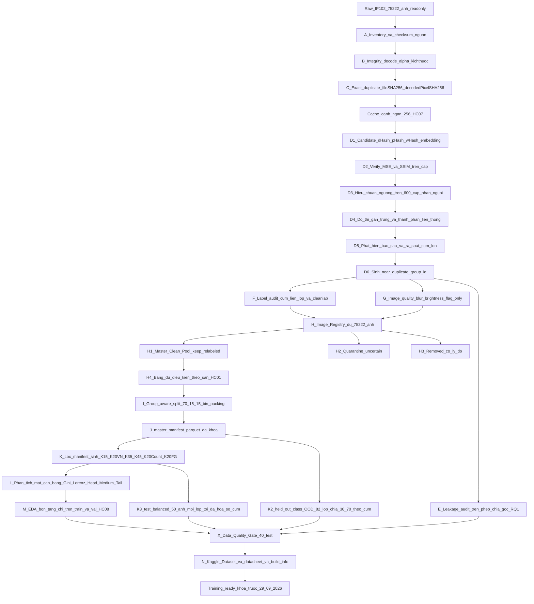

# PestID — Thiết kế Pipeline Dữ liệu Giai đoạn 1 (Tuần 1–4)

**Tài liệu kỹ thuật nội bộ · Phiên bản v1.2 hợp nhất · 01/9/2026**
**Phạm vi:** từ IP102 raw đến training-ready dataset, khóa trước 29/9/2026.
**Đối tượng đọc:** Nhóm 6 — DHKHMT19A. `[GIẢ ĐỊNH]` Phần lập ngân sách dùng quy mô 5 thành viên, trong đó 3 người có thể rà dữ liệu; phải thay bằng số thật ở ngày đầu Tuần 1. Trích một phần vào Chương 2 và Chương 3 báo cáo đồ án.

> **Quy ước ký hiệu dùng trong toàn tài liệu**
> `[ĐÃ ĐO]` — số liệu nhóm đã thực đo, có nguồn trong repo (chủ yếu `notebooks/notebook_cu/02_Quet_ChatLuong_IP102.ipynb`, lần quét 22/8/2026, và `reports/PestID_IP102_Dataset_Report.md`).
> `[ƯỚC LƯỢNG]` — con số suy ra bằng phép tính, kèm cơ sở; chưa đo.
> `[GIẢ ĐỊNH]` — giả định về tài nguyên/nhân lực; gom ở Phụ lục A.
> `[ĐỀ XUẤT SỬA ĐỀ CƯƠNG]` — khác với đề cương hiện tại; gom ở Phụ lục B.
> `P-xx`, `HC-xx`, `RQ-x`, `Ex` — mã nguyên tắc, ràng buộc cứng, câu hỏi nghiên cứu, thí nghiệm theo Mục 1 của yêu cầu.
> `[CẦN XÁC NHẬN]` — nội dung suy từ ngữ cảnh, chưa đối chiếu bản gốc; gom ở Phụ lục C.
> **Toàn bộ ký hiệu, mã số và thuật ngữ được giải thích đầy đủ ở Mục 0. Nếu gặp một chữ viết tắt lạ ở bất kỳ đâu trong tài liệu, tra Mục 0.7 trước khi đi hỏi.**

> **Lịch sử phiên bản.** `v1.0` là bản thiết kế đầu; `v1.1` là bản đã qua thẩm định kỹ thuật,
> sửa một lỗi chọn ngưỡng nghiêm trọng cùng khoảng mười lỗi suy diễn và đếm.
> `v1.2` — bản này — lấy toàn bộ nội dung kỹ thuật của `v1.1`, khôi phục mục *Ghi chú kết* của `v1.0`,
> vá bốn điểm còn hở (chi phí Tuần 2 chưa cập nhật theo phương pháp mới; không có ngày dự phòng
> khi Cổng hiệu chuẩn không đạt; thiếu một dòng rủi ro cho hiệu ứng dây chuyền của quarantine;
> số trường manifest ghi không khớp schema), rồi bổ sung ba thứ theo yêu cầu của nhóm:
> **Mục 0 — từ điển thuật ngữ**, quy tắc hạn chế viết tắt, và **chuyển toàn bộ mã nguồn sang notebook** (Mục XII).

---

## 0. Cách đọc tài liệu này và từ điển thuật ngữ

**Kết luận chính: mục này không chứa quyết định kỹ thuật nào; nó tồn tại để bất kỳ thành viên nào mở tài liệu ở tuần thứ ba cũng đọc được ngay mà không phải đi hỏi người viết một từ viết tắt nghĩa là gì.**

### 0.1. Ba cách đọc tùy vai trò

| Bạn là | Đọc theo thứ tự | Bỏ qua được |
|---|---|---|
| Người viết code tuần này | 0 → XII (notebook) → III (từng bước) → X (cổng chất lượng) | I, XVI |
| Người rà dữ liệu bằng tay | 0 → VII (rà nhãn) → VI.6 (hiệu chuẩn) → XIV (lịch) | IV, VIII, XI |
| Người viết báo cáo / trình hội đồng | 0 → I (thẩm định) → V (rò rỉ) → XIII (sản phẩm) → Phụ lục B | XI, XII |
| Nhóm trưởng, đọc một lần cho hết | tuần tự I → XVI | — |

Mỗi mục lớn mở đầu bằng một dòng in đậm **Kết luận chính**. Đọc riêng 16 dòng đó là đã nắm được toàn bộ lập luận của tài liệu.

### 0.2. Quy ước ký hiệu

| Ký hiệu | Nghĩa | Bắt buộc đi kèm |
|---|---|---|
| `[ĐÃ ĐO]` | Số nhóm đã thực đo, có nguồn trong repo | Tên file nguồn và ngày đo |
| `[ƯỚC LƯỢNG]` | Con số suy ra bằng phép tính, chưa đo | Cơ sở của phép tính |
| `[GIẢ ĐỊNH]` | Giả định về tài nguyên hoặc nhân lực | Một dòng trong Phụ lục A và cách kiểm chứng |
| `[ĐỀ XUẤT SỬA ĐỀ CƯƠNG]` | Khác với đề cương hiện tại | Một dòng trong Phụ lục B |
| `[CẦN XÁC NHẬN]` | Nội dung suy từ ngữ cảnh, chưa đối chiếu bản gốc | Một dòng trong Phụ lục C |

Quy tắc bất di bất dịch: **một con số không có nhãn nào trong bốn nhãn trên thì không được đưa vào báo cáo.** Đây là cách rẻ nhất để tránh tình huống hội đồng đối chiếu notebook của nhóm và thấy hai con số khác nhau.

### 0.3. Bốn họ mã định danh

Tài liệu dùng bốn họ mã ngắn để tham chiếu chéo. Chúng **không phải viết tắt của thuật ngữ**, mà là số hiệu của một điều khoản, giống như số điều trong một quy chế. Bảng đầy đủ ở 0.4 đến 0.6.

| Họ | Đọc là | Ví dụ | Ai đặt ra |
|---|---|---|---|
| `P-xx` | Nguyên tắc làm việc | P-08 | Mục 1 của yêu cầu đề tài |
| `HC-xx` | Ràng buộc cứng (hard constraint) | HC-02 | Mục 1 của yêu cầu đề tài |
| `RQ-x`, `Ex` | Câu hỏi nghiên cứu và thí nghiệm tương ứng | RQ1, E1 | Đề cương |
| `CRIT/MAJ/WARN/REP-xx` | Test trong cổng chất lượng | CRIT-04 | Tài liệu này, Mục X |

### 0.4. Mười nguyên tắc làm việc (P-01 … P-10)

`[CẦN XÁC NHẬN]` Bảng dưới đây được viết lại bằng lời từ cách các mã này được dùng trong toàn tài liệu. Trước khi in vào báo cáo, đối chiếu với Mục 1 của yêu cầu đề tài để chắc chắn không lệch nghĩa.

| Mã | Phát biểu ngắn | Chỗ nó ràng buộc mạnh nhất |
|---|---|---|
| **P-01** | Mỗi bước phải phục vụ một câu hỏi nghiên cứu hoặc một thí nghiệm cụ thể, nếu không thì loại khỏi phạm vi | II.1, VI.3 |
| **P-02** | Thứ tự ưu tiên khi phải chọn: chất lượng dữ liệu → chống rò rỉ → tái lập → truy vết. Tái lập được xếp trên "kỹ thuật hay" | VI.3, VIII.4, XIII.3 |
| **P-03** | Tuyệt đối không dùng tập test để ra bất kỳ quyết định phát triển nào | V.6, VI.6, IX.5 |
| **P-04** | Chia dữ liệu **một lần** trên toàn bộ 102 lớp, rồi mọi tập nghiên cứu đều là kết quả lọc từ một manifest duy nhất | II, III.7 |
| **P-05** | Không gộp hai việc khác bản chất vào một bước. Xóa bản sao là *làm sạch*; quyết định nhãn nào đúng là *rà nhãn* | III.3, III.10 |
| **P-06** | Augmentation chỉ áp ở tập train, chỉ tồn tại trong bộ nhớ, không bao giờ ghi ra đĩa | III.10 |
| **P-07** | Mọi quyết định trên một ảnh phải truy được: ai quyết, khi nào, dựa vào bằng chứng gì. Không xóa lặng lẽ | III.6, VII.4 |
| **P-08** | Không xóa ảnh chỉ vì một chỉ số vượt ngưỡng; và mọi ngưỡng phải được hiệu chuẩn trên mẫu có nhãn người | III.5, VI.6 |
| **P-09** | Dataset được đánh phiên bản; một phiên bản đã khóa thì không bao giờ ghi đè | III.6, XI |
| **P-10** | Công cụ tự động chỉ được phép *chỉ chỗ*; người quyết định | VII.1, IX.4 |

### 0.5. Mười ràng buộc cứng (HC-01 … HC-10)

`[CẦN XÁC NHẬN]` Cùng lưu ý như trên. Cột "giá trị số" là con số tài liệu này thực sự dùng trong code và assertion.

| Mã | Nội dung | Giá trị số đang dùng | Kiểm ở đâu |
|---|---|---|---|
| **HC-01** | Sàn số ảnh tối thiểu mỗi lớp trong mỗi split | train ≥ 100, validation ≥ 30, test ≥ 50, tức `n_c ≥ 334` | CRIT-13 |
| **HC-02** | Mỗi lớp phải chia gần đúng 70/15/15, lệch tối đa ±3 điểm phần trăm | `tol = 0,03` | MAJ-01 |
| **HC-03** | Cạnh ngắn tối thiểu của ảnh giữ lại, và trần hệ số phóng to | ≥ 112 px; phóng ≤ 256/112 = 2,286× | III.2, MAJ-07 |
| **HC-04** | Cụm ảnh gần trùng quá lớn phải được rà, **nhưng không bao giờ bị cắt** | ngưỡng cảnh báo `S_alert`, xem VI.5 | MAJ-05 |
| **HC-05** | Không giới hạn trần 800 ảnh/lớp trong tuyến chính | cap 800 chỉ tồn tại như một view của thí nghiệm E4 | II.1 |
| **HC-06** | Nếu không đủ 45 lớp đạt sàn HC-01 thì hạ quy mô lớn nhất và công bố phạm vi | K45 → K40 → K35 | MAJ-11 |
| **HC-07** | Mọi bộ nạp dữ liệu đọc từ bản cache cạnh ngắn 256 px, không đọc ảnh gốc | cạnh ngắn = 256 px | CRIT-01 |
| **HC-08** | Phân tích ở mức biểu diễn chỉ chạy trên train + validation | không chạm test | IX.5 |
| **HC-09** | Bảng xếp hạng lớp phải được hai người chấm độc lập | 2 người, báo cáo Krippendorff alpha | MAJ-09 |
| **HC-10** | Tỷ lệ mất cân bằng phải báo cáo bằng số đo thực tế, không dùng số dự kiến | dự kiến ≈ 24,9× sau khi lọc về 20 lớp | MAJ-02 |

### 0.6. Bảy câu hỏi nghiên cứu và mười thí nghiệm

| Mã | Câu hỏi | Thí nghiệm | Giai đoạn 1 phải bàn giao gì |
|---|---|---|---|
| **RQ1** | Rò rỉ ảnh gần trùng làm sai lệch ước lượng hiệu năng bao nhiêu? | E1 | Hai phép chia song song + hai cờ rò rỉ |
| **RQ2** | Biểu diễn của mô hình nền nào phù hợp nhất cho côn trùng hại? | E2 | K20-VN và K20-Count là view của cùng manifest |
| **RQ3** | Chiến lược nào xử lý đuôi dài tốt nhất? | E3, E4 | Số ảnh train từng lớp, tỷ lệ mất cân bằng theo ảnh và theo cụm |
| **RQ4** | Số lớp ảnh hưởng thế nào tới độ khó bài toán? | E5, E6, E7 | Các tập K lồng nhau, cùng phép chia, cùng nhãn |
| **RQ5** | Chưng cất tri thức có bù được cho mô hình nhỏ không? | E8 | Không sinh dữ liệu mới; dùng đúng tập train đã khóa |
| **RQ6** | Mô hình xử lý ảnh ngoài phân phối thế nào? | E9 | Tập giữ riêng theo lớp, chia theo cụm, và ảnh thực địa |
| **RQ7** | Lượng tử hóa INT8 mất bao nhiêu độ chính xác khi lên điện thoại? | E10 | Tập hiệu chuẩn lấy từ train, phép biến đổi khớp ứng dụng |

### 0.7. Từ điển thuật ngữ

Sắp theo nhóm khái niệm, không theo bảng chữ cái, để đọc một lượt là hiểu được mạch.

**Nhóm trùng lặp và rò rỉ**

| Thuật ngữ | Giải thích một câu |
|---|---|
| **Trùng byte** (duplicate file) | Hai file giống hệt nhau từng byte; phát hiện bằng SHA-256 của file thô |
| **Trùng pixel** (duplicate decoded pixels) | Hai file khác byte nhưng giải mã ra đúng cùng một ma trận điểm ảnh |
| **Gần trùng** (near-duplicate) | Hai ảnh đến từ **cùng một cảnh chụp hoặc cùng một ảnh gốc đã bị biến đổi** (cắt cúp, xoay, đổi nén, thêm chữ). Không phải "hai ảnh trông giống nhau" |
| **Cụm gần trùng** (near-duplicate cluster) | Một nhóm ảnh nối với nhau trong đồ thị gần trùng; đây là **đơn vị chia dữ liệu**, không phải ảnh lẻ |
| **Rò rỉ dữ liệu** (data leakage) | Ảnh trong tập test gần trùng với ảnh trong tập train, khiến mô hình được chấm điểm trên thứ nó đã thấy |
| **Cụm liên lớp** | Một cụm gần trùng chứa ảnh mang từ hai nhãn khác nhau trở lên; đây là lỗi nhãn, không phải lỗi trùng lặp |
| **Cạnh cầu** (bridge) | Một cạnh mà gỡ nó ra thì cụm tách làm đôi; thường là dấu hiệu hai cảnh chụp khác nhau bị nối nhầm |
| **Bắc cầu** (transitive bridging) | Hiện tượng A gần B, B gần C, nên A và C bị gom chung dù A và C không liên quan |

**Nhóm băm và so ảnh**

| Thuật ngữ | Giải thích một câu |
|---|---|
| **dHash** (difference hash) | Chuỗi 64 bit sinh từ việc so sáng tối giữa các điểm ảnh **kề nhau theo chiều ngang**; rẻ, nhạy với đổi nén, nhưng mù với cắt cúp và xoay |
| **pHash** (perceptual hash) | Chuỗi 64 bit sinh từ hệ số tần số thấp của biến đổi cosine rời rạc; bền hơn dHash trước thay đổi độ sáng |
| **wHash** (wavelet hash) | Tương tự pHash nhưng dùng biến đổi wavelet; bắt được một số biến dạng mà hai loại trên bỏ sót |
| **Khoảng cách Hamming** | Số bit khác nhau giữa hai chuỗi băm; càng nhỏ càng giống. Ký hiệu `H` |
| **Băm đa chỉ mục** (multi-index hashing, MIH) | Kỹ thuật chia chuỗi băm thành nhiều khối để tìm **đủ** mọi cặp trong một bán kính Hamming cho trước mà không phải so từng cặp một |
| **Nguyên lý chuồng bồ câu** | Nếu nhét 8 viên bi vào 3 ngăn thì có ngăn chứa ≤ 2 viên; đây là cơ sở toán học của MIH |
| **Embedding** | Vector số (ở đây 384 chiều) mô tả nội dung ảnh; hai ảnh giống nhau về ngữ nghĩa thì hai vector gần nhau |
| **Cosine similarity** | Độ đo góc giữa hai vector embedding, giá trị từ −1 đến 1; 1 nghĩa là cùng hướng |
| **MSE** (mean squared error) | Sai số bình phương trung bình giữa hai ảnh, tính từng điểm ảnh; nhạy với dịch chuyển |
| **SSIM** (structural similarity index) | Chỉ số tương đồng cấu trúc; so cả độ sáng, độ tương phản và cấu trúc cục bộ, gần với cảm nhận người hơn MSE |
| **PSNR** (peak signal-to-noise ratio) | Tỷ số tín hiệu trên nhiễu đỉnh, đơn vị dB; dùng để kiểm bản cache có mất chất lượng quá mức không. Trên 40 dB là gần như không phân biệt được bằng mắt |
| **Láng giềng gần xấp xỉ** (approximate nearest neighbor, ANN) | Nhóm thuật toán tìm vector gần nhất nhanh nhưng **không đảm bảo đúng**; tài liệu này không dùng vì vi phạm P-02 |

**Nhóm chia dữ liệu và manifest**

| Thuật ngữ | Giải thích một câu |
|---|---|
| **Manifest** | Một bảng liệt kê từng ảnh kèm mọi thuộc tính và phán quyết; là **nguồn sự thật duy nhất**, thay cho việc đi đếm file trong thư mục |
| **Image Registry** | Sổ cái đủ 75.222 ảnh gốc và số phận của từng ảnh (giữ / đổi nhãn / cách ly / loại) |
| **Master Clean Pool** | Tập con của registry chỉ gồm ảnh đã xác minh là dùng được |
| **Quarantine** | Vùng cách ly chứa ảnh không kết luận được nhãn; đếm được, báo cáo được, nhưng không vào thí nghiệm nào |
| **Split** | Phép chia ba tập train / validation / test |
| **`orig_split`** | Phép chia **gốc** do IP102 cung cấp; giữ nguyên vĩnh viễn vì nó là đối tượng đo của RQ1 |
| **Group-aware split** | Phép chia lấy **cụm** làm đơn vị thay vì ảnh, để cả cụm luôn rơi về cùng một phía |
| **Bin packing** | Bài toán xếp vật vào thùng sao cho cân; ở đây "vật" là cụm, "thùng" là ba split |
| **LPT** (longest processing time) | Quy tắc xếp **vật lớn trước**; vật lớn khó nhét về sau nên phải đặt trước |
| **Quy hoạch động** (dynamic programming, DP) | Kỹ thuật giải bài toán bằng cách lưu lại kết quả của bài toán con; ở đây dùng để **chứng minh** một lớp là vô nghiệm chứ không chỉ đoán |
| **Tập K** | Một tập nghiên cứu gồm K lớp, ví dụ K20-VN là 20 lớp ưu tiên cho Việt Nam |
| **View** | Một tập được sinh ra bằng cách **lọc** manifest, không phải bằng cách sao chép ảnh |
| **Held-out class** | Lớp cố ý không đưa vào huấn luyện, để đo khả năng nhận biết "chưa từng thấy" |
| **Ngoài phân phối** (out-of-distribution, OOD) | Dữ liệu thuộc phân phối khác với dữ liệu huấn luyện |

**Nhóm chất lượng và nhãn**

| Thuật ngữ | Giải thích một câu |
|---|---|
| **Laplacian variance** | Phương sai của ảnh sau khi lọc Laplace; thấp thường nghĩa là ảnh mờ, nhưng phụ thuộc độ phân giải nên phải chuẩn hóa |
| **Clipping ratio** | Tỷ lệ điểm ảnh bị cháy sáng hoặc chìm tối hoàn toàn |
| **EXIF orientation** | Thẻ trong metadata ảnh nói "ảnh này cần xoay bao nhiêu độ khi hiển thị"; áp hai lần sẽ xoay hỏng ảnh |
| **Alpha channel** | Kênh trong suốt của ảnh PNG; phải ghép lên nền trắng trước khi chuyển sang RGB |
| **CMYK** | Không gian màu dùng cho in ấn, khác với RGB của màn hình |
| **cleanlab / Confident Learning** | Thư viện và phương pháp tìm ảnh **khả nghi sai nhãn** bằng cách so nhãn hiện tại với xác suất dự đoán; chỉ tạo danh sách nghi vấn, không tự sửa |
| **Cohen's kappa** | Chỉ số đo mức đồng thuận giữa **hai** người chấm, đã trừ đi phần đồng thuận do may rủi; 0,70 là mức "khá tốt" |
| **Krippendorff's alpha** | Tương tự nhưng dùng được cho nhiều người chấm và cho thang thứ bậc |
| **Label Studio** | Phần mềm gán nhãn chạy cục bộ, dùng cho mọi việc chấm tay trong tài liệu này |

**Nhóm thống kê và hiệu chuẩn**

| Thuật ngữ | Giải thích một câu |
|---|---|
| **Precision** | Trong số cặp máy nói là gần trùng, bao nhiêu phần trăm đúng là gần trùng |
| **Recall** | Trong số cặp thực sự gần trùng, máy tìm ra được bao nhiêu phần trăm |
| **Ngưỡng hoạt động** (operating point) | Một giá trị cắt cụ thể trên thang điểm; đổi ngưỡng là đánh đổi precision lấy recall |
| **`τ_strict`** | Ngưỡng chặt, ưu tiên precision, dùng cho **con số đưa vào báo cáo** |
| **`τ_recall`** | Ngưỡng lỏng, ưu tiên recall, dùng cho **việc chia dữ liệu** |
| **Lấy mẫu phân tầng** (stratified sampling) | Chia quần thể thành tầng rồi lấy mẫu trong từng tầng, để chắc chắn phủ được vùng biên |
| **Trọng số nghịch xác suất chọn** | Khi các tầng được lấy mẫu với tỷ lệ khác nhau, mỗi mẫu phải mang trọng số `N_tầng / n_lấy` thì ước lượng mới không lệch |
| **Cỡ mẫu hiệu dụng** (`n_eff`) | Số mẫu "thực chất" sau khi tính trọng số; 100 mẫu lệch trọng số nặng có thể chỉ đáng giá 20 mẫu |
| **Bootstrap** | Lấy mẫu lại có hoàn lại nhiều nghìn lần để ước lượng khoảng tin cậy mà không cần giả định phân phối |
| **Khoảng tin cậy** (confidence interval, CI) | Khoảng số mà giá trị thật nằm trong đó với xác suất đã định, thường 95% |
| **Khoảng Wilson** | Một công thức khoảng tin cậy cho tỷ lệ; **chỉ đúng khi mẫu lấy đồng xác suất**, nên tài liệu này không dùng nó cho mẫu phân tầng |
| **Cross-fit / out-of-fold (OOF)** | Chia dữ liệu nhãn thành nhiều phần, mô hình chấm điểm cho phần nó **chưa từng thấy**; cách duy nhất để chọn ngưỡng mà không tự lừa mình |
| **Preregistration** | Ghi trước quyết định phân tích rồi mới nhìn kết quả, để tránh chọn cách phân tích cho ra số đẹp |
| **Sensitivity analysis** | Chạy lại phân tích ở một giả định khác để xem kết luận có đổi không |

**Nhóm tiền xử lý và triển khai**

| Thuật ngữ | Giải thích một câu |
|---|---|
| **Offline preprocessing** | Biến đổi làm **một lần** và ghi ra đĩa, ở đây là bản cache cạnh ngắn 256 px |
| **Online preprocessing** | Biến đổi làm **mỗi lần nạp** trong bộ nạp dữ liệu, ví dụ cắt giữa 224 và chuẩn hóa |
| **Augmentation** | Biến đổi ngẫu nhiên chỉ dùng khi huấn luyện để tăng đa dạng; không bao giờ ghi ra đĩa |
| **Center crop** | Cắt lấy phần giữa ảnh; đơn giản nhưng có thể cắt mất đối tượng nếu đối tượng lệch tâm |
| **Bounding box** | Khung chữ nhật đánh dấu vị trí đối tượng, có sẵn trong nhánh detection của IP102 |
| **Lượng tử hóa sau huấn luyện** (post-training quantization, PTQ) | Nén mô hình từ số thực 32 bit xuống số nguyên 8 bit sau khi đã huấn luyện xong |
| **Tập hiệu chuẩn PTQ** | Vài trăm ảnh dùng để đo dải giá trị khi lượng tử hóa; **bắt buộc lấy từ train** |
| **ECE** (expected calibration error) | Sai số hiệu chuẩn kỳ vọng: mô hình nói "chắc 90%" thì có đúng 90% số lần không |
| **Chưng cất tri thức** (knowledge distillation, KD) | Huấn luyện mô hình nhỏ bắt chước đầu ra của mô hình lớn |
| **TFLite** | Định dạng mô hình nhẹ để chạy trên điện thoại |

**Nhóm kỹ thuật phần mềm**

| Thuật ngữ | Giải thích một câu |
|---|---|
| **Idempotent** | Chạy lại nhiều lần cho ra đúng cùng một kết quả và không làm hỏng gì; điều kiện để dám chạy lại pipeline |
| **Checksum / SHA-256** | Chuỗi 64 ký tự đại diện cho nội dung một file; đổi một byte là đổi cả chuỗi |
| **Hash chuẩn tắc** (canonical hash) | Checksum tính theo một quy tắc tuần tự hóa cố định, để hai lần chạy khác máy vẫn ra cùng giá trị |
| **Parquet** | Định dạng bảng nén theo cột, giữ đúng kiểu dữ liệu; dùng làm nguồn sự thật thay CSV |
| **Hardlink** | Tạo tên file thứ hai trỏ vào cùng dữ liệu trên đĩa, không tốn thêm dung lượng và không nén lại ảnh |
| **Phân tích khám phá dữ liệu** (EDA) | Bước vẽ biểu đồ và lập bảng để *hiểu* dữ liệu, phân biệt với bước làm cho dữ liệu *đúng* |
| **Tỷ lệ mất cân bằng** (imbalance ratio, IR) | Số ảnh của lớp lớn nhất chia cho số ảnh của lớp nhỏ nhất |
| **Head / Medium / Tail** | Ba nhóm lớp theo số ảnh: nhiều, trung bình, ít |
| **Gini / đường cong Lorenz** | Hai cách đo và vẽ mức tập trung của phân bố, mượn từ kinh tế học |

### 0.8. Quy tắc viết tắt trong tài liệu này

Ba quy tắc, áp cho cả tài liệu này lẫn báo cáo đồ án:

1. **Mọi từ viết tắt phải được viết đầy đủ ở lần xuất hiện đầu tiên trong mỗi mục lớn**, kèm dạng viết tắt trong ngoặc. Ví dụ: "tỷ lệ mất cân bằng (imbalance ratio, IR)".
2. **Không tự đặt viết tắt mới.** Nếu một khái niệm chưa có tên ngắn phổ biến thì viết đủ, dài thêm vài chữ không tốn gì.
3. **Tên trường dữ liệu và tên file là ngoại lệ** và giữ nguyên dạng gốc, vì chúng là định danh trong code chứ không phải chữ viết tắt trong văn xuôi. `nd_group_size` không được đổi thành `kich_thuoc_cum_gan_trung` chỉ vì lý do đọc cho xuôi.

Bốn cụm ký tự dưới đây xuất hiện dày nhất và được thống nhất một lần ở đây, sau đó dùng dạng đầy đủ trong văn xuôi:

| Viết tắt | Dạng đầy đủ dùng trong văn xuôi | Chỉ giữ dạng viết tắt khi |
|---|---|---|
| ND | ảnh gần trùng / cụm gần trùng | nằm trong tên trường `nd_*` |
| IR | tỷ lệ mất cân bằng | nằm trong tên cột hoặc tiêu đề bảng chật |
| EDA | phân tích khám phá dữ liệu | nằm trong tên file `EDA_report.md` |
| GVHD | giảng viên hướng dẫn | không có ngoại lệ, luôn viết đủ |

---

## I. Đánh giá pipeline dữ liệu hiện tại trong đề cương

**Kết luận chính: triết lý của đề cương là đúng và phải giữ nguyên — Master Clean Pool → group-aware split → lọc manifest — nhưng ba trụ cột kỹ thuật đỡ nó (ngưỡng near-duplicate, cơ chế chặn cụm phình, thuật toán split) đang được đặc tả ở mức chưa đủ để thực thi mà không phát sinh quyết định tùy tiện, và một trong ba trụ cột — ngưỡng near-duplicate — hiện được hiệu chuẩn bằng chính một thành phần của nó nên chưa đứng vững trước hội đồng.**

### I.1. Những gì đề cương làm đúng và phải giữ

Bốn quyết định sau là điểm mạnh thực sự, không nên đụng vào.

Thứ nhất, **chia một lần trên toàn bộ 102 lớp rồi lọc manifest để sinh mọi tập K** (P-04). Đây là lựa chọn khiến toàn bộ chương trình E1–E10 nhất quán: một `image_id` giữ nguyên split ở K15, K20-VN, K35, K45, K20-Count và K20-FG, nên E7 (khảo sát số lớp) không bị nhiễu bởi việc mỗi K có một phép chia riêng. Nếu chia lại cho từng K, kết quả E7 sẽ trộn lẫn hai hiệu ứng "thêm lớp" và "đổi phép chia", và RQ4 mất khả năng kết luận.

Thứ hai, **lấy nhóm ảnh gần trùng làm đơn vị chia thay vì ảnh**. Đây là điều kiện cần để bất biến chống rò rỉ có nghĩa. Không nhóm nào ở tài liệu tham khảo trong `docs/phan_tich_bai_bao/paper/` áp dụng điều này trên IP102, nên đây đồng thời là điểm đóng góp của đề tài.

Thứ ba, **không xóa ảnh chỉ vì một chỉ số vượt ngưỡng** (P-08), cụ thể là quy định Laplacian variance chỉ gắn cờ chứ không tự động xóa. Với một bộ đuôi dài có tỷ lệ mất cân bằng (imbalance ratio, IR) ≈ 80,8× thì xóa tự động ở lớp Tail là con đường ngắn nhất tới việc phá HC-01.

Thứ tư, **tách `model_class_index` khỏi `ip102_id`**. Nhỏ nhưng đúng: đầu ra 0–19 của mô hình và mã lớp không liên tục của IP102 là hai không gian khác nhau, gộp chúng là nguồn lỗi kinh điển khi xuất TFLite và viết ứng dụng Flutter.

### I.2. Năm điểm phải sửa trước khi chạy Tuần 1

**(1) Ngưỡng near-duplicate hiện đang tự hiệu chuẩn bằng chính nó.** Đề cương chốt "gần trùng khi Hamming ≤ 2, hoặc Hamming ≤ 5 và sai số bình phương trung bình (MSE) < 300". Notebook 02 kết luận "ngưỡng tự động an toàn Hamming ≤ 2 vì tỉ lệ đúng ≥ 80%" — nhưng "tỉ lệ đúng" ở đó được chấm bằng **MSE làm trọng tài**, trong khi MSE lại là vế thứ hai của chính luật quyết định. Notebook có lập luận rằng dHash so bit theo chiều ngang còn MSE so từng điểm ảnh nên hai phép đo độc lập; điều đó đúng về mặt toán học nhưng không giải quyết vấn đề khoa học: cả hai đều là proxy tự động, không có nhãn người ở bất kỳ đâu trong vòng lặp. Vi phạm trực tiếp P-08 ("ngưỡng phải được hiệu chuẩn trên mẫu gán nhãn thủ công"). Khi hội đồng hỏi "vì sao 300 mà không phải 200 hay 500", hiện chưa có câu trả lời nào ngoài "chúng em chọn thế". Cách sửa nằm ở Mục VI.

**(2) Con số rò rỉ 14% trong đề cương không khớp số nhóm đã đo, và bản thân phép đo là chặn dưới.** Đề cương viết "khoảng 14% ảnh validation/test gần trùng với ảnh train". Notebook 02 `[ĐÃ ĐO]` cho 3.598/30.127 = **11,94%** ở mức đã xác minh và 2.818/30.127 = **9,35%** ở mức chắc chắn Hamming ≤ 2. Hai điều phải làm rõ. Một, con số đưa vào báo cáo phải là con số đo được, không phải con số nhớ áng chừng — đây là bằng chứng chính của RQ1, sai một chữ số là mất uy tín cả chương. Hai, phép đo hiện tại chỉ tìm ảnh train gần nhất **trong cùng lớp**, nên bỏ sót hoàn toàn rò rỉ liên lớp; đồng thời dHash mù với cắt cúp mạnh và xoay, nên 11,94% là **chặn dưới**, không phải ước lượng điểm. Kế hoạch mới phải đo lại bằng bộ phát hiện đã hiệu chuẩn và báo cáo kèm khoảng bất định.

**(3) Cách gọi “trần cụm 30 ảnh” là sai và dễ dẫn tới một hành động tự phá hoại.** Đề cương viết "giới hạn kích thước cụm ở 30 ảnh; cụm vượt ngưỡng bị siết tiêu chí và rà tay". Nếu “giới hạn” được thực thi bằng cách *cắt* một cụm gần trùng có thật thành hai cụm nhỏ hơn cho vừa trần, hai nửa có thể rơi vào hai split khác nhau — **tự tạo lại đúng thứ rò rỉ mà đề tài đang chống**. Cụm thật không bao giờ được cắt vì lý do tiện lợi. Phải tách hai đại lượng: `S_eval_max(c)=floor(0,18·n_c)` là giới hạn khả thi suy ra từ HC-02 để một cụm có thể nằm ở validation/test; còn 30 chỉ là `[GIẢ ĐỊNH]` ngưỡng audit tuyệt đối vì một cảnh web có hơn 30 ảnh là đáng ngờ. Dùng `S_alert(c)=min(30, S_eval_max(c))` **chỉ để ưu tiên rà**, không phải để cắt cụm hay tuyên bố cụm sai. Với lớp ở sàn 334 ảnh, `S_eval_max=60` nhưng vẫn rà từ 31 ảnh vì đó là cảnh báo bảo thủ; với lớp 150 ảnh, cảnh báo kích hoạt từ 28 ảnh vì cụm đã không còn đặt được vào validation/test. Việc thỏa HC-02 được giải ở Mục VIII, không bằng cách sửa dữ liệu cho vừa tỷ lệ.

**(4) "StratifiedGroupKFold rồi ghép fold" không có cơ chế đảm bảo HC-02 và không có cơ chế sửa chữa.** `StratifiedGroupKFold` của scikit-learn phân bổ nhóm theo heuristic tham lam để cân bằng phân bố lớp giữa các fold; nó không nhận ràng buộc "mỗi lớp lệch ≤ ±3 điểm" và không có đường trả về khi một lớp vi phạm. Ghép 5/1/1 từ k = 7 fold cho tỷ lệ toàn cục 71,4/14,3/14,3 — đạt ±3 điểm ở mức tổng, nhưng mức tổng không phải thứ HC-02 kiểm. Ở lớp Tail có ít cụm và cụm to, sai số từng lớp có thể lớn hơn nhiều lần. Đề xuất thay thế ở Mục VIII.

**(5) Đề cương không nói gì về cụm gần trùng đi qua ranh giới lớp trong lúc chia.** C6 có rà tay nhóm gần trùng mang nhãn khác nhau, nhưng sau khi rà xong vẫn còn phần dư: nhóm được chấm "không xác định" hoặc nhóm mà hai nhãn đều hợp lệ (ảnh chứa hai loài). Một cụm như vậy là **một đơn vị chia thuộc nhiều lớp cùng lúc**, và mọi thuật toán chia theo từng lớp sẽ vỡ khi gặp nó. Hiện chưa có quy tắc xử lý. `[ĐÃ ĐO]` riêng ở mức Hamming = 0 đã có **81 nhóm mâu thuẫn nhãn**, nên đây không phải trường hợp giả định.

### I.3. Ba điểm đúng nhưng đặc tả chưa đủ để thực thi

**"Siết tiêu chí và rà tay" khi cụm vượt 30 là mệnh lệnh, không phải thuật toán.** Siết thành gì, siết theo thứ tự nào, dừng khi nào, ai duyệt — bốn câu hỏi này phải có câu trả lời bằng code, nếu không hai thành viên chạy hai lần sẽ ra hai kết quả khác nhau và acceptance test #12 (tái lập) fail.

**Manifest bốn trường là manifest LỚP, không phải manifest ẢNH.** Đề cương liệt kê `model_class_index`, `ip102_id`, `display_name_vi`, `original_ip102_name` — bốn trường này mô tả 102 dòng lớp. Toàn bộ bất biến của Data Quality Gate lại phát biểu trên **ảnh** (`không ảnh nào ở hai split`, `cụm không bị chia`). Thiếu manifest cấp ảnh thì không có test nào ở Mục 2.4 kiểm được bằng code. Đây có lẽ chỉ là thiếu sót diễn đạt, nhưng phải vá tường minh — Mục IV.

**Thứ tự công việc trong Tuần 1–4 có một vòng phụ thuộc.** Bảng P/A/D dùng "số ảnh sạch nhiều hơn" làm tiêu chí phá hòa, mà số ảnh sạch chỉ có sau C1–C7 (Tuần 3). HC-06 lại yêu cầu kiểm tra số lớp đạt sàn 334 ngay Tuần 2, trong khi C4–C7 chưa xong. Vòng này gỡ được vì hai trục P và A của rubric hoàn toàn độc lập với dữ liệu và có thể chấm từ Tuần 1; chỉ tiêu chí phá hòa mới cần đếm. Nhưng phải nói rõ ra và xếp lại lịch, nếu không nhóm sẽ kẹt ở Tuần 2. Lịch đề xuất ở Mục XIV.

### I.4. Một quyết định ngầm cần được phát biểu thành lời

Đề cương mô tả C4 là "gom ảnh gần trùng" và notebook 02 dùng chữ "ảnh dư thừa 3.348 (4,45%)". Hai cách nói này gợi ý hai hành động khác nhau: **gom** thì giữ nguyên số ảnh, **dư thừa** thì hàm ý bỏ bớt. Tài liệu này chốt dứt khoát:

- **Trùng byte và trùng nội dung pixel: giữ một ảnh đại diện, loại phần còn lại.** Các bản sao thêm mang đúng zero thông tin, giữ lại chỉ làm sai lệch `n_c` dùng cho square-root sampling và effective-number ở E3.
- **Gần trùng: giữ toàn bộ, chỉ gom nhóm, tuyệt đối không xóa.** Xóa gần trùng sẽ cắt lớp Tail xuống dưới sàn HC-01 và làm hỏng chính đối tượng nghiên cứu của RQ1.

Kèm theo đó là một hệ quả mà đề cương chưa lường: nếu `test_balanced` lấy ngẫu nhiên 50 ảnh/lớp từ Natural Test mà không để ý cụm, một lớp có thể nhận 50 ảnh đến từ 12 cảnh chụp. Accuracy trên tập đó không đo được điều nó tuyên bố đo. Cách vá ở Mục III.9.

### I.5. Bốn phát hiện làm nhẹ khối lượng công việc

Đọc lại số liệu `[ĐÃ ĐO]` cho thấy ba khoản chi phí trong đề cương có thể cắt gần hết:

| Hạng mục | Số đo | Hệ quả cho kế hoạch |
|---|---|---|
| Ảnh không giải mã được / grayscale / CMYK | 0 / 0 / 0 | Giai đoạn B gần như miễn phí; chỉ còn 7 ảnh RGBA cần xử lý nền trắng |
| Tên file đầy đủ duy nhất toàn cục | 75.222/75.222 | `image_id = IP102__{file_name}`; giữ đuôi file, không suy diễn stem duy nhất |
| Trùng byte (MD5) | 5 nhóm, 5 ảnh dư | C3 gần như không có việc; **không được kết luận "dữ liệu sạch"** vì mức gần trùng mới là vấn đề |
| Toàn bộ C1–C4 là tác vụ CPU | 2,97 GB dữ liệu cục bộ | **Không tiêu một giờ GPU Kaggle nào cho giai đoạn dữ liệu**, trừ một lượt trích embedding |

Khoản cuối là khuyến nghị vận hành quan trọng nhất của mục này: hạn mức GPU Kaggle `[GIẢ ĐỊNH ~30 h/tuần]` phải được để dành nguyên vẹn cho E1–E10. Giai đoạn 1 chạy trên máy cá nhân.

### I.6. Bảng tổng kết thẩm định

| # | Thành phần đề cương | Kết luận | Mức ưu tiên sửa |
|---|---|---|---|
| 1 | Triết lý Master Clean Pool → split → lọc manifest | Giữ nguyên | — |
| 2 | C1 decode/alpha, C2 sàn 112 px, C3 hash byte | Giữ nguyên, bổ sung pixel-hash | P1 |
| 3 | Ngưỡng near-dup `H≤2 or (H≤5 and MSE<300)` | Chưa đủ căn cứ, phải hiệu chuẩn trên nhãn người | **P0** |
| 4 | Chỉ dùng dHash làm kênh phát hiện | Bỏ sót họ biến đổi cắt cúp/xoay | **P0** |
| 5 | “Trần” cụm cố định 30 ảnh | Phải đổi thành ngưỡng audit; giới hạn khả thi thật là `floor(0,18·n_c)`; tuyệt đối không cắt cụm thật | **P0** |
| 6 | "Siết tiêu chí và rà tay" khi cụm phình | Chưa phải thuật toán, không tái lập được | **P0** |
| 7 | StratifiedGroupKFold + ghép fold | Không bảo đảm HC-02 từng lớp, không sửa được | **P0** |
| 8 | Xử lý cụm liên lớp khi chia | Thiếu hoàn toàn | **P0** |
| 9 | Manifest 4 trường | Thiếu manifest cấp ảnh | **P0** |
| 10 | Con số rò rỉ 14% | Lệch số đo (11,94%) và là chặn dưới | P1 |
| 11 | `test_balanced` 50 ảnh/lớp | Thiếu ràng buộc đa dạng cảnh chụp | P1 |
| 12 | Laplacian variance gắn cờ, không xóa | Đúng hướng, thiếu chuẩn hóa theo độ phân giải | P1 |
| 13 | 12 acceptance test | 5 đủ chặt, 4 cần siết, 3 chưa kiểm được bằng code | **P0** |
| 14 | Thứ tự công việc Tuần 1–4 | Có vòng phụ thuộc P/A/D ↔ đếm ảnh sạch | P1 |

---

## II. Kiến trúc tổng thể của tuyến xử lý dữ liệu (data pipeline)

**Kết luận chính: pipeline là một đường thẳng một chiều, mọi nhánh rẽ đều chỉ đi từ trái sang phải, và điểm duy nhất được phép sinh ra tập dữ liệu là bộ lọc trên một manifest duy nhất đã khóa.**



Ba đặc điểm kiến trúc đáng chú ý. **Một**, cache 256 nằm sớm về mặt logic; khi triển khai, `01_scan.ipynb` ghi cache ứng viên trong cùng lượt đọc A/B, rồi C đánh dấu đại diện và D chỉ trích embedding cho ID đủ điều kiện — tránh đọc raw lần nữa mà vẫn giữ đúng phụ thuộc. **Hai**, `E_Leakage_audit` là một nhánh **cụt**: nó sinh bằng chứng RQ1 và hai cờ strict/recall cho E1 nhưng không quay lại chỉnh tham số, tạo hàng rào P-03. **Ba**, registry hạch toán đủ raw rồi mới tách clean/quarantine/removed; chỉ clean pool đi vào `master_manifest`, và mọi tập K đều là view hậu duệ của manifest (P-04).

### II.1. Ma trận truy vết từ dữ liệu tới RQ/E

Giai đoạn 1 không trực tiếp huấn luyện E1–E10, nhưng phải bàn giao đúng “hợp đồng dữ liệu” cho cả bảy câu hỏi; nếu thiếu một hàng dưới đây thì RQ tương ứng không còn so sánh kiểm soát được.

| Artifact/quyết định dữ liệu | RQ · thí nghiệm nhận | Bất biến phải khóa ngay Giai đoạn 1 |
|---|---|---|
| Split gốc song song split theo cụm; cờ rò rỉ; hai train view khớp số lượng | **RQ1 · E1** | `orig_split` bất biến; `τ_strict/τ_recall` khóa trước khi đọc test; cùng cụm cùng split |
| K20-VN theo P/A/D và K20-Count theo số ảnh sạch | **RQ2 · E2** | Cả hai là view của cùng manifest; K20-Count chỉ là reference, không gán diễn giải nhân quả |
| `n_train_c`, IR ảnh/cụm, Head/Medium/Tail, chất lượng theo lớp | **RQ3 · E3–E4** | Không cap 800 trong pipeline chính (**HC-05**); cap 800 chỉ là view baseline B4; train augmentation không ghi ra dataset |
| K20-FG, K15/K20/K35/Kmax và thống kê IR/quy mô từng K | **RQ4 · E5–E7** | Protocol/split/path/label không đổi giữa K; Kmax tuân **HC-06** |
| Cùng tập train, cùng manifest/version cho teacher, student, KD0/KD1 | **RQ5 · E8** | Giai đoạn 1 **không sinh dữ liệu KD mới**; mọi ablation dùng đúng ID và augmentation policy đã khóa để chỉ còn biến KD |
| Natural Test, `test_balanced`, field registry và held-out-class OOD 30/70 theo cụm | **RQ6 · E9** | Natural Test bất biến; OOD calib/eval không chung cụm; ảnh thực địa giữ `individual_id` khi có |
| PTQ calibration view từ train, golden preprocessing set, metadata xuất TFLite/Flutter | **RQ7 · E10** | PTQ không đọc val/test; eval transform khớp Flutter; ngưỡng/ECE phải đo lại trên chính INT8 |

Các HC còn lại neo vào đúng chỗ: HC-01/02 ở split, HC-03 ở integrity, **HC-04 được sửa từ “trần cắt cụm” thành ngưỡng audit không phá cụm**, HC-07 ở cache, HC-08 ở tầng biểu diễn của phân tích khám phá dữ liệu (EDA), **HC-09 ở quy trình chấm kép P/A/D**, HC-10 ở báo cáo IR thực đo. Ma trận này là cách thực thi P-01: mỗi bước hoặc phục vụ một RQ/E cụ thể, hoặc bị loại khỏi scope.

---

## III. Quy trình chi tiết từng bước

**Kết luận chính: bảy trong mười giai đoạn của mục này gần như không tốn công vì `[ĐÃ ĐO]` cho thấy IP102 sạch ở mức toàn vẹn file; toàn bộ ngân sách người và máy phải dồn vào ba chỗ — hiệu chuẩn ngưỡng gần trùng, rà cụm liên lớp, và đo thực nghiệm mức mất đối tượng do center crop.**

Mục này phủ các giai đoạn **A, B, C, G, H, K, L** và **N** (bảng ánh xạ ở Mục 8 của yêu cầu bỏ sót N; đặt N ở đây vì bước cache cạnh ngắn 256 nằm ngay giữa C và D về mặt thời gian). Giai đoạn D ở Mục VI, E ở Mục V, F ở Mục VII, I ở Mục VIII, J ở Mục IV, M ở Mục IX.

### III.1. Giai đoạn A — Kiểm kê và bảo toàn dữ liệu gốc

**Why.** Không có bản raw bất biến thì mọi tuyên bố tái lập ở acceptance test #12 đều vô nghĩa, và một lệnh `rm` nhầm trong Tuần 2 sẽ giết cả đồ án. Phục vụ P-09, HC-07, và test REP-01/REP-02 của Quality Gate. Bỏ qua bước này thì rủi ro số 12 trong Mục 13 của yêu cầu (mất dữ liệu do thao tác thủ công) không có hàng rào nào chặn.

**How.** Bốn việc, chạy đúng một lần.

1. Duyệt đệ quy `data/raw/IP102/classification/{train,val,test}/{0..101}/`, ghi mỗi file một dòng: đường dẫn tương đối, split gốc, `class_id` gốc, tên file, kích thước byte, `mtime`.
2. Tính SHA-256 từng file và một `source_checksum` tổng hợp = SHA-256 của chuỗi `"{relative_path}:{sha256}\n"` đã sắp xếp theo `relative_path`. Đây là dấu vân tay của toàn bộ nguồn, đi thẳng vào `build_info.json`.
3. Đối chiếu với annotation gốc: `classes.txt` (102 dòng), `train.txt`/`val.txt`/`test.txt`, và thư mục `Annotations/` + `JPEGImages/`. Báo cáo ba tập hiệu: file có trên đĩa nhưng không có trong annotation, file có trong annotation nhưng thiếu trên đĩa, và file có trong `Annotations/` nhưng không ánh xạ được về ảnh classification.
4. Đặt toàn bộ cây `data/raw/` sang chế độ chỉ đọc (`attrib +R /S` trên Windows, `chmod -R a-w` trên Linux) và ghi một sentinel `data/raw/.LOCKED` chứa `source_checksum` + timestamp.

```python
def build_inventory(raw_root: Path, out_csv: Path) -> pd.DataFrame:
    """Duyet raw, tinh sha256, doi chieu annotation. Idempotent."""
    ...

def compute_source_checksum(inv: pd.DataFrame) -> str:
    """SHA-256 cua chuoi '{relative_path}:{sha256}\\n' da sort theo relative_path."""
    ...

assert inv["relative_path"].is_unique
assert len(inv) == 75_222, "So anh khac cong bo goc -> dung, kiem tra ban tai ve"
assert inv["class_id"].nunique() == 102
```

**Threshold & Calibration.** Không có ngưỡng. Chỉ có ba đẳng thức phải đúng tuyệt đối: 75.222 ảnh, 102 lớp, 45.095/7.508/22.619 theo split gốc — cả ba đã được notebook 02 xác nhận `[ĐÃ ĐO]`. Nếu lệch, dừng và tải lại IP102; không được "sửa cho khớp".

**Cost.** Máy `[ƯỚC LƯỢNG]` ~8–12 phút cho SHA-256 trên 2,97 GB với ổ SSD (giới hạn bởi băng thông đọc ~5 MB/s hiệu dụng cho file nhỏ 41 KB). Người: 0,5 h đọc và xác nhận báo cáo lệch.

**Validation.** PASS khi: `len(inventory) == 75222` và `inventory.relative_path.is_unique` và tập hiệu với annotation gốc rỗng hoặc đã được ghi nhận bằng văn bản trong `docs/data/A_inventory_discrepancies.md`.

**Output.** `data/interim/A_inventory.parquet` — cột: `image_id, relative_path, orig_split, orig_class_id, file_name, file_size, sha256, mtime_utc`. Kèm `data/interim/A_source_checksum.txt`.

**Downstream.** `sha256` là khóa của C3; `orig_split` là dữ liệu bắt buộc của giai đoạn E (RQ1); `source_checksum` đi vào `build_info.json` và là điều kiện của test REP-02.

> **Lưu ý cho A.** `[ĐÃ ĐO]` **tên file đầy đủ** duy nhất toàn cục trên cả 75.222 ảnh; notebook chưa chứng minh riêng phần stem là duy nhất. Vì vậy dùng khóa ổn định, an toàn cả trên Windows: **`image_id = "IP102__" + file_name`**, giữ cả phần mở rộng (ví dụ `IP102__00340.jpg`). Cách này truy vết ngược trực tiếp, không nhập nhằng nếu sau này có `00340.png`, và không va chạm khi bổ sung nguồn khác. CRIT-02 phải kiểm `image_id.is_unique`, phép tạo ID đúng quy tắc và ánh xạ 1–1 về `relative_path`; không suy diễn tính duy nhất của stem từ tính duy nhất của filename.

### III.2. Giai đoạn B — Kiểm tra toàn vẹn ảnh

**Why.** Một ảnh truncated làm `DataLoader` ném exception giữa epoch 40 và mất cả lượt chạy; một ảnh RGBA chuyển RGB sai làm vùng trong suốt thành đen tuyền và tạo mẫu nhiễu mà mô hình học thuộc. Phục vụ HC-03, và gián tiếp mọi thí nghiệm E3–E10. Bỏ qua thì hỏng ở chỗ khó chẩn đoán nhất: giữa lúc train.

**How.** Một lượt đọc duy nhất, mỗi lỗi có bộ ba detect → action → log.

| Lỗi | Cách phát hiện | Hành động | Log | `[ĐÃ ĐO]` trên IP102 |
|---|---|---|---|---|
| Decode failure | `PIL.Image.open().verify()` ném exception | REMOVE | `B_removed.csv` lý do `decode_fail` | 0 ảnh |
| Truncated JPEG | `ImageFile.LOAD_TRUNCATED_IMAGES=False` rồi `.load()` ném | REMOVE nếu không đọc nổi; KEEP + cờ nếu đọc được phần lớn | `quality_flags += truncated` | chưa đo riêng |
| Alpha channel | `img.mode in {RGBA, LA, P với transparency}` | Ghép lên nền trắng rồi `convert("RGB")` | `quality_flags += alpha_composited` | **7 ảnh** |
| Grayscale | `img.mode in {L, 1}` | KEEP, `convert("RGB")`, gắn cờ | `quality_flags += grayscale` | 0 ảnh |
| CMYK | `img.mode == "CMYK"` | KEEP, `convert("RGB")`, gắn cờ | `quality_flags += cmyk` | 0 ảnh |
| EXIF orientation | `img.getexif().get(274) not in {None, 1}` | Áp `ImageOps.exif_transpose` **một lần** trong canonical decoded view dùng chung cho pixel-hash và cache | `quality_flags += exif_rotated` | chưa đo |
| Cạnh nhỏ < 112 px | `min(w, h) < 112` | REMOVE (HC-03) | `B_removed.csv` lý do `too_small` | **chưa đo** — mới chỉ đo mức < 64 px là 5 ảnh |
| Aspect ratio bất thường | `ar = max(w,h)/min(w,h) > 4.0` | KEEP + cờ, đưa vào mẫu rà tay | `quality_flags += extreme_ar` | chưa đo |
| Ảnh 0 byte | `file_size == 0` | REMOVE | `B_removed.csv` lý do `empty_file` | chưa đo |

Ba điểm cần nhấn. **Một**, EXIF orientation phải áp **đúng một lần trong canonical decoded view của lượt scan**; pixel-hash và cache cùng tiêu thụ view đó, `DataLoader` không áp lại. Sau khi cache, ảnh không còn EXIF; ghi điều này vào `preprocessing_version`. **Hai**, số ảnh bị loại bởi ngưỡng 112 px hiện **chưa được đo**: notebook 02 chỉ đếm mức < 64 px (5 ảnh). Đây là số đầu tiên phải có trong Tuần 1 vì nó ảnh hưởng trực tiếp tới `n_c` của lớp Tail và do đó tới HC-01/HC-06. **Ba**, ngưỡng 112 px không phải để cải thiện chất lượng mà để chặn phóng ảnh quá 2,29× (256/112) khi resize — đây là ràng buộc kỹ thuật, không phải phán xét chất lượng, nên nó là REMOVE tự động hợp lệ theo P-08 (lý do rõ ràng, không phải "chỉ số vượt ngưỡng").

**Threshold & Calibration.** 112 px lấy từ HC-03, không cần hiệu chuẩn. Ngưỡng aspect ratio 4,0 là ngưỡng **gắn cờ**, không xóa, nên sai số không gây hại; chọn 4,0 vì với `ar = 4` thì sau resize cạnh ngắn 256 ảnh dài 1024 px và center crop 224 chỉ giữ 21,9% chiều dài — mức mà khả năng cắt mất đối tượng đủ cao để đáng nhìn. Con số này được xác nhận lại bằng nghiên cứu bounding box ở III.10.

**Cost.** Máy `[ƯỚC LƯỢNG]` 6–10 phút (gộp chung một lượt đọc với A và C, xem III.11). Người: 1,0 h — xem 7 ảnh RGBA sau khi ghép nền, xem toàn bộ ảnh bị loại vì < 112 px (dự kiến vài chục ảnh), xem 20 ảnh có `extreme_ar`.

**Validation.** PASS khi: mọi ảnh còn lại mở được bằng `PIL` và `cv2`; `min(width, height) >= 112` với mọi dòng trong Master Clean Pool; mọi ảnh có `quality_flags` chứa `alpha_composited` đều đã được người xem qua (cột `reviewed_by` khác rỗng).

**Output.** `data/interim/B_integrity.parquet` — `image_id, width, height, mode, has_alpha, exif_orientation, aspect_ratio, integrity_status, quality_flags`. Và `data/interim/B_removed.csv` — `image_id, reason, decided_by, decided_at, note`.

**Downstream.** `width/height` vào manifest và vào phân tích III.10; `integrity_status` là điều kiện đầu tiên của cây quyết định H.

### III.3. Giai đoạn C — Trùng chính xác

**Why.** Hai bản sao byte-identical trong cùng một lớp làm `n_c` sai, kéo theo trọng số square-root sampling và effective-number ở E3 sai; hai bản sao ở hai split là rò rỉ tuyệt đối; hai bản sao ở hai lớp là mâu thuẫn nhãn không thể chối cãi. Phục vụ E3 (cần `n_c` chính xác), RQ1, và giai đoạn F.

**How.** Ba mức, phân biệt đúng theo từ điển thuật ngữ ở Mục 3 của yêu cầu.

1. **Duplicate file** — nhóm theo `sha256` của file thô. Đây là mức notebook 02 đã đo bằng MD5: `[ĐÃ ĐO]` 5 nhóm, 5 ảnh dư, trong đó 2 nhóm rò rỉ xuyên split, 0 nhóm mâu thuẫn nhãn. Chuyển sang SHA-256 để loại rủi ro va chạm MD5; chi phí chênh lệch không đáng kể.
2. **Duplicate decoded pixels** — nhóm theo `sha256_pixel = SHA256(pack(width,height) || rgb.tobytes())`, trong đó `rgb` là ảnh sau `exif_transpose` → ghép alpha trên nền trắng → `convert("RGB")` **ở đúng độ phân giải gốc, không resize và không nén lại**. Việc kèm kích thước loại nhập nhằng về cách trải byte. Hash này bắt hai file khác byte nhưng giải mã thành đúng cùng ma trận pixel. Hai JPEG lưu ở mức nén khác nhau thường **không** có pixel giống hệt; chúng thuộc bài toán near-duplicate ở D, không được quảng bá sai là exact duplicate. **Chưa đo** — đây là số liệu mới phải sinh ra ở Tuần 1.
3. **Chọn ảnh đại diện** trong mỗi nhóm theo thứ tự ưu tiên xác định: (a) độ phân giải gốc lớn hơn; (b) `file_size` lớn hơn (proxy cho chất lượng nén cao hơn); (c) `image_id` nhỏ hơn theo thứ tự chuỗi. Ba tiêu chí này là toàn phần và xác định, nên chọn đại diện tái lập được — điều kiện của test REP-01.

Xử lý theo bối cảnh nhóm khác nhau:

| Bối cảnh nhóm trùng | Hành động | Lý do |
|---|---|---|
| Cùng lớp, cùng split gốc | Giữ đại diện, REMOVE phần còn lại, `reason=exact_dup_intra` | Zero thông tin thêm |
| Cùng lớp, khác split gốc | Giữ đại diện, REMOVE phần còn lại, **và ghi `orig_split_leak=True`** cho cả nhóm | Là bằng chứng RQ1, phải giữ vết trước khi xóa |
| Khác lớp | **Không xóa tự động.** Đưa cả nhóm vào `F_label_conflicts.csv`, trạng thái `needs_review` | Một ảnh hai nhãn là lỗi nhãn, không phải lỗi trùng lặp (P-05) |

Điểm thứ ba là chỗ đề cương gộp nhầm hai việc khác bản chất. Xóa bản sao là *cleaning*; quyết định nhãn nào đúng là *label auditing*. Gộp chúng vi phạm P-05 và làm mất một nguồn bằng chứng nhãn quý.

**Threshold & Calibration.** Không có ngưỡng — hash là quan hệ đúng/sai tuyệt đối. Đây chính là lý do C3 rẻ và đáng làm trước C4.

**Cost.** Máy `[ƯỚC LƯỢNG]` cộng thêm 3–5 phút vào lượt đọc chung (pixel-hash cần decode, nhưng decode đã làm ở B). Người: 0,5 h nếu số nhóm khác lớp nhỏ như mức MD5 (`[ĐÃ ĐO]` = 0); tăng lên nếu pixel-hash phát hiện thêm.

**Validation.** PASS khi: mọi `exact_duplicate_group` trong Master Clean Pool có đúng một dòng (`groupby("exact_duplicate_group").size().max() == 1`); mọi nhóm trùng khác lớp đều có dòng trong `F_label_conflicts.csv` với `status != "open"`.

**Output.** `data/interim/C_duplicate_clusters.csv` — `exact_duplicate_group, image_id, hash_type ∈ {file_sha256, decoded_pixel_sha256}, is_representative, group_context ∈ {intra, cross_split, cross_class}, action`.

**Downstream.** Ảnh không phải đại diện bị loại trước khi vào D, nên đồ thị gần trùng nhỏ hơn và sạch hơn. Nhóm `cross_class` đi thẳng vào hàng đợi rà nhãn của F.

### III.4. Giai đoạn N phần offline — Cache cạnh ngắn 256

**Why.** HC-07 yêu cầu đóng gói ảnh cạnh ngắn 256 thành một Kaggle Dataset để chống nghẽn I/O. Nhưng lý do đặt bước này **ngay sau C thay vì cuối pipeline** mạnh hơn thế: D (hash tri-kênh + embedding), G (blur) và M (EDA) đều phải đọc lại toàn bộ ảnh, và đọc bản 256 px rẻ hơn bản gốc khoảng một nửa. Làm cache sớm là tiết kiệm cộng dồn trên bốn lượt đọc.

**How.** Biến đổi xác định, áp cho **tất cả** ảnh (train/val/test như nhau — đây là *preprocessing*, không phải *augmentation*, theo Mục 3 của yêu cầu):

```
exif_transpose  ->  alpha composite tren nen trang neu co alpha  ->  convert RGB
->  resize sao cho min(w,h) = 256, BICUBIC, antialias=True
    (thu nho neu >256; phong to neu 112..255)
->  luu JPEG quality=95, subsampling=0, progressive=False
```

**Mọi ảnh được giữ lại đều phải có cạnh ngắn đúng 256 px.** Đây là cách duy nhất để HC-07 và phép `center_crop(224)` luôn khả thi; nếu giữ nguyên ảnh cạnh ngắn 112–223 px thì loader buộc phải resize ngầm hoặc crop thiếu kích thước, khiến preprocessing offline và runtime lệch nhau. HC-03 giới hạn hệ số phóng tối đa ở `256/112 = 2,286×`. Độ phân giải gốc vẫn nằm trong `width, height` và EDA dùng hai cột đó, nên việc phóng cache không làm mất dấu ảnh độ phân giải thấp.

`quality=95, subsampling=0` (không lấy mẫu con màu) được chọn để artifact nén của bước cache không lẫn vào artifact nén gốc mà giai đoạn G đang đo. Nếu dùng `quality=85` mặc định, blur score và compression artifact đo được sẽ là của bước cache, không phải của IP102.

**Threshold & Calibration.** 256 lấy từ HC-07 và ràng buộc đầu vào 224×224. `quality=95` chọn theo nguyên tắc "nhiễu do công cụ phải nhỏ hơn nhiều lần nhiễu cần đo"; kiểm chứng bằng cách chọn ngẫu nhiên 200 ảnh, tính tỷ số tín hiệu trên nhiễu đỉnh (PSNR) giữa bản cache và bản gốc đã resize không nén, PASS khi trung vị PSNR ≥ 40 dB `[ƯỚC LƯỢNG: q95 subsampling=0 thường cho 42–46 dB trên ảnh tự nhiên]`.

**Cost.** Máy `[ƯỚC LƯỢNG]` 25–40 phút đơn luồng, 8–12 phút với 4 tiến trình. Đĩa `[ƯỚC LƯỢNG]` 1,4–2,1 GB, cơ sở: trung vị 439×325 → 346×256 tức 0,56× diện tích, `q95` bù lại một phần, cộng phần **phóng to** các ảnh có cạnh ngắn 112–255 px lên 256 px (v1.0 giả định không phóng to nên ước lượng cũ 1,2–1,8 GB là thấp). Con số này phải đo lại thật ngay sau `01_scan.ipynb` ở Tuần 1 vì nó quyết định việc đóng gói Kaggle. Người: 0,25 h.

**Validation.** Ở lớp scan, PASS khi mọi ảnh qua integrity có đúng một cache ứng viên; `min(cache_w,cache_h)==256` cho 100% ảnh; tỷ lệ phóng không vượt `2,286×`; trung vị PSNR ≥ 40 dB trên 200 ảnh so với tensor đã resize trước nén; không file nào 0 byte. Ở lớp phát hành, tập file cache phải bằng **đúng** tập `image_id` của master manifest (CRIT-01).

**Output.** Lượt scan ghi `data/interim/cache256_scan/{class_id}/{cache_key}.jpg` + `N_cache_scan_manifest.parquet`. Khi H khóa clean pool, hardlink/copy **không re-encode** đúng các ID `keep|relabeled` sang `data/processed/clean_v1.0/cache256/` và sinh `N_cache_manifest.parquet` cuối (`image_id, cache_key, cache_path, cache_w, cache_h, cache_sha256, preprocessing_version`). Đặt `cache_key=SHA256(image_id)[:20]`; manifest giữ ánh xạ ngược.

**Downstream.** D, G, M và toàn bộ E1–E10 đọc từ đây. `preprocessing_version = "cache256_v1"` đi vào manifest; đổi độ phân giải đầu vào ⇒ tăng version ⇒ dựng lại cache ⇒ dataset version mới (P-09).

### III.5. Giai đoạn G — Đo chất lượng ảnh

**Why.** Câu hỏi thật của giai đoạn L là "lớp Tail chỉ ít dữ liệu, hay còn kém chất lượng hơn?" — nếu Tail vừa ít vừa mờ thì E3 sẽ cho kết luận sai về hiệu quả của các chiến lược cân bằng: cải thiện có thể đến từ việc bù dữ liệu, hoặc từ việc bù nhiễu nhãn/nhiễu ảnh, và hai thứ đó cần hai cách xử lý khác nhau. Phục vụ RQ3, L, và M tầng 2.

**How.** Bốn chỉ số, tính trên bản cache 256 px để loại nhiễu do độ phân giải:

| Chỉ số | Công thức | Nhạy với gì | Dùng làm gì |
|---|---|---|---|
| `blur_lapvar` | `cv2.Laplacian(gray, CV_64F).var()` trên ảnh xám đã resize cạnh ngắn 256 | Độ nét, **và cả** mật độ texture, độ tương phản, tỷ lệ đối tượng/nền | Gắn cờ, không xóa |
| `blur_lapvar_norm` | `blur_lapvar / (std(gray)^2 + eps)` | Chỉ độ nét, đã khử ảnh hưởng tương phản | So sánh giữa các lớp |
| `brightness` | trung bình kênh V trong HSV | Thiếu/thừa sáng | Gắn cờ |
| `clipping` | tỷ lệ điểm ảnh có V < 5 hoặc V > 250 | Cháy sáng / bết tối | Gắn cờ |

**Vì sao Laplacian variance một mình không đủ để xóa bất kỳ ảnh nào.** Phương sai Laplacian đo năng lượng tần số cao, và năng lượng tần số cao phụ thuộc ít nhất bốn thứ ngoài độ nét. **(a) Độ phân giải:** cùng một cảnh, bản 800 px cho `lapvar` cao hơn hẳn bản 200 px — đây là lý do phải tính trên bản đã chuẩn hóa cạnh ngắn 256, và ngay cả thế thì ảnh gốc nhỏ hơn 256 vẫn giữ nguyên kích thước nên vẫn lệch. **(b) Mật độ texture:** một con rệp nhẵn bóng chụp nét trên nền trời trắng cho `lapvar` thấp hơn một chiếc lá nhiều gân chụp mờ. **(c) Tỷ lệ đối tượng:** ảnh macro cận cảnh có ít biên hơn ảnh chụp xa nhiều lá. **(d) Nén JPEG:** nén mạnh vừa làm mất tần số cao vừa thêm biên block, hai tác động ngược chiều. Hệ quả: đặt một ngưỡng toàn cục rồi xóa hàng loạt sẽ xóa **theo nội dung lớp** chứ không theo độ nét, và vì lớp Tail có nội dung khác lớp Head, việc này tạo bias có hệ thống đúng ở chỗ nguy hiểm nhất.

**Threshold & Calibration.** Không đặt ngưỡng tuyệt đối. Quy trình ba bước:
1. Tính phân vị **trong từng lớp**: `q_c(p)` với `p ∈ {1, 2, 5, 10}` của `blur_lapvar_norm`.
2. Lấy mẫu phân tầng 300 ảnh: 100 ảnh dưới `q_c(2)`, 100 ảnh trong dải `[q_c(2), q_c(10)]`, 100 ảnh trên `q_c(50)` (nhóm đối chứng, người chấm không biết ảnh thuộc dải nào). Hai thành viên chấm độc lập theo đúng một câu hỏi nhị phân: *"Một người có kiến thức nông nghiệp cơ bản có thể nói được đây là con gì, hay không đủ để nói bất cứ điều gì?"* — nhãn `usable` / `unusable`.
3. Vẽ precision của luật "dưới `q_c(p)` ⇒ unusable" theo `p`. Chọn `p*` là giá trị lớn nhất mà precision ≥ 0,90. Nếu ngay cả `p = 1` cũng không đạt 0,90, **kết luận là không có ngưỡng blur nào dùng được** và chuyển toàn bộ `blur_lapvar_norm` sang vai trò metadata thuần túy. Kết quả nào cũng là kết quả hợp lệ và đều được báo cáo.

Ai chấp nhận ngưỡng: nhóm trưởng, sau khi xem 20 ảnh biên quanh `q_c(p*)`, ghi vào `docs/data/G_blur_calibration.md` kèm chữ ký và ngày.

**Cost.** Máy `[ƯỚC LƯỢNG]` 5–8 phút (đọc cache 256). Người: **2,5 h** = 300 ảnh × 2 người × 15 s/ảnh = 2,5 h. Đây là khoản chi người thứ ba lớn nhất của Giai đoạn 1.

**Validation.** PASS khi: `blur_lapvar` có giá trị cho 100% ảnh trong pool; số ảnh bị REMOVE vì lý do blur ≤ 1% tổng pool **và** mỗi ảnh bị loại đều có `decided_by` và `note`; không lớp nào mất quá 5% ảnh vì blur (nếu vượt, dừng và rà lại — đó là dấu hiệu ngưỡng đang bắt nội dung chứ không bắt độ nét).

**Output.** `data/interim/G_quality.parquet` — `image_id, blur_lapvar, blur_lapvar_norm, brightness, clipping_ratio, blur_percentile_in_class, quality_flags`.

**Downstream.** Vào manifest dưới dạng `blur_score` + `quality_flags`; vào EDA tầng 2 và tầng 3; vào phân tích tương quan `class_size × blur` của giai đoạn L — kết quả này quyết định cách diễn giải E3.

### III.6. Giai đoạn H — Master Clean Pool v1.0

**Why.** Đây là nơi mọi phán quyết cleaning và label auditing hội tụ thành một tập ảnh duy nhất, và là ranh giới mà sau nó không được xóa ảnh nữa. Nếu định nghĩa "được vào pool" không phát biểu được bằng một biểu thức boolean, thì `master_manifest` không tái lập được và test REP-01 fail.

**How — cây quyết định.** Áp theo thứ tự, dừng ở nhánh khớp đầu tiên:

```
1. integrity_status == "decode_fail" OR file_size == 0          -> REMOVE  (ly do ky thuat, tu dong)
2. min(width, height) < 112                                      -> REMOVE  (HC-03, tu dong)
3. is_exact_duplicate AND NOT is_representative
     3a. group_context in {intra, cross_split}                   -> REMOVE  (giu dai dien)
     3b. group_context == cross_class                            -> REVIEW  -> nhanh 6
4. label_status == "conflict_unresolved"                         -> REVIEW  -> nhanh 6
5. blur_lapvar_norm < q_c(p*) AND nguong p* da duoc chap nhan    -> REVIEW  -> nhanh 6
6. REVIEW: hai nguoi cham doc lap
     6a. ca hai "keep"                                           -> KEEP
     6b. ca hai "remove"                                         -> REMOVE (ghi ly do + nguoi + timestamp)
     6c. ca hai "relabel" va cung nhan dich                      -> RELABEL (ghi nhan cu + nhan moi)
     6d. bat dong                                                -> UNCERTAIN
7. mac dinh                                                      -> KEEP
```

**Bốn trạng thái đầu ra và nơi chúng đi tới:**

| `label_status` | Vào Image Registry? | Vào Master Clean Pool? | Vào các tập K / held-out OOD? | Ghi chú |
|---|---|---|---|---|
| `keep` | Có | Có | Có; OOD nếu lớp ngoài K20-VN | Đường bình thường |
| `relabeled` | Có | Có, với nhãn mới | Có; OOD tùy nhãn mới | Phải giữ `orig_class_id` trong registry/manifest |
| `uncertain` | Có | **Không** | **Không** | Vào `quarantine_images.csv`; không được coi là dữ liệu sạch |
| `removed` | Có | Không | Không | Có dòng trong `removed_images.csv` với lý do |

Tách rõ ba khái niệm: **Image Registry** là sổ cái đủ 75.222 ảnh và mọi phán quyết; **Master Clean Pool** chỉ gồm `keep|relabeled`; **quarantine** chứa `uncertain`. Nhờ vậy vẫn báo cáo được đầy đủ mà không gọi nhầm ảnh chưa xác minh là “clean”. Ba tập là phân hoạch có truy vết, không xóa lặng lẽ (P-07).

**Versioning (P-09).** `raw` → `clean-v0` (sau B+C, chưa có phán quyết người) → `clean-v1.0` (sau F+G, đã khóa) → `clean-v1.1` (nếu phát hiện lỗi sau khi khóa). Không bao giờ ghi đè. Mỗi phiên bản là một thư mục manifest riêng + một dòng trong `docs/data/CHANGELOG_dataset.md` ghi: cái gì đổi, bao nhiêu ảnh bị ảnh hưởng, ai quyết định, tại sao. Nếu phải lên `v1.1` **sau khi đã bắt đầu E1**, mọi thí nghiệm đã chạy phải được đánh dấu là chạy trên `v1.0` và hoặc chạy lại, hoặc báo cáo rõ là kết quả trên phiên bản cũ — không được trộn.

**Threshold & Calibration.** Ngưỡng duy nhất trong cây là `p*` của G, đã hiệu chuẩn ở III.5. Mọi nhánh còn lại là boolean.

**Cost.** Máy: vài giây (thuần bảng). Người: đã tính ở G, F và VI, không cộng thêm.

**Validation.** PASS khi: mỗi `image_id` xuất hiện đúng một lần trong registry và có đúng một `label_status ∈ {keep, relabeled, uncertain, removed}`; `master_pool = registry[label_status ∈ {keep, relabeled}]`; mọi dòng `uncertain|removed` có `reason`, `decided_by`, `decided_at`; và `|master_pool| + |quarantine| + |removed| == |inventory| == 75.222`, các tập đôi một không giao.

**Output.** `data/processed/clean_v1.0/image_registry.parquet` + `master_pool.parquet` + `quarantine_images.csv` + `removed_images.csv` + cache sạch/`N_cache_manifest.parquet` + `CHANGELOG_dataset.md`. Cache scan vẫn ở `interim` và không được đóng gói Kaggle.

**Downstream.** Đầu vào duy nhất của giai đoạn I (split).

### III.7. Giai đoạn K — Sinh các tập nghiên cứu bằng lọc manifest

**Why.** P-04 nói mọi tập K sinh bằng lọc từ một manifest; mục này biến nguyên tắc đó thành code. Phục vụ E2, E5, E6, E7, E9.

**How.** Mọi tập là một hàm thuần túy `filter(manifest, class_list) -> view`, không sao chép ảnh, không chia lại.

| Tập | Luật lọc | Ràng buộc riêng |
|---|---|---|
| K15 / K20-VN / K35 / Kmax | Top-N bảng P/A/D trong số lớp `eligible`; `Kmax=K45`, fallback K40/K35 theo HC-06 | Lồng nhau đúng thứ hạng, kiểm bằng ACC-02 |
| K20-Count | 20 lớp `eligible` có `n_clean_train` lớn nhất | Tập tham chiếu, không phải đối chứng nhân quả |
| K20-FG | 20 lớp `eligible` theo điểm tương đồng hình thái | IR trong ±20%, tổng ảnh train trong ±15% so K20-VN |
| K20-FG-matched | Hạ mẫu K20-FG | Chỉ tạo khi K20-FG trượt ràng buộc khớp; hạ mẫu **theo cụm**, seed ghi lại |
| Natural Test | `split == "test"` trong mỗi tập K | Đóng băng, không được chạm |
| `test_balanced` | 50 ảnh/lớp từ Natural Test | Xem III.8 |
| held-out-class OOD | 82 lớp ngoài K20-VN | Xem III.8 |

**Bất biến then chốt:** với mọi ảnh `i` và mọi hai tập `K_a`, `K_b` chứa lớp của `i`, phải có `split(i, K_a) == split(i, K_b)` và `path(i, K_a) == path(i, K_b)` và `label(i, K_a) == label(i, K_b)`. Điều này đúng **tự động** nếu K-set thực sự là view chứ không phải bản sao — nên nó vừa là bất biến vừa là bài kiểm tra xem code có đi đúng đường không (ACC-06).

`K45` và HC-06: nếu số lớp `eligible` < 45, hạ xuống mức khả thi lớn nhất trong `{40, 35}` và ghi phạm vi vào `build_info.json` + datasheet. Kiểm tra này chạy **ngay khi có `n_clean` sơ bộ sau C3**, không đợi tới cuối (xem Mục XIV, Tuần 2).

Hạ mẫu K20-FG-matched: hạ **theo cụm gần trùng**, bỏ cụm nguyên vẹn từ nhỏ đến lớn cho tới khi đạt ràng buộc, thứ tự bỏ xác định bởi `(kích thước cụm, cluster_id)`. Hạ theo ảnh sẽ phá vỡ tính nguyên vẹn cụm và làm hỏng bất biến chống rò rỉ.

**Threshold & Calibration.** ±20% IR và ±15% tổng ảnh train lấy từ đề cương. Cần nói rõ IR nào: **IR thô của tập train sau khi khóa manifest** = `max_c n_train_c / min_c n_train_c`. Ghi định nghĩa này vào `split_config.yaml` để test ACC-11 kiểm đúng thứ.

**Cost.** Máy: < 1 phút. Người: 0 h (chấm điểm P/A/D và K20-FG đã tính riêng ở Mục VII).

**Validation.** ACC-02, ACC-06, ACC-07, ACC-11 ở Mục X.

**Output.** `data/processed/clean_v1.0/sets/{K15,K20_VN,K35,Kmax,K20_Count,K20_FG}.csv`, trong đó filename của Kmax là kích thước thật (`K45.csv`, `K40.csv` hoặc `K35.csv`) — mỗi file chỉ hai cột `image_id, model_class_index`, cộng `class_manifest_{set}.csv`.

**Downstream.** Đầu vào của mọi lượt chạy E1–E10.

### III.8. `test_balanced` và held-out-class OOD

**`test_balanced` — vá lỗ hổng đa dạng cảnh chụp.** Đề cương yêu cầu đúng 50 ảnh thật mỗi lớp lấy từ Natural Test. Nếu lấy ngẫu nhiên đều, một lớp có cụm lớn có thể nhận nhiều ảnh cùng một cảnh, và accuracy đo được là accuracy trên vài cảnh chứ không trên 50 tình huống.

> **[ĐỀ XUẤT SỬA ĐỀ CƯƠNG] — Ràng buộc đa dạng cụm cho `test_balanced`**
> **Hiện tại:** `test_balanced` gồm đúng 50 ảnh thật/lớp lấy từ Natural Test, không nêu ràng buộc về nguồn gốc ảnh.
> **Vấn đề:** ảnh trong Natural Test đã được gom cụm gần trùng; lấy mẫu đều có thể rút nhiều ảnh từ một cụm, khiến 50 ảnh chỉ đại diện cho ít cảnh chụp và Accuracy tham chiếu 0,82–0,88 mất ý nghĩa.
> **Đề xuất:** lấy mẫu hai pha với seed ghi lại — pha 1 lấy tối đa **1 ảnh mỗi cụm** cho tới khi hết cụm hoặc đủ 50; pha 2, nếu chưa đủ, nới lên tối đa 2 ảnh/cụm, rồi 3, cho tới khi đủ 50. Báo cáo số cụm khác nhau mà 50 ảnh của mỗi lớp trải trên.
> **Tác động lên RQ/E:** làm chỉ số tham chiếu của E5, E8, E10 đáng tin hơn; không đổi bất kỳ lượt huấn luyện nào.
> **Chi phí đổi:** ~20 dòng code trong `07_build_split.ipynb`, 0 giờ người.
> **Nếu KHÔNG sửa thì rủi ro là:** Accuracy trên `test_balanced` có thể lệch vài điểm chỉ vì may rủi của việc bốc trúng cụm lớn, và hội đồng có thể chỉ ra điều này.

**held-out-class ngoài phân phối (out-of-distribution, OOD) — chia 30/70 phải theo cụm, không theo ảnh.** Đề cương nói "chia theo cá thể chứ không theo ảnh". Với ảnh IP102 không có ID cá thể, **proxy vận hành duy nhất khả dụng là `near_duplicate_group_id`**: ảnh cùng cụm gần như chắc chắn cùng một cá thể/một cảnh. Nếu chia 30/70 theo ảnh, một cảnh sẽ nằm cả ở phần hiệu chỉnh lẫn phần đánh giá, và ngưỡng từ chối được hiệu chỉnh trên chính dữ liệu dùng để đánh giá nó — đúng dạng rò rỉ mà cả đề tài đang chống. Phải phát biểu tường minh và kiểm bằng test CRIT-09.

Tập này gồm ảnh `label_status ∈ {keep, relabeled}` thuộc 82 lớp ngoài K20-VN, **mọi split** (train/val/test của manifest chính đều dùng được vì các lớp này không tham gia huấn luyện K20-VN). Chia 30% hiệu chỉnh / 70% đánh giá theo cụm, seed ghi vào `split_config.yaml`.

**Cost.** Máy: < 1 phút. Người: 0 h.

**Output.** `sets/ood_heldout_calib.csv`, `sets/ood_heldout_eval.csv` — `image_id, ip102_id, ood_split`.

**Downstream.** E9 (ngưỡng từ chối), E10 (hiệu chỉnh lại trên bản INT8).

### III.9. Giai đoạn L — Phân tích mất cân bằng

**Why.** E3 sàng lọc bảy cấu hình xử lý mất cân bằng. Diễn giải kết quả E3 phụ thuộc hoàn toàn vào việc lớp Tail *chỉ* ít dữ liệu hay còn *kém chất lượng hơn*: nếu Tail cũng mờ hơn, phân giải thấp hơn, trùng lặp nhiều hơn thì một sampler cân bằng đang khuếch đại cả nhiễu, và kết luận "sampler X thắng" có nghĩa khác hẳn. Phục vụ RQ3 trực tiếp.

**How.** Hai khối.

*Khối 1 — mô tả phân bố.* Trên `n_train_c` của K20-VN (và của cả 102 lớp để đối chiếu): số ảnh/lớp; `IR = max/min`; hệ số Gini; đường cong Lorenz; effective number `E_c = (1-β^{n_c})/(1-β)` với `β = 0,999` (dùng lại đúng công thức của B2 để bảng số liệu và cấu hình huấn luyện khớp nhau); phân nhóm Head/Medium/Tail theo định nghĩa **khóa trước**: 7 lớp nhiều ảnh nhất là Head, 6 lớp tiếp là Medium, 7 lớp ít nhất là Tail.

`[ĐÃ ĐO]` trên IP102 gốc toàn bộ 102 lớp: trung bình 737,47 ảnh/lớp, trung vị 482, độ lệch chuẩn 971,41, Q1 = 263,2, Q3 = 830,5, IR = 80,85×. Sau C1–C7 và giới hạn về K20-VN, HC-10 dự kiến IR ≈ 24,9× và **bắt buộc phải báo cáo lại bằng số đo thực tế**.

*Khối 2 — tương quan chất lượng × kích thước lớp.* Với mỗi lớp, tính `n_train_c` và sáu biến chất lượng: trung vị `blur_lapvar_norm`, trung vị cạnh ngắn, tỷ lệ ảnh có cạnh ngắn < 200 px, tỷ lệ ảnh nằm trong cụm gần trùng kích thước ≥ 3, số cụm khác nhau chia cho `n_c` (chỉ số đa dạng cảnh), tỷ lệ ảnh có `quality_flags` khác rỗng. Báo cáo hệ số tương quan hạng Spearman của `log n_c` với từng biến, kèm khoảng tin cậy bootstrap 2.000 lần.

Câu hỏi được trả lời và hành động tương ứng:

| Kết quả | Diễn giải | Hành động |
|---|---|---|
| `ρ(log n_c, blur_norm) ≈ 0` | Tail chỉ ít, không kém | E3 đọc thẳng: cải thiện đến từ cân bằng dữ liệu |
| `ρ > 0` đáng kể | Tail mờ hơn Head | Ghi vào phần diễn giải E3: sampler đang khuếch đại cả nhiễu; kiểm chứng bằng cách báo cáo riêng Macro-F1 của Tail |
| `ρ(log n_c, ti_le_cum) < 0` | Head trùng lặp nhiều hơn | Ghi chú rằng IR thô thổi phồng ưu thế Head; báo cáo thêm IR tính trên số **cụm** thay vì số ảnh |

Chỉ số cuối đáng nhấn: **IR tính theo cụm** (`max_c #clusters_c / min_c #clusters_c`) là thước đo mất cân bằng trung thực hơn IR theo ảnh, vì nó không đếm cùng một cảnh nhiều lần. Đề cương chưa có chỉ số này; nên báo cáo cả hai.

**Threshold & Calibration.** Không có ngưỡng quyết định; tất cả là mô tả. Định nghĩa Head/Medium/Tail (7/6/7) khóa trước khi xem bất kỳ kết quả mô hình nào — ghi vào `split_config.yaml` cùng ngày khóa.

**Cost.** Máy: < 2 phút. Người: 1,0 h viết diễn giải.

**Validation.** PASS khi: `IR` báo cáo khớp giá trị tính lại từ manifest với sai số 0; tổng Head + Medium + Tail == 20 với K20-VN; định nghĩa 7/6/7 có timestamp sớm hơn timestamp của mọi file kết quả mô hình.

**Output.** `reports/L_imbalance_analysis.md` + `data/interim/L_class_stats.csv`.

**Downstream.** Bảng `n_c` chính xác từng lớp là **dữ liệu bắt buộc của E3** (square-root sampler, effective-number, Balanced Softmax đều cần `n_c`). Sai một lớp là sai cả bảy cấu hình.

### III.10. Giai đoạn N — Preprocessing và ranh giới với augmentation

**Why.** Nếu preprocessing lúc train khác lúc inference thì mô hình đúng trên Kaggle và sai trên điện thoại, và không ai biết vì sao. Ràng buộc §5.6 của đề cương chốt Flutter dùng resize + center crop 224×224, nên train phải khớp. Phục vụ E4, E5, E10 và toàn bộ phần triển khai.

**How — ba nhóm tách bạch tuyệt đối (P-05, P-06):**

| Nhóm | Nội dung | Áp cho | Ở đâu | Ghi ra đĩa? |
|---|---|---|---|---|
| **Offline preprocessing** | `exif_transpose` → alpha lên nền trắng → RGB → resize cạnh ngắn **đúng 256** (thu nhỏ hoặc phóng tối đa 2,286×) | train + val + test như nhau | Bước cache (III.4) | **Có** — đây là `cache256` |
| **Online preprocessing** | center crop 224 → `ToTensor` → chuẩn hóa ImageNet `mean=[0.485,0.456,0.406] std=[0.229,0.224,0.225]` | **val + test** | `DataLoader` | Không |
| **Augmentation** | `RandomResizedCrop(224, scale=?)`, `HorizontalFlip`, `ColorJitter`, `RandAugment`, `RandomErasing`, `MixUp`, `CutMix` | **chỉ train** | `DataLoader`, chỉ trong RAM | **Tuyệt đối không** |

Ba hệ quả phải tuân thủ: augmentation không bao giờ được tính vào thống kê dataset (một ảnh vẫn là một ảnh dù sampler lấy nó 5 lần); `num_samples` của `WeightedRandomSampler` đặt bằng kích thước tập train gốc như đề cương đã quy định; và không có bất kỳ script nào ghi ảnh đã augment xuống `data/`.

**Phân tích bắt buộc — center crop có làm mất côn trùng không, và đo thế nào.**

Với trung vị ảnh IP102 `[ĐÃ ĐO]` 439×325, aspect ratio 1,35: resize cạnh ngắn 256 cho 346×256, center crop 224 giữ 224/346 = **64,7% chiều rộng**, tức bỏ 17,7% mỗi bên. Với ảnh `ar = 2,0` thì chỉ giữ 43,8% chiều dài. Đây mới là số học; câu hỏi thật là **đối tượng có nằm trong phần bị bỏ không**, và câu đó phải trả lời bằng dữ liệu chứ không bằng suy đoán.

May mắn là IP102 có sẵn nhánh detection để trả lời. Tuy nhiên phải tách nguồn số liệu: bài báo IP102 công bố **18.983 ảnh detection có annotation**, còn báo cáo dữ liệu cục bộ hiện ghi **18.981 ảnh trong `JPEGImages/` và phủ 96/102 lớp**; hai con số không được tự coi là cùng một tập đã ánh xạ 1–1. T01 phải kiểm kê riêng `n_xml`, `n_jpeg`, `n_image_id_mapped`, `n_boxes` và sáu lớp không phủ trước khi nghiên cứu. Phần dưới chạy trên **toàn bộ annotation ánh xạ thành công**, không hard-code 18.983 dòng.

```python
def measure_crop_loss(ann_dir: Path, cache_dir: Path) -> pd.DataFrame:
    """Voi moi anh co bbox: mo phong resize-256 + center-crop-224,
    tinh ti le dien tich bbox con lai trong khung crop."""
    # 1. parse XML -> (xmin, ymin, xmax, ymax, w_img, h_img)
    # 2. anh xa bbox qua phep resize canh ngan 256  -> bbox_256
    # 3. khung crop = hinh vuong 224 giua anh 256   -> crop_box
    # 4. retained = area(bbox_256 ∩ crop_box) / area(bbox_256)
    # 5. bbox_area_frac = area(bbox) / (w_img * h_img)
    ...

assert df["retained"].between(0, 1).all()
```

Bốn con số cần lấy ra và ý nghĩa hành động của từng con số:

| Chỉ số | Nếu kết quả là | Hành động |
|---|---|---|
| `P(retained < 0,50)` | < 3% | Giữ nguyên center crop; ghi con số vào báo cáo làm bằng chứng |
| | 3–10% | Giữ center crop cho eval (khớp Flutter) nhưng dùng `RandomResizedCrop(scale=(0.65,1.0))` cho train và báo cáo rủi ro |
| | > 10% | Cân nhắc đổi sang **resize cạnh dài 256 + pad về vuông**, đổi ở **cả hai phía** train và Flutter; xem đánh đổi bên dưới |
| `P(bbox_area_frac < 0,05)` | Cao | Bài toán đối tượng nhỏ nghiêm trọng: sau khi về 224, đối tượng < 50×50 px. Ghi vào phần hạn chế; cân nhắc đầu vào 256 nếu ngân sách latency cho phép |
| `P(retained < 0,50 \| ar > 2)` so với toàn cục | Chênh lệch lớn | Xác nhận ngưỡng cờ `extreme_ar = 4,0` ở III.2, hoặc hạ ngưỡng xuống mức đo được |
| `retained` trung vị theo lớp | Một vài lớp thấp bất thường | Ghi vào phân tích lỗi của E5; có thể là lời giải thích cho lớp có F1 thấp |

**Đánh đổi của phương án padding**, nếu số liệu buộc phải đổi: padding giữ toàn bộ trường nhìn nên không bao giờ cắt mất đối tượng, nhưng đưa vào viền xám/đen chiếm tới 50% diện tích ở ảnh `ar = 2`, làm giảm số điểm ảnh thật của đối tượng và tạo một đặc trưng nhân tạo (vị trí viền) tương quan với aspect ratio — mô hình có thể học tắt qua đó. Center crop thì ngược lại: mất trường nhìn nhưng mọi điểm ảnh đều là ảnh thật. Không có câu trả lời tiên nghiệm; nếu phải chọn, **cách kiểm chứng là một lượt chạy đối chứng trong E4** với đúng một biến thay đổi, so trên Macro-F1 validation, và nếu chênh lệch dưới ngưỡng hòa `max(0,005; 2σ)` thì **giữ center crop** vì nó khớp với ràng buộc triển khai đã có.

> **[ĐỀ XUẤT SỬA ĐỀ CƯƠNG] — Đo mức mất đối tượng bằng bounding box IP102 trước khi khóa preprocessing**
> **Hiện tại:** §3.4 và §5.6 chốt resize cạnh ngắn 256 → center crop 224 ở cả train và Flutter, không kèm bằng chứng về mức mất đối tượng.
> **Vấn đề:** với trung vị 439×325, center crop bỏ 35,3% chiều rộng; chưa ai đo tỷ lệ ảnh mà thao tác này cắt mất đối tượng.
> **Đề xuất:** dùng toàn bộ bounding box ánh xạ thành công từ `Annotations/` (kỳ vọng khoảng 18,98 nghìn ảnh theo bài báo/báo cáo cục bộ, nhưng phải kiểm kê) để đo `P(retained < 0,5)` trước khi khóa `training_protocol_v1.yaml`; giữ nguyên nếu < 3%.
> **Tác động lên RQ/E:** E4 (một lượt đối chứng bổ sung nếu vượt ngưỡng), E5, E10 và §5.6.
> **Chi phí đổi:** 0,5 h người viết script, ~10 phút máy. Nếu phải đổi sang padding: thêm 1 lượt train E4 và một lần sửa mã Flutter.
> **Nếu KHÔNG sửa thì rủi ro là:** trần hiệu năng bị đặt bởi tiền xử lý chứ không bởi mô hình, và nhóm sẽ dành cả Giai đoạn 3 tối ưu kiến trúc để bù cho một quyết định crop.

**Cost.** Máy `[ƯỚC LƯỢNG]` 10 phút (parse khoảng 19 nghìn XML + tính hình học). Người: 0,5 h viết script + 0,5 h đọc kết quả và ra quyết định.

**Validation.** PASS khi: transform của `val`/`test` trong code train **bằng đúng** transform mô tả trong `configs/preprocess_v1.yaml` và bằng đúng transform mô tả trong tài liệu bàn giao Flutter; một test đơn vị nạp một ảnh mẫu qua cả hai đường và so tensor với sai số tuyệt đối < 1e-5.

**Output.** `configs/preprocess_v1.yaml`, `reports/N_crop_loss_study.md`, `data/interim/N_bbox_crop_analysis.csv`.

**Downstream.** `preprocess_v1.yaml` được nhúng vào `training_protocol_v1.yaml` ở Tuần 6 và vào gói bàn giao Flutter.

### III.11. Ghi chú vận hành — gộp lượt đọc đĩa

A, B, C và cache đều cần decode từng ảnh. Đọc bốn lượt trên 75.222 file nhỏ là lãng phí lớn nhất về thời gian máy trong cả Giai đoạn 1. Notebook 02 đã áp dụng đúng cách gộp lượt đọc; mốc 6–10 phút cho lượt đầy đủ phải được đo lại trên máy triển khai và ghi vào `build_info`, không coi là hằng số phần cứng.

Thiết kế lại: **một lượt đọc duy nhất** `01_scan.ipynb` mở mỗi file đúng một lần và sinh cùng lúc: `sha256` file, `sha256` của pixel decoded ở độ phân giải gốc, dHash/pHash/wHash 64-bit, thumbnail xám 32×32 (cho MSE), `blur_lapvar`, `brightness`, `clipping`, metadata kích thước/mode/EXIF, và ghi luôn bản cache 256. Toàn bộ kết quả cache xuống `.parquet` + `.npy` để mọi bước sau chạy tức thì mà không đụng đĩa ảnh.

`[ƯỚC LƯỢNG]` tổng thời gian lượt gộp: 35–55 phút đơn luồng, 12–18 phút với 4 tiến trình. Đây là toàn bộ chi phí máy của giai đoạn A+B+C+G+N-offline cộng lại.

---

## IV. Thiết kế Master Manifest

**Kết luận chính: đề cương mới có manifest cấp LỚP (4 trường, 102 dòng); phải bổ sung một manifest cấp ẢNH (36 trường, ~75.000 dòng) và một registry cấp nguồn vì mọi bất biến của Quality Gate đều phát biểu trên ảnh, và không có chúng thì không test nào ở Mục 2.4 kiểm được bằng code.**

### IV.1. Hai manifest, hai vai trò

| | `class_manifest.csv` | `master_manifest.parquet` |
|---|---|---|
| Đơn vị dòng | Một lớp | Một ảnh |
| Số dòng | 102 (và một bản rút gọn cho mỗi tập K) | Bằng số ảnh trong Master Clean Pool |
| Khóa chính | `ip102_id` | `image_id` |
| Vai trò | Ánh xạ chỉ số ↔ tên ↔ điểm P/A/D | Nguồn sự thật duy nhất cho split, cụm, nhãn, chất lượng |
| Ai đọc | Ứng dụng Flutter, bảng báo cáo | Mọi script, mọi `DataLoader`, mọi acceptance test |

### IV.2. `master_manifest.parquet` — schema đầy đủ

`R` = required (thiếu là fail Quality Gate) · `Rc` = recommended (thiếu thì mất khả năng phân tích nhưng pipeline vẫn chạy) · `O` = optional.

| Tên trường | Kiểu | Mức | Nullable | Nguồn sinh | Ví dụ | Ghi chú |
|---|---|---|---|---|---|---|
| `image_id` | string | **R** | Không | `01_scan.ipynb` | `IP102__00340.jpg` | **Khóa chính.** Namespace + tên file đầy đủ; không dùng stem |
| `relative_path` | string | **R** | Không | `01_scan.ipynb` | `train/0/00340.jpg` | Đường dẫn trong `data/raw`, giữ nguyên vĩnh viễn |
| `cache_path` | string | **R** | Không | `06_build_clean_pool.ipynb` từ cache scan | `cache256/0/a31f…9c.jpg` | Đường dẫn **cache phát hành** cạnh ngắn đúng 256 px; tên từ `cache_key` |
| `sha256_file` | string(64) | **R** | Không | `01_scan.ipynb` | `9f2c...` | Hash file thô; khóa của duplicate file |
| `sha256_pixel` | string(64) | **R** | Không | `01_scan.ipynb` | `1ab8...` | Hash kích thước + pixel RGB đã EXIF/alpha ở độ phân giải gốc; không resize |
| `orig_split` | enum | **R** | Không | `01_inventory.ipynb` | `train` | Split gốc IP102 — **bắt buộc cho RQ1/E1**, không được ghi đè |
| `orig_class_id` | int8 | **R** | Không | `01_inventory.ipynb` | `0` | Nhãn gốc IP102, giữ nguyên kể cả khi relabel |
| `ip102_id` | int8 | **R** | Không | `05_label_audit.ipynb` | `0` | Nhãn sau audit; bằng `orig_class_id` trừ khi `label_status=relabeled` |
| `width` / `height` | int16 | **R** | Không | `01_scan.ipynb` | `439` / `325` | Kích thước **ảnh gốc**, không phải bản cache |
| `aspect_ratio` | float32 | Rc | Không | dẫn xuất | `1.351` | `max(w,h)/min(w,h)`; dùng ở III.10 |
| `file_size` | int32 | Rc | Không | `01_inventory.ipynb` | `42118` | Byte |
| `color_mode` | enum | Rc | Không | `01_scan.ipynb` | `RGB` | `RGB/RGBA/L/CMYK/P` |
| `exif_orientation` | int8 | O | Có | `01_scan.ipynb` | `1` | Null nếu không có EXIF |
| `exact_duplicate_group` | string | **R** | Có | `03_exact_duplicates.ipynb` | `EX_00042` | Null khi ảnh không trùng với ảnh nào |
| `is_exact_representative` | bool | **R** | Không | `03_exact_duplicates.ipynb` | `true` | `true` cho ảnh đơn lẻ và cho đại diện nhóm |
| `near_duplicate_group` | string | **R** | Không | `04c_nd_cluster.ipynb` | `ND_001873` | **Không null**: ảnh không có bạn vẫn là cụm kích thước 1 |
| `nd_group_size` | int16 | **R** | Không | dẫn xuất | `4` | Dùng trực tiếp trong test HC-02 và bin-packing |
| `nd_group_classes` | int8 | **R** | Không | dẫn xuất | `1` | Trong manifest thí nghiệm bắt buộc `=1`; giá trị `>1` chỉ được tồn tại ở registry/hàng đợi audit |
| `nd_confidence` | enum | Rc | Không | `04c_nd_cluster.ipynb` | `strict` | `strict` (`score≥τ_strict`) / `recall` (`τ_recall≤score<τ_strict`) / `manual` |
| `split` | enum | **R** | Không | `07_build_split.ipynb` | `train` | Split mới group-aware. **Trường quan trọng nhất file** |
| `near_dup_with_train_orig_strict` | bool | **R** | Không | `04c_nd_cluster.ipynb`, sau khi khóa config | `false` | Primary RQ1: ảnh val/test gốc nối tới train gốc trong đồ thị `τ_strict` |
| `near_dup_with_train_orig_recall` | bool | **R** | Không | `04c_nd_cluster.ipynb`, sau khi khóa config | `false` | Sensitivity: cùng định nghĩa tại `τ_recall`; không trộn với cờ strict |
| `label_status` | enum | **R** | Không | `05_label_audit.ipynb` | `keep` | Trong master manifest chỉ `keep/relabeled`; registry có đủ bốn trạng thái |
| `label_evidence` | string | Rc | Có | `05_label_audit.ipynb` | `cleanlab_p=0.87` | Vì sao ảnh vào hàng đợi rà |
| `reviewed_by` | string | **R** nếu review | Có | Label Studio export | `huy;khoa` | Null khi ảnh đi nhánh mặc định KEEP |
| `reviewed_at` | timestamp | **R** nếu review | Có | Label Studio export | `2026-09-18T14:22Z` | P-07 |
| `blur_lapvar` | float32 | Rc | Không | `01_scan.ipynb` | `184.7` | Trên bản cache xám |
| `blur_lapvar_norm` | float32 | Rc | Không | dẫn xuất | `0.91` | Đã khử tương phản |
| `blur_pct_in_class` | float32 | Rc | Không | dẫn xuất | `0.043` | Phân vị trong lớp, dùng cho ngưỡng `p*` |
| `brightness` | float32 | O | Không | `01_scan.ipynb` | `128.4` | |
| `clipping_ratio` | float32 | O | Không | `01_scan.ipynb` | `0.012` | |
| `quality_flags` | string | Rc | Có | nhiều bước | `alpha_composited;extreme_ar` | Ngăn cách bằng `;`, sắp xếp theo bảng chữ cái để hash ổn định |
| `bbox_retained_224` | float32 | O | Có | `10_crop_study.ipynb` | `0.94` | Chỉ có cho ảnh ánh xạ thành công sang annotation detection; phải báo cáo coverage thực đo |
| `source_dataset` | enum | **R** | Không | hằng | `IP102` | Chỗ dành sẵn nếu sau này nhập ảnh ngoài |
| `dataset_version` | string | **R** | Không | hằng | `clean-v1.0` | P-09 |
| `preprocessing_version` | string | **R** | Không | hằng | `cache256_v1` | Đổi cache ⇒ đổi giá trị này ⇒ dataset version mới |

**Tiêu chí phân loại ba mức.** Một trường là **required** khi có ít nhất một test Critical của Quality Gate tham chiếu tới nó, hoặc khi thiếu nó thì không dựng lại được dataset (`relative_path`, `sha256_file`, `dataset_version`). **Recommended** khi nó chỉ phục vụ phân tích và báo cáo — mất nó thì mất một phần EDA hoặc một cột trong bảng kết quả nhưng huấn luyện vẫn đúng. **Optional** khi nó chỉ có cho một tập con dữ liệu hoặc chỉ hữu ích khi điều tra sự cố.

**Khóa chính là `image_id`**, không phải `relative_path`, vì nó ổn định qua mọi lần tái tổ chức thư mục và có namespace nguồn. `[ĐÃ ĐO]` chỉ xác nhận tên file đầy đủ duy nhất trên IP102; công thức `IP102__{file_name}` biến bằng chứng đó thành khóa hiện tại, còn test CRIT-02 vẫn phải chạy ở mọi build. `image_registry.parquet` giữ đủ 75.222 dòng và mọi disposition; `master_manifest` là view chỉ gồm `keep|relabeled` đã được split.

**Định dạng: Parquet cho manifest chính, CSV cho các file người đọc.** Parquet vì ba lý do cụ thể: giữ được kiểu dữ liệu (một `image_id` như `00340` bị CSV+pandas đọc thành số nguyên `340` và làm hỏng mọi phép join — lỗi này sẽ xảy ra, không phải có thể xảy ra); nén cột giúp file ~75.000 × 36 cột còn dưới 10 MB `[ƯỚC LƯỢNG]`; và đọc nhanh hơn nhiều lần khi mỗi script chỉ cần vài cột. Đổi lại, Parquet không xem được bằng mắt và không diff được bằng `git diff`, nên **xuất kèm một bản `master_manifest.csv`** với `image_id` ép kiểu string tường minh, dùng cho review và cho phụ lục báo cáo. Bản Parquet là nguồn sự thật; bản CSV là bản sao đọc được.

**Hash chuẩn tắc của manifest** (dùng cho REP-01): sắp xếp theo `image_id`, cố định thứ tự cột theo bảng trên, ép mọi float về 6 chữ số thập phân, ghi CSV UTF-8 không BOM với `\n`, rồi SHA-256 chuỗi byte đó. Định nghĩa này phải nằm trong code chứ không trong đầu ai cả, vì "hash giống hệt" mà không có quy tắc tuần tự hóa là một tuyên bố không kiểm được.

### IV.3. `class_manifest.csv` — mở rộng từ 4 trường của đề cương

| Trường | Kiểu | Mức | Nguồn | Ghi chú |
|---|---|---|---|---|
| `model_class_index` | int8 | **R** | `07_build_split.ipynb` | 0..N-1, **riêng cho từng tập K** |
| `ip102_id` | int8 | **R** | đề cương | Khóa chính |
| `display_name_vi` | string | **R** | đề cương | Hiển thị trên Flutter |
| `original_ip102_name` | string | **R** | `classes.txt` | Tên gốc, kể cả khi sai chính tả trong nguồn |
| `taxonomy_level` | enum | **R** | `05_label_audit.ipynb` | `species/genus/family/order/unknown` — đây là lý do đề cương dùng chữ "lớp đối tượng gây hại" |
| `crop_group` | string | Rc | báo cáo dataset | Một trong 8 nhóm cây trồng |
| `score_P` / `score_A` / `score_D` | int8 | **R** | chấm kép | 0–3 mỗi trục |
| `score_total` | int16 | **R** | dẫn xuất | `8P + 7A + 5D` |
| `rank_vn` | int16 | **R** | dẫn xuất | Thứ hạng sau phá hòa; quyết định K15/K20/K35/K45 |
| `fg_similarity_score` | int8 | Rc | chấm kép | Dùng chọn K20-FG |
| `n_clean`, `n_train`, `n_val`, `n_test` | int32 | **R** | `07_build_split.ipynb` | Sau khi khóa split |
| `n_clusters` | int32 | Rc | dẫn xuất | Số cụm gần trùng — mẫu số của IR theo cụm |
| `eligible` | bool | **R** | `06_build_clean_pool.ipynb` | Đạt sàn HC-01 hay không |
| `in_K15/in_K20VN/in_K35/in_Kmax/in_K20Count/in_K20FG` | bool | **R** | `07_build_split.ipynb` | Sáu cột boolean; thêm `kmax_size∈{35,40,45}` ở build info; ACC-02 kiểm prefix thứ hạng |

---

## V. Chiến lược chống rò rỉ dữ liệu (data leakage)

**Kết luận chính: rò rỉ được xử lý ở hai tầng độc lập — một tầng ĐO để trả lời RQ1 và một tầng CHẶN để bảo vệ mọi thí nghiệm còn lại — và hai tầng đó phải dùng hai điểm hoạt động khác nhau của cùng một bộ phát hiện, vì một cái cần độ chính xác còn cái kia cần độ phủ.**

### V.1. Vì sao phải tách hai tầng

Đây là điểm thiết kế quan trọng nhất của mục này và nó không có trong đề cương.

Tầng **ĐO** sinh ra con số sẽ xuất hiện trong Chương 3 báo cáo: "phép chia gốc IP102 có X% ảnh đánh giá gần trùng với train". Con số này là một **tuyên bố khoa học**. Nếu bộ phát hiện gắn cờ quá tay, nhóm sẽ thổi phồng mức rò rỉ và hội đồng có quyền bác. Ở đây **precision là thứ phải bảo vệ**, và mỗi cặp được đếm phải chịu được việc bị chiếu lên màn hình.

Tầng **CHẶN** quyết định ảnh nào phải nằm cùng split. Ở đây bỏ sót một cặp gần trùng là để lọt rò rỉ vào chính benchmark mà cả đồ án dựa vào; gộp nhầm hai ảnh khác nhau chỉ làm mất chút hiệu quả chia. **Recall là thứ phải bảo vệ.**

Vì hai mục tiêu ngược nhau, dùng một ngưỡng cho cả hai là sai. Thiết kế: một scorer, hai điểm hoạt động `τ_strict` (báo cáo) và `τ_recall` (chia). Scorer và precision được kiểm bằng nhãn người ngoài fold (out-of-fold, OOF) có trọng số; recall toàn pipeline được kiểm bằng biến đổi tổng hợp có ground truth. Cả hai ngưỡng khóa vào `cleaning_config.yaml` trước khi chạy E1.

### V.2. Những gì bắt buộc phải đo

| Chỉ số | Định nghĩa | Đã có `[ĐÃ ĐO]` | Còn phải làm |
|---|---|---|---|
| Rò rỉ trùng byte | Số ảnh val/test có file identical trong train | 2 ảnh | Chuyển sang SHA-256, thêm pixel-hash |
| Rò rỉ gần trùng — chắc chắn | Ảnh val/test có ảnh train ở `H ≤ 2` | 2.818 (9,35%) | Đo lại tại `τ_strict` đã hiệu chuẩn |
| Rò rỉ gần trùng — đã xác minh | `H ≤ 5` và `MSE < 300` | 3.598 (11,94%) | Đo lại tại `τ_recall`; **bổ sung kênh embedding** |
| Tỷ lệ ảnh test gần trùng train | Riêng cho 22.619 ảnh test | chưa tách riêng | Bắt buộc — đây là mẫu số của E1 |
| Tỷ lệ ảnh val gần trùng train | Riêng cho 7.508 ảnh val | chưa tách riêng | Bắt buộc |
| Số cụm xuyên split | Số `near_duplicate_group` chứa ảnh ở ≥ 2 split gốc | 1.411 nhóm ở `H=0` | Đo lại trên đồ thị đầy đủ |
| Số ảnh bị ảnh hưởng | Tổng ảnh trong các cụm xuyên split | chưa | Bắt buộc |
| Rò rỉ theo từng lớp | 102 dòng | có `leak_per_class.csv` | Đo lại; thêm cột cho riêng K20-VN |
| **Rò rỉ liên lớp** | Ảnh test gần trùng với ảnh train **khác lớp** | **chưa đo** | Bắt buộc — phép đo hiện tại chỉ tìm trong cùng lớp |

Dòng cuối là lỗ hổng thật sự của phép đo hiện có. Notebook 02 tìm "ảnh train gần nhất **trong cùng lớp**", nên 11,94% là mức rò rỉ *trong lớp*. Một ảnh test gần trùng với ảnh train của lớp khác vẫn là rò rỉ (mô hình đã thấy điểm ảnh đó) và đồng thời là bằng chứng nhãn mâu thuẫn. Con số đầy đủ chỉ có sau khi chạy tìm kiếm không giới hạn lớp.

### V.3. Bảng và biểu đồ đưa thẳng vào báo cáo

| Mã | Tên | Loại | Trục / cột | Câu hỏi nó trả lời |
|---|---|---|---|---|
| **B-L1** | Tổng hợp rò rỉ theo split gốc | Bảng | Hàng: val, test, val+test · Cột: tổng ảnh, rò rỉ tại `τ_strict` (n, %), tại `τ_recall` (n, %), CI 95% | Mức rò rỉ tổng thể là bao nhiêu, và bất định đến đâu |
| **B-L2** | Rò rỉ theo lớp | Bảng 102 dòng | `ip102_id`, tên, `n_test`, `n_leak`, tỷ lệ, thuộc K20-VN? | Rò rỉ tập trung ở đâu |
| **B-L3** | Phân bố kích thước cụm | Bảng | Kích thước 1, 2, 3–5, 6–10, 11–30, >30 · số cụm, số ảnh, % | Cụm có phình không (đề cương yêu cầu báo cáo) |
| **B-L4** | Ma trận cụm × split gốc | Bảng | Hàng: mẫu hình (chỉ train, chỉ test, train+test, cả ba…) · Cột: số cụm, số ảnh | Bao nhiêu cụm đi qua ranh giới |
| **H-L1** | Histogram khoảng cách Hamming của cặp gần nhất | Cột đứng | X: Hamming 0..10 · Y: số ảnh val/test · tô màu theo nhãn người trên mẫu hiệu chuẩn | Ngưỡng nên đặt ở đâu, và vì sao |
| **H-L2** | Đồ thị hiệu chuẩn hai nguồn theo ngưỡng | Hai panel chung trục ngưỡng | Panel A: precision OOF có trọng số + CI; Panel B: recall tổng hợp theo từng họ; đánh dấu `τ_strict`, `τ_recall` | Không gọi sai đây là PR curve vì precision và recall đến từ hai quần thể khác nhau |
| **H-L3** | Rò rỉ theo lớp, sắp giảm dần | Cột ngang | X: % ảnh test rò rỉ · Y: 102 lớp · tô đậm 20 lớp K20-VN | Rò rỉ có nhắm vào lớp nào ta quan tâm không |
| **H-L4** | Tương quan rò rỉ × kích thước lớp | Scatter | X: `log n_c` · Y: % rò rỉ · đường hồi quy + CI | Lớp lớn có rò rỉ nhiều hơn không |
| **H-L5** | Lưới cặp ảnh đối chứng | Ảnh ghép | 12 cặp train‖test đặt cạnh nhau, kèm `H` và `MSE` | **Bằng chứng trực quan** — con số một mình không thuyết phục hội đồng |
| **H-L6** | Chênh lệch hiệu năng E1 | Cột nhóm | X: {test gốc gần trùng, test gốc không gần trùng} · Y: Macro-F1 · CI bootstrap | Bằng chứng **chính** của RQ1 |

`H-L5` được nhấn mạnh vì đó là hình mà hội đồng sẽ nhớ. Notebook 03 hiện có đã dựng các hình tương tự (`phat_hien_H1_ro_ri_cap_anh.png`) — nên tái sử dụng, chỉ thay số liệu bằng bản đã hiệu chuẩn.

### V.4. Split mới và bất biến chống rò rỉ

Bất biến duy nhất, phát biểu chính xác:

> Với mọi cặp ảnh `(i, j)` sao cho `near_duplicate_group(i) == near_duplicate_group(j)`, ta có `split(i) == split(j)`.

Vì `near_duplicate_group` là thành phần liên thông của đồ thị gần trùng, bất biến này **bao hàm** cả các cặp bắc cầu: nếu `A~B` và `B~C` thì cả ba cùng split, kể cả khi `A` và `C` không giống nhau trực tiếp. Đây là điều đúng, không phải tác dụng phụ cần khắc phục: nếu `A` ở train và `C` ở test trong khi `B` ở train, thì `C` vẫn rò rỉ qua `B`. Bắc cầu là **ngữ nghĩa đúng** của ràng buộc split; vấn đề của bắc cầu nằm ở chỗ khác (một cạnh sai làm nhập hai cụm lớn) và được xử lý ở Mục VI.5, không phải bằng cách bỏ tính bắc cầu.

Assertion tương ứng, đúng dạng đề bài yêu cầu:

```python
# CRIT-04: moi near_duplicate_group chi thuoc dung mot split
assert (
    manifest.groupby("near_duplicate_group")["split"].nunique() == 1
).all(), "Cluster gan trung bi chia qua nhieu split"
```

### V.5. Cặp split khớp số lượng cho E1

E1 cần hai lượt huấn luyện: một theo phép chia gốc IP102 giới hạn ở K20-VN, một theo group-aware split, với **số ảnh train khớp nhau** để chênh lệch hiệu năng không đến từ khối lượng dữ liệu. Kế hoạch dữ liệu phải giao sẵn cặp này chứ không để Giai đoạn 2 tự xoay.

Cách dựng, và thứ tự quan trọng:

1. Lọc manifest về 20 lớp K20-VN. Có hai cột split song song: `orig_split` và `split`.
2. Tính `n_train_orig_c` và `n_train_new_c` cho từng lớp. Vì group-aware split đặt cả cụm về một phía, `n_train_new_c` thường **nhỏ hơn** `n_train_orig_c` một chút — nhưng dấu của chênh lệch không đảm bảo, phải đo.
3. Với mỗi lớp, đặt `n_target_c = min(n_train_orig_c, n_train_new_c)`.
4. Hạ mẫu nhánh dư **ưu tiên theo cụm nguyên vẹn** để giữ cùng mức đa dạng cảnh: chọn tập cụm bằng subset-sum/greedy xác định sao cho gần `n_target_c` nhất nhưng không vượt. Chỉ khi E1 bắt buộc bằng đúng số ảnh và không có tổ hợp cụm nào đạt đúng, lấy một phần của **cụm cuối chỉ trong tập train**; đây là loại bớt mẫu huấn luyện, không chuyển ảnh sang val/test nên không tạo rò rỉ. Ghi rõ `partial_train_group=True`, số cụm/cảnh và seed ở cả hai nhánh; không dùng ảnh bị bỏ cho bất kỳ split nào khác.
5. Xuất `sets/E1_orig_split_matched.csv` và `sets/E1_group_split_matched.csv`.

Song song, mọi ảnh trong `orig_split∈{val,test}` phải có **hai cờ** `near_dup_with_train_orig_strict` và `_recall`. Phân tích chính của E1 tách test gốc theo cờ strict (precision được bảo vệ); cờ recall là sensitivity analysis về phần có thể bị bỏ sót. Không được chọn cờ sau khi xem chênh lệch. So sánh trong cùng phép chia này là bằng chứng mạnh của RQ1 vì loại bỏ khác biệt cấu hình.

### V.6. Hàng rào P-03 cho chính giai đoạn này

Giai đoạn E đọc `orig_split == "test"`. Điều này thoạt nhìn va vào P-03 ("tuyệt đối không dùng Test cho bất kỳ quyết định phát triển nào"). Cần phân biệt rõ và ghi vào báo cáo:

- Cái được phép: **đo** trên test gốc để trả lời RQ1. Đó là đối tượng nghiên cứu, không phải công cụ tuyển chọn.
- Cái bị cấm: dùng kết quả đó để chỉnh ngưỡng near-duplicate, chọn lớp, chọn cấu hình, hay chọn checkpoint.

Hàng rào thực thi: **`cleaning_config.yaml` chứa `τ_strict` và `τ_recall` phải được khóa bằng checksum và commit TRƯỚC khi bất kỳ script nào đọc `orig_split == "test"`**. Quality Gate kiểm bằng hash config + timestamp khóa trong metadata của lần chạy (MAJ-06), không dựa vào `mtime`. Không có hàng rào này, cám dỗ "chỉnh ngưỡng cho con số rò rỉ đẹp hơn" là có thật và không ai phát hiện được.

---

## VI. Thiết kế bộ phát hiện ảnh gần trùng (near-duplicate detection)

**Kết luận chính: giữ dHash làm kênh chính vì nó rẻ và đã chứng minh hiệu quả trên chính bộ này, nhưng bổ sung ba kênh bù (pHash, wHash và embedding) để phủ họ biến đổi cắt cúp/xoay mà dHash mù hoàn toàn; và thay việc "chọn ngưỡng" bằng việc hiệu chuẩn hai điểm hoạt động trên hai nguồn sự thật khác nhau — recall đo bằng biến đổi tổng hợp có nhãn chính xác, precision đo bằng 600 cặp nhãn người.**

### VI.1. Thẩm định pipeline hiện tại

Pipeline hiện tại: dHash 64-bit → khoảng cách Hamming → xác minh bằng MSE trên ảnh xám 32×32 → luật `H ≤ 2 hoặc (H ≤ 5 và MSE < 300)` → thành phần liên thông → trần cụm 30.

**Điểm mạnh.** dHash là lựa chọn đúng cho kênh chính. Nó bất biến với thay đổi độ phân giải, mức nén JPEG và (một phần) độ sáng — ba biến đổi chiếm phần lớn ảnh gần trùng trong một bộ dữ liệu thu thập từ web như IP102. Nó rẻ: 64 bit/ảnh, `[ĐÃ ĐO]` toàn bộ 75.222 dHash chỉ 0,6 MB, và so sánh là XOR + popcount. Việc dùng MSE làm kênh xác minh thứ hai cũng đúng về nguyên tắc: dHash so quan hệ bit theo chiều ngang, MSE so từng điểm ảnh, hai phép đo bắt hai loại lỗi khác nhau.

**Ba điểm yếu.**

*Yếu điểm 1 — mù với cắt cúp và xoay.* dHash thu ảnh về lưới 9×8 rồi so sánh điểm kề nhau theo chiều ngang. Cắt bỏ 20% mép ảnh làm dịch chuyển toàn bộ lưới lấy mẫu, và chuỗi bit thu được thường khác quá 5 bit. Xoay dù chỉ vài độ cũng vậy. Nhưng từ điển thuật ngữ ở Mục 3 của yêu cầu **định nghĩa near-duplicate bao gồm crop và xoay nhẹ**. Nói cách khác, bộ phát hiện hiện tại không phủ được chính định nghĩa mà đề tài đang dùng. Đây là lỗ hổng nghiêm trọng nhất, và nó có hệ quả trực tiếp: con số rò rỉ 11,94% `[ĐÃ ĐO]` là **chặn dưới**, chưa biết chặn dưới cách sự thật bao xa.

*Yếu điểm 2 — hiệu chuẩn vòng tròn.* Đã phân tích ở Mục I.2. Notebook 02 kết luận "Hamming ≤ 2 an toàn vì tỉ lệ đúng ≥ 80%", nhưng "đúng" ở đó do MSE chấm, mà MSE lại là một vế của chính luật. Không có nhãn người ở bất kỳ đâu. Vi phạm P-08. Đồng thời mức 80% là ngưỡng thấp cho một tuyên bố sẽ đưa vào báo cáo: nghĩa là cứ 5 cặp báo rò rỉ thì 1 cặp có thể sai.

*Yếu điểm 3 — chỉ tìm trong cùng lớp.* Phép đo hiện có tìm ảnh train gần nhất *trong cùng lớp*. Bỏ sót hoàn toàn rò rỉ liên lớp, vốn đồng thời là nguồn bằng chứng mâu thuẫn nhãn cho C6. `[ĐÃ ĐO]` chỉ riêng ở mức `H = 0` đã có 81 nhóm mang hai nhãn khác nhau — con số ở mức `H ≤ 5` chắc chắn lớn hơn nhưng chưa biết bao nhiêu.

### VI.2. Recall hay precision — xác nhận và bổ chính định hướng của đề bài

Đề bài gợi ý: *"recall của bộ phát hiện near-duplicate quan trọng hơn precision — bỏ sót một cặp gây leakage, còn gộp nhầm chỉ làm mất chút hiệu quả split."*

**Xác nhận phần chính, nhưng vế thứ hai không hoàn toàn đúng, và chỗ nó sai lại quan trọng.**

Đúng ở chỗ: với **nhiệm vụ chia dữ liệu**, chi phí của hai loại lỗi bất đối xứng rõ ràng. Một cặp bị bỏ sót đặt ảnh gần trùng ở hai bên ranh giới train/test và làm hỏng chính chỉ số cam kết Macro-F1 > 0,85 — một lỗi không sửa được sau khi đã báo cáo. Một cặp gộp nhầm chỉ khiến hai ảnh không liên quan bị buộc cùng split.

Sai ở chỗ "chỉ làm mất chút hiệu quả". Gộp nhầm có **ba** đường gây hại, và cả ba đều đã được nêu ở đâu đó trong đề cương mà chưa nối lại với nhau:

1. **Hiệu ứng bắc cầu.** Một cạnh sai giữa hai cụm hợp lệ 15 ảnh tạo ra một cụm 30 ảnh. Precision thấp không cộng tuyến tính vào kích thước cụm — nó nhân lên qua thành phần liên thông. Một tỷ lệ cạnh sai nhỏ có thể làm sụp toàn bộ cấu trúc cụm của một lớp.
2. **Ràng buộc khả thi HC-02.** Rút từ HC-02, một cụm chỉ đặt được vào val hoặc test khi `s ≤ 0,18·n_c`. Cụm phình do gộp nhầm dễ vượt ngưỡng này ở lớp Tail và đẩy toàn bộ cụm về train, làm val/test của lớp đó thiếu ảnh.
3. **Con số của RQ1.** Nếu bộ phát hiện dùng cho báo cáo có precision thấp, mức rò rỉ công bố bị thổi phồng, và điểm đóng góp khoa học của đề tài trở thành điểm yếu bị chất vấn.

Kết luận vận hành: **định hướng recall-first là đúng, nhưng phải là "recall-first có ngân sách"** — tối đa hóa recall với ràng buộc rằng phân bố kích thước cụm không vượt ngưỡng cảnh báo, và với một điểm hoạt động thứ hai thiên về precision dành riêng cho việc báo cáo. Đó chính là thiết kế hai điểm hoạt động `τ_recall` / `τ_strict` ở Mục V.1.

### VI.3. Kiến trúc bộ phát hiện đề xuất

Bốn kênh sinh ứng viên, mỗi kênh phủ một họ biến đổi:

| Kênh | Bắt được | Mù với | Chi phí trên 75k ảnh | Quyết định |
|---|---|---|---|---|
| **dHash 64-bit** (giữ) | resize, nén JPEG, chỉnh sáng nhẹ | crop > ~10%, xoay, lật | `[ĐÃ ĐO]` đã có sẵn | **Kênh chính** |
| **pHash DCT 64-bit** (thêm) | như dHash + bền hơn với thay đổi cường độ toàn cục, watermark nhỏ | crop mạnh, xoay | +3 phút trong lượt scan gộp | **Thêm** |
| **wHash Haar 64-bit** (thêm) | biến đổi tần số thấp, làm mờ | crop, xoay | +3 phút | **Thêm** — rẻ, gộp chung lượt đọc |
| **Embedding DINOv2 ViT-S/14 + cosine** (thêm) | **crop, xoay, lật, thay nền, đổi tỷ lệ** | ảnh khác nhau nhưng cùng bố cục ⇒ dương tính giả | 1 lượt GPU ~5 phút | **Thêm** — kênh duy nhất phủ crop/xoay |
| SSIM | xác minh cặp chính xác | quá chậm để sinh ứng viên | ~2 ms/cặp | **Chỉ dùng ở bước xác minh** |

**Những gì KHÔNG đáng làm ở quy mô 75k, và vì sao.**

*FAISS/láng giềng gần xấp xỉ (approximate nearest neighbor, ANN) — chưa cần ở quy mô này.* `FAISS IndexFlatIP` có thể tìm kiếm **chính xác** và tái lập khi môi trường được khóa; không nên đánh đồng toàn bộ FAISS với ANN không xác định. Tuy nhiên, với 75.222 ảnh × 384 chiều, cosine top-k chính xác theo khối bằng PyTorch chỉ tốn `[ƯỚC LƯỢNG]` vài phút trên T4, đã nằm trong stack hiện có và dễ test. Các chỉ mục xấp xỉ IVF/HNSW thêm tham số (`nlist`, `nprobe`, `efSearch`) và một phép đánh đổi recall không cần thiết. Vì vậy dùng **exact blockwise top-k**; chỉ cân nhắc FAISS `IndexFlatIP` nếu profiling chứng minh nút thắt, không dùng ANN trong Giai đoạn 1.

*Học một mô hình đo tương đồng riêng — không đáng.* Cần dữ liệu huấn luyện có nhãn cặp mà nhóm không có, tốn cả tuần, và không phục vụ RQ nào (P-01). Loại.

*Đối sánh đặc trưng cục bộ SIFT/ORB + RANSAC — hạ xuống P2.* Đây là công cụ mạnh nhất cho crop và xoay, chính xác hơn embedding. Nhưng chi phí là ~10–50 ms mỗi cặp, và chỉ dùng được ở bước xác minh trên tập ứng viên. Nếu tập ứng viên khoảng 50.000 cặp `[ƯỚC LƯỢNG]` thì mất 8–40 phút — chấp nhận được. Đưa vào **P2**: chỉ chạy nếu nghiên cứu biến đổi tổng hợp ở VI.6 cho thấy embedding một mình không đạt recall mục tiêu trên họ crop/xoay.

**Rủi ro nhiễm dữ liệu tiền huấn luyện của DINOv2 — phân tích riêng.** Không có bằng chứng đủ để gọi DINOv2 “không nhiễm”: LVD-142M là kho web được tuyển lọc, nhưng nguồn công bố không cho phép chứng minh không có ảnh IP102 hoặc bản sao của chúng. BioCLIP 2 và Insect-Foundation cũng không có phép kiểm overlap ở mức ảnh đủ để xóa nghi vấn. Với việc **sinh ứng viên gần trùng**, rủi ro này không làm sai nhãn cuối: embedding chỉ tăng độ phủ ứng viên, được áp đồng đều trước split, còn cạnh được quyết định bởi scorer đã hiệu chuẩn/kiểm tra người. Nhưng với E2 (linear probe, RQ2), DINOv2 chỉ là backbone chính **theo thiết kế đề cương**, không phải baseline đã chứng minh “contamination-free”; báo cáo phải giữ caveat này và không dùng kết quả E2 để suy ra một cách tuyệt đối về khả năng khái quát chưa từng thấy IP102.

### VI.4. Tám bước của pipeline

**Bước 1 — Sinh ứng viên (candidate generation).**

Không so mọi cặp: 75.222² / 2 ≈ 2,83 tỷ cặp. Với mỗi dHash/pHash/wHash, dùng **băm đa chỉ mục (multi-index hashing, MIH) chính xác trong bán kính Hamming 8**. Chia 64 bit thành ba block `21/21/22`. Nếu tổng khoảng cách `≤ 8`, theo nguyên lý chuồng bồ câu phải có ít nhất một block cách `≤ floor(8/3)=2` bit. Lập bảng `block_value → image_ids`; khi truy vấn một ảnh, với từng block liệt kê giá trị ở Hamming 0, 1 hoặc 2 rồi hợp tất cả ảnh trong bucket. Sau khi khử trùng ứng viên, tính XOR + popcount đủ 64 bit và chỉ giữ `H≤8`. Bảo đảm này không phụ thuộc phân bố hash; block 21–22 bit cũng tránh các bucket cực lớn của band 8-bit.

```python
def mih_candidates_u64(hashes: np.ndarray, radius: int = 8) -> set[tuple[int, int]]:
    """Exact candidate recall for every uint64 pair with Hamming <= 8."""
    assert radius == 8
    blocks = ((0, 21), (21, 42), (42, 64))
    tables = build_block_tables(hashes, blocks)
    candidates = set()
    for i, h in enumerate(hashes):
        for b, (lo, hi) in enumerate(blocks):
            value = slice_bits(h, lo, hi)
            for neighbor in bit_variants(value, n_bits=hi-lo, max_flips=2):
                candidates.update(canonical_pairs(i, tables[b].get(neighbor, ())))
    return {(i, j) for i, j in candidates if popcount(hashes[i] ^ hashes[j]) <= radius}
```

Song song, kênh embedding sinh ứng viên bằng top-`k` láng giềng cosine (`k=20`) **chính xác theo khối**, chuẩn hóa L2 trước nhân ma trận; lấy hợp của láng giềng có hướng để một phía truy hồi là đủ. `r=8` và `k=20` chỉ là **tham số sinh ứng viên**, không phải nhãn near-duplicate. Chúng được kiểm bằng cách chèn 3.600 biến thể vào **toàn corpus** rồi đo candidate recall trước scorer; nếu một họ trọng yếu dưới 0,995, thử grid nhỏ đăng ký trước `r∈{8,10,12}`, `k∈{20,50}` và chọn cặp nhỏ nhất đạt sàn trước khi đọc test gốc.

Hợp nhất bốn danh sách, ghi `n_candidates_by_channel`, candidate recall theo họ, kích thước bucket cực đại, phần giao và tổng sau dedup vào log. Không đặt assertion dựa trên một con số ứng viên ước lượng: nếu vượt RAM thì stream theo shard vào Parquet và external-sort theo `(image_id_a,image_id_b)`, không tự ý nới/làm hẹp ngưỡng để làm số cặp “đẹp”.

**Bước 2 — Xác minh cặp (pair verification).**

Mỗi cặp ứng viên được chấm bởi bốn đặc trưng, **không** bởi một luật ngưỡng đơn:

| Đặc trưng | Cách tính | Ý nghĩa |
|---|---|---|
| `h_d`, `h_p`, `h_w` | Hamming của dHash/pHash/wHash | Tương đồng bố cục |
| `mse32` | MSE trên ảnh xám 32×32 đã chuẩn hóa histogram | Tương đồng điểm ảnh, bền với chênh sáng |
| `ssim64` | SSIM trên ảnh xám 64×64 | Tương đồng cấu trúc; bắt được thứ MSE bỏ sót |
| `cos_emb` | cosine của embedding DINOv2 | Tương đồng ngữ nghĩa; kênh duy nhất sống sót qua crop/xoay |

Không dùng công thức `max(...)` với các hằng số 0,85/0,15 chưa hiệu chuẩn. Scorer là logistic regression regularized (`L2`, `C=1`) trên các feature đã chuẩn hóa `[-h_d/64, -h_p/64, -h_w/64, -log1p(mse32), ssim64, cos_emb]`, cờ kênh và số tương tác tối thiểu đã đăng ký trước. Fit với `sample_weight = 1 / inclusion_probability` theo tầng (cắt trọng số cực trị theo quy tắc khóa trước), **không cộng thêm `class_weight="balanced"`** vì sẽ đổi quần thể mục tiêu lần nữa. Sáu trăm cặp được grouped 5-fold cross-fit theo provisional component: mỗi cặp nhận điểm OOF từ model chưa thấy component của nó; năm model được giữ thành ensemble cho cặp mới. Ngưỡng ở VI.6 chỉ chọn trên điểm OOF. Nếu logistic không tăng average precision OOF so với luật đơn giản đã khóa trước, dùng luật đơn giản và ghi ablation; không thêm feature sau khi xem test gốc.

**Bước 3 — Tạo và chấm bộ hiệu chuẩn.** Dùng một điểm sơ bộ đơn điệu chỉ để chia sáu tầng lấy mẫu; lưu kích thước quần thể/xác suất chọn. Hai người chấm độc lập 600 cặp trong Label Studio với ba nút `same_scene` / `different` / `unsure`. Câu hỏi là về **nguồn gốc**, không về vẻ giống nhau: *"Hai ảnh này có phải cùng một cảnh/lần bấm máy hoặc cùng ảnh gốc đã biến đổi, hay là hai lần chụp độc lập?"* Hai côn trùng cùng loài trên hai chiếc lá khác nhau có thể rất giống nhưng không phải near-duplicate.

**Bước 4 — Fit scorer, hiệu chuẩn và khóa ngưỡng.** Chạy grouped cross-fit, bootstrap có trọng số và phép thử biến đổi tổng hợp ở VI.6. Chỉ khi Calibration Gate PASS mới ghi `τ_strict`, `τ_recall`, hệ số/ensemble và hash vào config; trước thời điểm này **không được dựng split hoặc đọc test gốc**.

**Bước 5 — Dựng hai lớp cạnh.** Đỉnh = ảnh đủ điều kiện sau C3. Lưu mọi cạnh với `score≥τ_recall`; cờ `is_strict = score≥τ_strict`. Đồ thị dùng cho split lấy cạnh recall. Phép đo RQ1 dùng cờ strict (và báo thêm recall như sensitivity analysis), không trộn hai mẫu số.

**Bước 6 — Thành phần liên thông.** Chạy `scipy.sparse.csgraph.connected_components` trên cạnh recall. Ảnh không có cạnh là cụm kích thước 1, không để null. Tính lại thành phần sau mọi cạnh bị hai người xác nhận là false.

**Bước 7 — Audit cụm.** Q1 là mọi cụm liên lớp, xử lý ở VII bằng relabel nhất quán hoặc quarantine toàn cụm. Q2 là cụm vượt `S_alert`, xử lý cạnh cầu/cạnh yếu theo VI.5. Không lấy thêm “cặp biên” sau khi đã khóa ngưỡng để chỉnh ngưỡng; muốn tăng nhãn phải mở calibration version mới trước khi chạm test gốc.

**Bước 8 — Sinh `near_duplicate_group_id`.** Sau audit cạnh, định danh ổn định: `ND_` + 6 chữ số, đánh số theo thứ tự `min(image_id)` trong cụm. Cách đánh số không phụ thuộc thứ tự duyệt. Mỗi nhóm exact duplicate chỉ đưa tối đa một đại diện vào đồ thị; lineage của mọi bản sao bị loại/quarantine vẫn nằm trong registry và được CRIT-05 hạch toán, không đòi ảnh đã loại phải có `near_duplicate_group`.

### VI.5. Bắc cầu, phình cụm và ràng buộc HC-02

**A~B, B~C nhưng A≁C thì xử lý thế nào?**

Câu trả lời có hai tầng, và phải phân biệt chúng.

*Tầng ngữ nghĩa: bắc cầu là đúng.* Nếu `A` ở train, `B` ở train, `C` ở test, thì `C` vẫn rò rỉ qua `B`. Ràng buộc "cùng split" mà bất biến chống rò rỉ cần **chính là quan hệ bắc cầu** của quan hệ gần trùng. Bỏ tính bắc cầu là mở lại rò rỉ. Vậy nên không được "cắt cụm cho gọn".

*Tầng chất lượng dữ liệu: bắc cầu khuếch đại lỗi.* Vấn đề thật không phải bắc cầu, mà là **cạnh sai**. Một cạnh dương tính giả duy nhất giữa hai cụm hợp lệ tạo ra một cụm gấp đôi. Do đó cách xử lý đúng là **không đụng vào tính bắc cầu, mà đi tìm và gỡ cạnh sai**.

**Thang leo xử lý cụm lớn — thuật toán, không phải mệnh lệnh.**

Với cụm một lớp, đặt `S_eval_max(c)=floor(0.18*n_c)` và `S_alert(c)=min(30,S_eval_max(c))`. Cụm liên lớp luôn vào Q1; trước khi xử lý xong nhãn, dùng `min_c S_alert(c)` để cảnh báo bảo thủ. `S_alert` chỉ ưu tiên audit, tuyệt đối không phải luật cắt cụm. Chạy **hai pass**: pass sơ bộ dùng `n_c` sau integrity/exact-dedup để lập ngân sách ở Tuần 2; sau H recompute bằng `n_clean` và rà bổ sung mọi cụm mới vượt ngưỡng trước split. Pass 2 không được chỉnh `τ_recall`. Với cụm có `size > S_alert`:

```
Buoc 1 — Tim canh cau xac dinh, O(|V|+|E|).
  Chay Tarjan bridge-finding (tu cai dat bang standard library, duyet dinh/canh da sap xep).
  Voi moi bridge e, gia lap go e de lay kich thuoc hai phan a,b.
  Xep hang: (1-score_e) * min(a,b)/(a+b), roi tie-break bang image_id.

Buoc 2 — Neu khong co bridge nhung cum van dang ngo.
  Dang ngo khi size>S_alert va (duong kinh do thi lon, score_min thap,
  hoac anh dai dien hai dau co SSIM/cosine bat nhat).
  Lay toi da 5 canh score thap nhat chua duoc nguoi xac minh.

Buoc 3 — Ra tay CHI toi da 5 canh ung vien (khong ra toan cum).
  Hai thanh vien xem cap anh cua canh do.
  Ca hai tra loi "different"  -> GO canh, tinh lai thanh phan lien thong
  Con lai                     -> GIU canh

Buoc 4 — Chap nhan va bao cao.
  Cum sau khi go van > S_alert  ->  GIU NGUYEN, danh dau oversized_cluster = True
  Ghi vao bao cao: lop nao, kich thuoc bao nhieu, ti le so voi n_c.
  Cum nay se buoc phai vao TRAIN o buoc split (xem duoi).
```

Điểm mấu chốt ở Bước 4: **cụm lớn có thật thì được giữ nguyên và được báo cáo**, chứ không bị cắt. Đó là sự khác biệt giữa một quy trình khoa học và một quy trình làm cho số liệu đẹp.

Chi phí rà tay của thang leo này rất nhỏ vì chỉ rà **≤ 5 cạnh mỗi cụm lớn**, không rà toàn bộ ảnh trong cụm: `[ƯỚC LƯỢNG]` 60 cụm lớn × 5 cạnh × 2 người × 10 s = 1,7 h, thay vì 60 cụm × 30 ảnh × 2 người × 10 s = 10 h nếu rà toàn bộ.

**Trần 30 của đề cương có hợp lý không?**

Không, với tư cách trần cứng — nhưng hợp lý với tư cách ngưỡng cảnh báo, và cần bổ sung thành phần tỷ lệ. Cơ sở của công thức `min(30, floor(0.18·n_c))`:

- Vế `0.18·n_c` là **ràng buộc khả thi rút trực tiếp từ HC-02**. Bin val có mục tiêu `0,15·n_c` và trần trên `0,18·n_c`. Một cụm lớn hơn `0,18·n_c` không thể đặt vào val hay test mà không phá HC-02, nên buộc phải vào train. Đây là số học, không phải quy ước.
- Vế hằng số `30` là ngưỡng thực dụng: một cảnh chụp thật hiếm khi sinh quá 30 ảnh trong một bộ thu thập từ web, nên vượt 30 là tín hiệu đáng ngờ ngay cả ở lớp Head có `n_c = 3.000` (nơi `0,18·n_c = 540` chẳng cảnh báo gì). `[GIẢ ĐỊNH]` — kiểm chứng bằng cách đọc phân bố kích thước cụm thực tế ở Tuần 2 và điều chỉnh nếu phân bố cho thấy đuôi tự nhiên dài hơn.

**Điều gì xảy ra với HC-02 nếu một lớp Tail có cụm chiếm 40% số ảnh của lớp?**

Phân tích chính xác. Gọi `n` = số ảnh sạch của lớp, `s = 0,40n`. Ba khoảng cho phép theo HC-02: train `[0,67n; 0,73n]`, val `[0,12n; 0,18n]`, test `[0,12n; 0,18n]`.

- `s = 0,40n > 0,18n` ⇒ cụm **không thể** vào val hoặc test. Bắt buộc vào train.
- Train sau đó cần thêm `0,27n` đến `0,33n` từ 60% ảnh còn lại; val và test mỗi bên cần `0,12n`–`0,18n` từ cùng phần còn lại. Tổng cầu `0,51n`–`0,69n` trên nguồn cung `0,60n`. **Khả thi**, miễn là phần còn lại đủ mịn (không chứa cụm lớn khác).
- Nếu phần còn lại lại chứa thêm một cụm `> 0,18n`, cụm đó cũng phải vào train, train vọt lên `> 0,58n` cộng thêm phần lấp — vẫn có thể trong `[0,67n; 0,73n]`, nhưng dư địa hẹp dần.
- Ngưỡng phá vỡ tuyệt đối: một cụm `> 0,73n` khiến HC-02 **không thể thỏa bằng bất kỳ cách chia nào**.

Vậy nên câu trả lời là: cụm 40% **không phá HC-02**, nhưng nó phá một thứ khác mà đề cương chưa kiểm — **tính đa dạng của tập train**. Một lớp mà 40/70 phần trăm ảnh train đến từ một cảnh thì mô hình học được rất ít về lớp đó, và Macro-F1 thấp ở lớp đó sẽ bị quy nhầm cho "long-tail" trong khi nguyên nhân thật là "một cảnh lặp lại". Đề xuất bổ sung một chỉ số và một test mức Warning:

> **[ĐỀ XUẤT SỬA ĐỀ CƯƠNG] — Bổ sung chỉ số đa dạng cảnh chụp và test cảnh báo**
> **Hiện tại:** ràng buộc duy nhất về cụm là trần 30 ảnh và bất biến "cùng cụm cùng split".
> **Vấn đề:** một lớp có thể thỏa cả HC-01 lẫn HC-02 mà tập train vẫn chỉ gồm vài cảnh chụp lặp lại; đề cương không có cách phát hiện.
> **Đề xuất:** thêm cột `n_clusters_train_c` và chỉ số `scene_diversity_c = n_clusters_train_c / n_train_c`; thêm test mức Warning `WARN-05` kích hoạt khi cụm lớn nhất chiếm > 25% ảnh train của lớp; báo cáo **IR theo cụm** song song với IR theo ảnh.
> **Tác động lên RQ/E:** đổi cách diễn giải E3 (RQ3) và E7 (RQ4); không đổi lượt huấn luyện nào.
> **Chi phí đổi:** ~30 dòng code, 0,5 h người viết diễn giải.
> **Nếu KHÔNG sửa thì rủi ro là:** quy nhầm nguyên nhân của lớp có F1 thấp cho long-tail, và chọn sai chiến lược xử lý mất cân bằng ở E3.

### VI.6. Hiệu chuẩn ngưỡng — thiết kế đầy đủ

**Ngưỡng nên cố định hay hiệu chuẩn?** Bắt buộc hiệu chuẩn. P-08 nói thẳng. Nhưng có một điều tinh tế: **precision và recall phải hiệu chuẩn trên hai nguồn sự thật khác nhau**, vì không nguồn nào cho được cả hai.

*Recall không đo được bằng nhãn người.* Muốn biết bộ phát hiện bỏ sót bao nhiêu cặp, phải biết tổng số cặp gần trùng thật — mà tổng đó chỉ có được bằng cách duyệt 2,83 tỷ cặp bằng mắt. Lấy mẫu ngẫu nhiên cũng vô ích: tỷ lệ cặp gần trùng thật `[ƯỚC LƯỢNG]` dưới `10^-5`, nên mẫu 10.000 cặp ngẫu nhiên gần như chắc chắn không chứa cặp dương tính nào.

*Giải pháp: đo recall bằng biến đổi tổng hợp, nơi ground truth được dựng chứ không được đoán.* Lấy 300 ảnh ngẫu nhiên phân tầng theo lớp; với mỗi ảnh sinh 12 biến thể theo các họ biến đổi nằm trong định nghĩa near-duplicate ở Mục 3 của yêu cầu; nạp cả gốc lẫn biến thể vào bộ phát hiện; đo tỷ lệ biến thể truy hồi được về ảnh gốc, **tách riêng theo từng họ biến đổi**. Ground truth chính xác 100%, chi phí người bằng 0.

| Họ biến đổi | Tham số | Dự đoán kênh nào bắt được |
|---|---|---|
| Nén JPEG | q = 50, 30 | dHash, pHash |
| Đổi kích thước | 0,5×, 0,75× | cả bốn |
| Cắt cúp trung tâm | 10%, 20%, 30% | embedding; dHash mất từ ~15% |
| Xoay | 3°, 8° | embedding |
| Lật ngang | — | embedding; hash mù hoàn toàn |
| Chỉnh sáng/tương phản | ±20% | pHash, embedding |
| Watermark góc | ô 15% diện tích | pHash, embedding |

Bảng recall theo họ biến đổi này là một **kết quả có giá trị công bố** — nó nói chính xác bộ phát hiện của nhóm phủ được gì, và là câu trả lời chuẩn bị sẵn cho câu hỏi "làm sao các em biết mình không bỏ sót?".

*Precision đo bằng nhãn người, lấy mẫu phân tầng theo điểm.* Không lấy ngẫu nhiên, vì gần như toàn bộ cặp ứng viên có điểm cao và mẫu ngẫu nhiên sẽ không phủ vùng biên — mà vùng biên mới là nơi ngưỡng được đặt.

- **Cỡ mẫu: 600 cặp**, chia 6 tầng × 100 cặp theo điểm sơ bộ: `[0,95;1,0]`, `[0,90;0,95)`, `[0,85;0,90)`, `[0,80;0,85)`, `[0,70;0,80)`, `[0,55;0,70)`. Mục tiêu của 100/tầng là phủ vùng biên đủ dày cho cross-fit; độ chắc chắn cuối không suy từ riêng `n=100` mà từ bootstrap phân tầng có trọng số. Nếu tại ngưỡng chọn `n_eff<30` hoặc CI quá rộng, lấy bổ sung đúng tầng thiếu bằng chứng thay vì hạ chuẩn.
- **Cách chọn mẫu:** trong mỗi tầng lấy ngẫu nhiên có seed; ép tối thiểu 20 cặp liên lớp mỗi tầng (vì đó là loại cặp có hệ quả nặng nhất và tự nhiên hiếm). Lưu kích thước quần thể `N_h`, số lấy `n_h` và xác suất chọn của từng cặp; nếu ép quota liên lớp thì đây là một tầng con riêng, không được trộn như lấy mẫu đều.
- **Tiêu chí gán nhãn:** ba mức `same_scene` / `different` / `unsure`, với câu hỏi về nguồn gốc như ở Bước 7. Cặp `unsure` của cả hai người tính là `different` khi đo precision (bảo thủ) và được báo cáo riêng.
- **Người chấm:** hai thành viên độc lập; báo cáo Cohen's kappa. Nếu kappa < 0,70, dừng, làm rõ tiêu chí và chấm lại — một bộ nhãn mà hai người không đồng thuận thì không hiệu chuẩn được gì.

**Chỉ số tối ưu và cách chọn hai ngưỡng:**

- Vì lấy mẫu phân tầng không đồng xác suất, **không dùng Wilson trực tiếp trên 600 dòng**. Precision tại mỗi ngưỡng được hậu phân tầng với trọng số `w_h=N_h/n_h`; cận dưới 95% lấy bằng bootstrap phân tầng 5.000 lần, seed khóa, và chỉ xét điểm có cỡ mẫu hiệu dụng `n_eff=(Σw)^2/Σw² ≥ 30`.
- `τ_strict` = **điểm thấp nhất** sao cho cận dưới 95% của precision có trọng số ≥ 0,90 và điều kiện vẫn đúng trên đường bao đơn điệu ở mọi ngưỡng chặt hơn còn đủ `n_eff`. Vì điểm càng cao càng giống, đây là ngưỡng cho recall lớn nhất trong các ngưỡng đạt sàn precision; dùng cho **con số báo cáo RQ1**.
- `τ_recall` = **điểm cao nhất** sao cho recall toàn pipeline trên biến đổi tổng hợp ≥ 0,98 và recall từng họ trọng yếu không dưới mức đã khóa trong config. Đây là ngưỡng precision cao nhất vẫn đạt mục tiêu recall; dùng cho **chia dữ liệu**. Sau khi chọn ứng viên này, dựng đồ thị và audit VI.5 đúng một lần; chỉ khóa khi tỷ lệ cụm lớn **chưa được giải quyết/ghi nhận đầy đủ** ≤ 2%. Cụm lớn đã được hai người xác nhận là thật không bị tính là lỗi và không bị cắt.
- Nếu không tồn tại một trong hai ngưỡng, **Calibration Gate FAIL**: bổ sung kênh/xác minh hoặc tăng mẫu nhãn rồi chạy lại. Không dùng cực trị của grid làm fallback và không hạ mục tiêu sau khi đã xem test gốc.

**Ai chấp nhận ngưỡng:** nhóm trưởng ký vào `docs/data/D_threshold_calibration.md`, kèm bảng precision theo tầng, bảng recall theo họ biến đổi, giá trị Cohen's kappa, và 12 cặp ảnh minh họa quanh mỗi ngưỡng. File này **phải commit trước** khi chạy bất kỳ script nào đọc `orig_split == "test"` (hàng rào P-03, Mục V.6).

**Snippet — thuật toán hiệu chuẩn ngưỡng:**

```python
def choose_thresholds(curve: pd.DataFrame) -> dict:
    """score cao = giong hon; curve da co OOF/weighted-bootstrap metrics."""
    strict_ok = curve[
        (curve.precision_lcb95 >= 0.90) &
        (curve.n_eff >= 30) &
        curve.precision_envelope_ok
    ]
    recall_ok = curve[(curve.recall_synth >= 0.98) & curve.family_recall_ok]
    if strict_ok.empty or recall_ok.empty:
        raise CalibrationError("Khong dat muc tieu; cai thien detector/nhan, khong fallback")

    tau_strict = float(strict_ok.tau.min())   # rong nhat van dat precision
    tau_recall = float(recall_ok.tau.max())   # chat nhat van dat recall
    audit = audit_clusters_at(tau_recall)  # Tarjan + review, chi tren diem ung vien nay
    if audit.unresolved_oversized_rate > 0.02:
        raise CalibrationError("Vuot ngan sach cum chua giai quyet; bo sung review/scorer")
    if tau_recall > tau_strict:
        raise CalibrationError("Hai diem hoat dong mau thuan; can cai thien scorer")
    return {"tau_strict": tau_strict, "tau_recall": tau_recall}
```

Hàng rào cuối là kiểm tra chiều ngưỡng: với điểm càng cao càng giống, chế độ recall phải lỏng hơn hoặc bằng chế độ strict, tức `τ_recall ≤ τ_strict`. Recall tổng hợp phải đo **toàn pipeline** (ứng viên được truy hồi *và* cạnh vượt ngưỡng), không chỉ đo scorer trên các cặp đã lọt vào candidate set.

### VI.7. Chi phí, kiểm chứng, đầu ra

**Cost.**

| Hạng mục | Giờ máy | Giờ người |
|---|---|---|
| Tính pHash + wHash (gộp lượt scan) | +6 phút | 0 |
| Trích embedding DINOv2 trên Kaggle | ~5 phút GPU + 20 phút chuẩn bị | 1,0 h |
| Sinh ứng viên 4 kênh + hợp nhất | ~10 phút | 0,5 h |
| Xác minh cặp (MSE + SSIM trên ~150k cặp) | `[ƯỚC LƯỢNG]` 15–30 phút | 0 |
| Sinh 300×12 = 3.600 ảnh biến đổi tổng hợp + chạy lại | ~15 phút | 1,0 h viết script |
| **Gán nhãn 600 cặp × 2 người × 8 s** | — | **2,7 h** |
| Rà cạnh cầu của cụm lớn | — | **1,7 h** |
| Rà cụm liên lớp (Q1) | — | tính ở Mục VII |
| **Cộng** | **~1,5 h máy** | **6,9 h người** |

**Validation.** PASS khi đồng thời: recall **toàn pipeline** tổng hợp ≥ 0,98 trên các họ trong phạm vi tại `τ_recall`; cận dưới bootstrap phân tầng 95% của precision OOF có trọng số ≥ 0,90 tại `τ_strict` với `n_eff≥30`; Cohen's kappa của hai người chấm ≥ 0,70; tỷ lệ cụm lớn **chưa giải quyết/ghi nhận** ≤ 2%; mọi cụm còn `oversized_cluster=True` đều có dòng trong `D_oversized_clusters.csv` kèm `reviewed_by` và kết luận `confirmed_true|accepted_unresolved`.

**Output.**
- `data/processed/clean_v1.0/near_duplicate_clusters.csv` — `near_duplicate_group, image_id, nd_group_size, nd_group_classes, nd_confidence, oversized_cluster`
- `data/interim/D_pairs_verified.parquet` — `image_id_a, image_id_b, h_d, h_p, h_w, mse32, ssim64, cos_emb, score, channel_fired, edge_status ∈ {kept, removed_manual}`
- `data/interim/E_orig_leakage_flags.parquet` — hai cờ strict/recall, chỉ sinh **sau** khi config ngưỡng đã khóa; được join vào manifest trước khi khóa J
- `docs/data/D_threshold_calibration.md` — hồ sơ hiệu chuẩn có chữ ký
- `reports/D_synthetic_recall_by_transform.csv` — bảng recall theo họ biến đổi

**Downstream.** `near_duplicate_group` là **đơn vị chia** của Mục VIII, mẫu số của bất biến CRIT-04, cơ sở chia 30/70 cho held-out OOD, ràng buộc lấy mẫu của `test_balanced`, và đầu vào của toàn bộ giai đoạn E.

---

## VII. Rà soát nhãn và chất lượng ảnh (label & image quality audit)

**Kết luận chính: rà nhãn không thể làm toàn diện trong 4 tuần với 3 người, nên phải phân tầng ưu tiên — chỉ rà 100% ở nơi tự động đã chỉ đúng chỗ (cụm liên lớp), rà mẫu ở nơi tín hiệu yếu (cleanlab, blur), và tuyệt đối không rà đại trà.**

### VII.1. Vì sao phải phân tầng thay vì rà toàn bộ

Ngân sách giờ công rà thủ công trong 4 tuần `[GIẢ ĐỊNH: 60 h — 3 người × 5 h/tuần × 4 tuần]` là ràng buộc quyết định nhất của cả kế hoạch. Rà toàn bộ 75.222 ảnh ở tốc độ lạc quan 5 s/ảnh cho một người là 104 h, nhân đôi cho chấm kép là 209 h. Vượt ngân sách hơn ba lần. Rà đại trà không phải lựa chọn, và bất kỳ kế hoạch nào ngầm giả định điều đó đều sai ngay từ đầu.

Chiến lược thay thế: **để công cụ tự động chỉ chỗ, để người quyết định** (P-10), và chi giờ công theo tỷ lệ nghịch với độ chắc chắn của tín hiệu tự động.

### VII.2. Tám loại lỗi nhãn, cách phát hiện và ngân sách

| Loại lỗi | Cách sinh ứng viên | Số ứng viên | Chiến lược rà | Giờ người |
|---|---|---|---|---|
| Cùng ảnh, khác nhãn (trùng byte/pixel) | `sha256_file` / `sha256_pixel` nhóm có `nunique(class) > 1` | `[ĐÃ ĐO]` 0 ở mức MD5; pixel-hash chưa đo | **100%** — tín hiệu tuyệt đối | 0,3 h |
| Gần trùng, khác nhãn | `nd_group_classes > 1` | `[ĐÃ ĐO]` 81 nhóm ở `H=0`; `[ƯỚC LƯỢNG]` 200–350 nhóm ở `τ_recall` | **100%** — tín hiệu mạnh nhất còn lại | **6,3 h** |
| Nhãn khả nghi (label noise lẻ) | cleanlab Confident Learning trên xác suất out-of-fold từ linear probe DINOv2, **chỉ trên train+val** (HC-08) | top 400 theo `self_confidence` | **Mẫu 400** | **4,4 h** |
| Tên lớp không nhất quán | So `classes.txt` với danh pháp; tự động phát hiện lỗi chính tả rõ (`Polyphagotars onemus`, `Brevipoalpus`) | `[ĐÃ ĐO]` ít nhất 2 lỗi thấy được trong báo cáo dataset | **100%**, thuần bàn giấy | 1,0 h |
| Cấp phân loại không đồng nhất | Đối chiếu từng tên với cấp species/genus/family | 102 lớp | **100%**, thuần bàn giấy | 2,0 h |
| Ảnh không chứa đối tượng | Ảnh có `cos_emb` xa tâm lớp nhất (outlier) | top 150 | **Mẫu 150** | 1,3 h |
| Ảnh nhiều đối tượng gây hại | Không có tín hiệu tự động đáng tin ở mức phân loại | — | **Không rà chủ động**; ghi nhận khi gặp | 0 h |
| Ảnh quá mơ hồ | Trùng với hàng đợi blur ở III.5 | 300 | đã tính ở III.5 | (2,5 h) |
| **Cộng riêng Mục VII** | | | | **15,3 h** |

Ba quyết định cắt giảm cần nói rõ:

**Không rà chủ động ảnh nhiều đối tượng.** Không có bộ phát hiện nào khả dụng ở đây mà không phải huấn luyện thêm, và bài toán đã được định nghĩa là phân loại đơn nhãn. Ghi vào datasheet như một hạn chế đã biết, kèm cách nó ảnh hưởng tới diễn giải: một ảnh chứa hai loài mà chỉ có một nhãn tạo trần trên cho accuracy mà không mô hình nào vượt được.

**cleanlab chỉ chạy trên train + validation.** Đây là ràng buộc HC-08 và P-03. Xác suất out-of-fold phải sinh từ mô hình chỉ thấy train+val. Chạy cleanlab trên test là dùng test để ra quyết định phát triển — vi phạm trực tiếp.

**Thứ tự chạy quan trọng.** cleanlab cần embedding, embedding cần cache, và toàn bộ label audit phải xong **trước** khi khóa split. Nhưng cleanlab lại cần biết split để chạy out-of-fold "chỉ train+val"... Vòng lặp này gỡ bằng cách: chạy cleanlab với **k-fold ngẫu nhiên group-aware trên toàn pool** (không phải trên split cuối), vì mục đích ở đây là sinh ứng viên chứ không phải ước lượng hiệu năng. Ghi rõ điều này để không ai nhầm con số cleanlab với con số hiệu năng.

### VII.3. Taxonomy quyết định

Áp cho **mọi** ứng viên đi qua rà tay, dù đến từ hàng đợi nào:

| Quyết định | Điều kiện | Hành động lên manifest | Vào tập K? |
|---|---|---|---|
| `keep` | Hai người đồng thuận nhãn hiện tại đúng | `label_status = keep` | Có |
| `relabel` | Hai người đồng thuận nhãn hiện tại sai **và** đồng thuận nhãn đúng | `ip102_id` đổi, `orig_class_id` giữ nguyên, `label_status = relabeled` | Có |
| `remove` | Hai người đồng thuận ảnh không dùng được (không có đối tượng, không nhận dạng nổi, không phải ảnh côn trùng) | `label_status = removed`, ghi `removed_images.csv` | Không |
| `uncertain` | Hai người bất đồng/cùng `unsure`, **hoặc** hàng đợi ngoài phạm vi bị dừng vì ngân sách | `label_status=uncertain`, chuyển quarantine; trường hợp ngân sách ghi `reason=unreviewed_budget`, `decided_by=locked_scope_policy` | **Không** — vẫn ở registry để đếm/truy vết, nhưng không ở clean pool |
| `needs_review` | Trạng thái tạm trong lúc chấm | — | Không được tồn tại khi khóa manifest |

Ba quy tắc bắt buộc kèm theo. **Một**, không ai được vừa chấm vừa quyết định một mình: mọi thay đổi nhãn cần hai chữ ký; trường hợp bất đồng đi thẳng vào `uncertain`, **không** giải quyết bằng "người thứ ba phá hòa" — vì với 3 người rà thì người thứ ba luôn là cùng một người và thực chất là quyết định đơn phương. **Hai**, `needs_review` phải bằng 0 ở thời điểm khóa; Quality Gate kiểm bằng CRIT-08. **Ba**, mọi `near_duplicate_group` đưa vào thí nghiệm phải có đúng **một nhãn cuối**. Cụm liên lớp chỉ có hai lối ra: rà và relabel để toàn cụm nhất quán, hoặc chuyển **toàn cụm** vào quarantine; không giữ cụm đa nhãn để thuật toán split “tự xử”.

### VII.4. Audit log — thiết kế truy vết (P-07)

Một dòng cho mỗi **hành động**, không phải cho mỗi ảnh. Ảnh bị chạm nhiều lần có nhiều dòng, và trạng thái cuối là dòng mới nhất.

`data/processed/clean_v1.0/label_audit.csv`:

| Cột | Ví dụ | Ghi chú |
|---|---|---|
| `audit_id` | `AU_000412` | Khóa chính, tăng dần |
| `image_id` | `IP102__00489.jpg` | |
| `queue` | `nd_cross_class` | `exact_cross_class` / `nd_cross_class` / `cleanlab` / `outlier` / `blur` |
| `evidence` | `ND_001873 chua lop 0 va 13` | Vì sao ảnh vào hàng đợi |
| `label_before` | `0` | |
| `label_after` | `13` | Bằng `label_before` nếu quyết định là `keep` |
| `decision` | `relabel` | Theo taxonomy VII.3 |
| `reviewer_1` / `reviewer_2` | `huy` / `khoa` | |
| `vote_1` / `vote_2` | `relabel:13` / `relabel:13` | Phiếu thô, giữ nguyên kể cả khi bất đồng |
| `decided_at` | `2026-09-18T14:22:07Z` | UTC |
| `note` | `Anh trung voi 08369, canh chup giong het` | Tự do |

Ba tính chất khiến log này truy vết ngược được: nó **chỉ ghi thêm** (append-only, không sửa dòng cũ); nó giữ **phiếu thô của từng người** nên có thể tính lại Cohen's kappa bất cứ lúc nào; và nó có `evidence` nên hội đồng hỏi "vì sao các em sửa ảnh này" thì câu trả lời có sẵn, không cần nhớ.

### VII.5. Chấm bảng P/A/D và K20-FG

Hai công việc chấm kép mà đề cương yêu cầu, kèm ngân sách:

| Việc | Khối lượng | Đơn giá | Giờ người | Chỉ số đồng thuận |
|---|---|---|---|---|
| Bảng P/A/D, 102 lớp × 3 trục | 102 × 2 người | 1,5 phút/lớp | **5,1 h** | Krippendorff's alpha (thang thứ bậc), báo cáo riêng từng trục |
| Rà chung dòng bất đồng | `[ƯỚC LƯỢNG]` 25 lớp | 4 phút/lớp × 2 | **3,3 h** | — |
| K20-FG, 3 trục trên lớp `eligible` | `[ƯỚC LƯỢNG]` 45 lớp × 2 người | 3 phút/lớp | **4,5 h** | Krippendorff's alpha |
| **Cộng** | | | **12,9 h** | |

Hai lưu ý phương pháp. **Krippendorff's alpha phải báo cáo cho từng trục P, A, D riêng**, không gộp — vì trục D (dữ liệu/nhận diện được) khách quan hơn hẳn trục P (phổ biến ở Việt Nam), và một con số alpha gộp sẽ che mất việc trục nào đang chủ quan. **Chấm mù một phần**: người chấm không nên nhìn thấy `n_c` khi chấm, vì biết lớp nào nhiều ảnh sẽ vô thức chấm cao hơn cho lớp đó và làm K20-VN trượt về phía K20-Count, giết mất chính phép so sánh của RQ2.

Vòng phụ thuộc đã nêu ở Mục I.3 gỡ như sau: chấm ba trục P/A/D **từ Tuần 1** vì cả ba đều độc lập với dữ liệu; chỉ tiêu chí phá hòa "số ảnh sạch nhiều hơn" mới cần `n_clean`, và nó chỉ áp dụng cho các cặp thực sự hòa điểm — thường rất ít. Khóa bảng cuối Tuần 3, sau khi `n_clean` sơ bộ đã có.

### VII.6. Tổng ngân sách rà thủ công Giai đoạn 1

| Nguồn | Giờ người |
|---|---|
| Hiệu chuẩn ngưỡng near-dup (600 cặp) — VI.6 | 2,7 |
| Rà cạnh cầu cụm lớn — VI.5 | 1,7 |
| Label audit tám loại — VII.2 | 15,3 |
| Chấm P/A/D + K20-FG — VII.5 | 12,9 |
| Hiệu chuẩn blur (300 ảnh) — III.5 | 2,5 |
| Rà ảnh toàn vẹn (RGBA, quá nhỏ, `extreme_ar`) — III.2 | 1,0 |
| Đọc và ký các báo cáo hiệu chuẩn | 2,0 |
| **Cộng** | **38,1 h** |
| **Ngân sách `[GIẢ ĐỊNH]`** | **60 h** |
| **Dư địa** | **21,9 h (37%)** |

Dư địa 37% là cố ý: `[ƯỚC LƯỢNG]` số cụm liên lớp ở `τ_recall` có thể cao hơn dự đoán 2–3 lần, và đó là khoản duy nhất có thể phình. Nếu nó phình quá dư địa, **chiến lược cắt giảm theo thứ tự**: (1) hạ mẫu cleanlab từ 400 xuống 200 ảnh; (2) rà 100% cụm liên lớp chạm K20-VN, còn cụm ngoài K20-VN chưa rà thì chuyển **toàn cụm** vào quarantine và ghi số ảnh mất theo lớp trong datasheet; (3) bỏ hàng đợi outlier "ảnh không chứa đối tượng". Không được rà mẫu 30% rồi để 70% chưa giải quyết quay lại clean pool. **Không được cắt**: rà cụm liên lớp của K20-VN, hiệu chuẩn ngưỡng near-dup, chấm kép P/A/D — ba việc này là điều kiện của các test Critical.

Ảnh thực địa (120–200 ảnh, gán nhãn kép, Cohen's kappa) `[ƯỚC LƯỢNG]` 3,3 h trải từ Tuần 1 đến Tuần 11, **không** tính vào ngân sách 4 tuần đầu.

---

## VIII. Chia dữ liệu theo cụm (group-aware split)

**Kết luận chính: thay `StratifiedGroupKFold` + ghép fold bằng một bộ đóng gói tham lam theo từng lớp có pha sửa chữa, vì HC-02 là ràng buộc cứng cần tối ưu trực tiếp chứ không phải kết quả phụ mà ta hy vọng nhận được.**

### VIII.1. Đánh giá phương án của đề cương

`StratifiedGroupKFold` của scikit-learn phân bổ nhóm vào `k` fold theo heuristic tham lam nhằm cân bằng phân bố lớp. Ưu điểm thật: đã kiểm thử kỹ, quen thuộc, một dòng code, và bảo đảm cứng rằng nhóm không bị chia.

Ba nhược điểm quyết định. **Một**, nó tối ưu sự cân bằng *giữa các fold* chứ không nhận ràng buộc "mỗi lớp lệch ≤ ±3 điểm so với 70/15/15". Ghép 5/1/1 từ `k = 7` cho tỷ lệ toàn cục 71,4/14,3/14,3 — đạt HC-02 ở mức tổng, nhưng HC-02 kiểm **từng lớp**, và ở lớp Tail có ít cụm và cụm to thì sai số từng lớp có thể lớn hơn nhiều lần. **Hai**, không có đường sửa chữa: khi một lớp vi phạm, lựa chọn duy nhất là đổi seed và chạy lại, tức tìm kiếm mù. **Ba**, nó không xử lý được cụm liên lớp — đó phải là lỗi đầu vào bị F/H giải quyết bằng relabel hoặc quarantine, không phải một trường hợp mà split được phép đoán.

Kết luận: dùng được như baseline đối chứng, không dùng được làm thuật toán chính.

### VIII.2. Thuật toán đề xuất — đóng gói tham lam theo lớp có pha sửa chữa

Ý tưởng: HC-02 là ràng buộc **theo từng lớp**, nên hãy giải nó **theo từng lớp**. Với mỗi lớp, bài toán là đóng gói các cụm (vật phẩm không chia được, kích thước biết trước) vào ba thùng có mục tiêu 70/15/15 — một bài toán nhỏ, và ở quy mô này thì tham lam vật lớn xếp trước (longest processing time, LPT) cộng một pha sửa chữa cục bộ cho kết quả gần tối ưu.

```python
def group_aware_split(
    pool: pd.DataFrame,          # chi keep|relabeled; image_id, ip102_id, near_duplicate_group
    ratios=(0.70, 0.15, 0.15),
    tol=0.03,                    # HC-02
    seed=42,
) -> pd.DataFrame:               # tra ve image_id -> split

    # ---- PHA 0: chan dau vao khong hop le ----
    assert pool.label_status.isin(["keep", "relabeled"]).all()
    assert pool.groupby("near_duplicate_group").ip102_id.nunique().eq(1).all()
    assert pool.image_id.is_unique

    # ---- PHA 1: dong goi tham lam theo tung lop ----
    for c in sorted(classes):                                    # thu tu xac dinh
        items = clusters_of_class(c)
        n_c   = total_images_of_class(c)
        target = {s: r * n_c for s, r in zip(SPLITS, ratios)}
        lower, upper = integer_bounds(target, tol, floors={"train":100,"val":30,"test":50})
        cur = {s: 0 for s in SPLITS}

        # LPT: cum lon truoc, tie-break xac dinh bang cluster_id
        for cl in sorted(items, key=lambda x: (-x.size, x.id)):
            feasible = [s for s in SPLITS
                        if cur[s] + cl.size <= target[s] + tol * n_c]
            if not feasible:                                     # ghi vi pham tam, khong mac dinh train
                feasible = SPLITS
            best = min(feasible, key=lambda s: lexicographic_penalty(cur, cl, s, lower, upper, target))
            assign(cl, best); cur[best] += cl.size

        # ---- PHA 2: sua chua cuc bo ----
        for _ in range(MAX_REPAIR_ITERS):                        # vd 200
            if max_deviation(cur, target, n_c) <= tol: break
            move = best_single_cluster_move(c, cur, target)       # giam max_deviation nhieu nhat
            swap = best_pairwise_swap(c, cur, target)
            act  = better_of(move, swap)
            if act is None or act.gain <= 0: break                # ket thuc o cuc tieu cuc bo
            apply(act)

        # ---- PHA 3: fallback co kha nang chung minh ----
        # Neu greedy+repair fail, DP thua tren (n_val,n_test), train=n_c-val-test.
        # Gioi han state vao cac khoang integer [lower,upper], luu backpointer.
        if not all_bounds_hold(cur, lower, upper):
            solution = sparse_two_bin_dp(items, lower, upper, target)
            if solution is not None: apply(solution)
        record_class_result(c, counts(c), target, feasible=all_bounds_hold(counts(c), lower, upper))

    # ---- PHA 4: kiem tra bat bien ----
    assert manifest.groupby("near_duplicate_group")["split"].nunique().eq(1).all()
    assert manifest["image_id"].is_unique
    return manifest[["image_id", "split"]]
```

Bốn đặc điểm đáng chú ý. **Pha 0 là fail-fast**: cụm đa nhãn không được che bằng một heuristic “ưu tiên lớp hiếm”, vì gán split không giải quyết mâu thuẫn nhãn. **LPT (cụm lớn trước)** là thứ tự hợp lý vì vật phẩm lớn khó nhét về sau. **Tie-break bằng `cluster_id` chứ không bằng RNG** khiến thuật toán xác định hoàn toàn; `seed` chỉ dùng cho `test_balanced` và hạ mẫu E1. **DP thưa ở Pha 3** chỉ chạy cho lớp mà greedy+repair chưa đạt, nên vừa thực dụng vừa phân biệt được “heuristic thất bại” với “bài toán thật sự vô nghiệm”; khi DP trả `None`, báo cáo infeasible thay vì đổi seed mù.

### VIII.3. Tình huống xấu và thứ tự ưu tiên vi phạm

Khi một lớp không thể đạt đồng thời cả ba điều kiện, thứ tự ưu tiên là:

| Hạng | Bảo vệ | Vì sao đứng ở đây |
|---|---|---|
| **1** | **Toàn vẹn cụm** (cùng cụm ⇒ cùng split) | Vi phạm điều này là tái tạo rò rỉ — đúng thứ RQ1 tồn tại để chống. Không có ngoại lệ, không có đánh đổi. |
| **2** | **Sàn HC-01**, theo thứ tự test ≥ 50 → val ≥ 30 → train ≥ 100 | Sàn quyết định tính hợp lệ của phép **đo**. Một lớp có 20 ảnh test cho per-class F1 với khoảng tin cậy rộng đến vô nghĩa; báo cáo con số đó là tệ hơn không báo cáo. |
| **3** | **Tỷ lệ HC-02 ±3 điểm** | Tỷ lệ bảo vệ tính so sánh được giữa các lớp, quan trọng nhưng thứ cấp so với việc từng phép đo có nghĩa. |
| **4** | Con số 70/15/15 chính xác | Thẩm mỹ. |

**Và hành động khi không thỏa được hạng 2:** lớp đó bị đặt `eligible = False` và **loại khỏi mọi tập K**, nhưng **vẫn ở trong Master Clean Pool** và vẫn dùng được làm held-out-class OOD. Đây là lối thoát sạch: thà có 18 lớp đo được còn hơn 20 lớp trong đó 2 lớp cho con số không diễn giải nổi. Nếu việc này làm số lớp `eligible` xuống dưới 45 thì HC-06 kích hoạt và K45 hạ xuống K40.

**Khi không thỏa được hạng 3 nhưng thỏa hạng 2:** giữ lớp lại, đánh dấu `hc02_violated = True`, ghi vào `split_statistics.csv` và vào datasheet với lý do (thường là "lớp có một cụm chiếm x% số ảnh"), và Quality Gate xếp đây là **Major** — được phép FAIL nhưng phải có văn bản chấp nhận rủi ro trong `build_info.json`, theo đúng quy tắc cổng ở Mục 9 của yêu cầu.

### VIII.4. Kiểm chứng tính tái lập

Tuyên bố cần chứng minh: *chạy lại hai lần với cùng seed cho hash manifest giống hệt.* Cách kiểm, không chỉ tuyên bố:

```bash
python 07_build_split.py --config configs/split_config.yaml --out runs/A
python 07_build_split.py --config configs/split_config.yaml --out runs/B
python 08_validate_dataset.py --compare runs/A runs/B     # so hash chuan tac
```

`08_validate_dataset.ipynb` tính hash chuẩn tắc theo đúng định nghĩa ở Mục IV.2 (sắp xếp theo `image_id`, thứ tự cột cố định, float 6 chữ số, UTF-8 không BOM, `\n`) và so hai giá trị. Đây là test REP-01, mức **Critical**.

Bổ sung một kiểm tra mạnh hơn mà đề cương chưa có: **tái lập từ đầu**, không chỉ tái lập bước split. Từ `data/raw` + code tại commit ghi trong `build_info.json` + toàn bộ config, chạy lại `01` → `07` và so hash. Test này chậm (`[ƯỚC LƯỢNG]` ~1 h) nên chạy **một lần trước khi khóa dataset** và một lần nữa nếu có bất kỳ thay đổi code nào sau đó — đây là REP-02, cũng mức Critical, và là bằng chứng trực tiếp cho acceptance test #12 của đề cương.

Một điểm dễ sót làm hỏng tái lập: `dict` và `set` trong Python có thứ tự lặp không đảm bảo giữa các phiên bản, và `os.listdir` không sắp xếp. Mọi vòng lặp sinh ra thứ tự gán phải duyệt trên danh sách **đã `sorted()`**. Đây là nguyên nhân số một của "chạy hai lần ra hai kết quả" trong loại pipeline này, và nó không bao giờ báo lỗi — chỉ âm thầm cho hash khác.

---

## IX. Phân tích khám phá dữ liệu trước khi huấn luyện

**Kết luận chính: mỗi biểu đồ phải gắn với một hành động cụ thể khi thấy kết quả bất thường; bảy biểu đồ trong danh mục EDA thông thường bị loại khỏi kế hoạch này vì không dẫn tới hành động nào.**

### IX.1. Nguyên tắc lọc

Một biểu đồ được giữ khi trả lời được ba câu: *nó trả lời câu hỏi gì · nếu kết quả bất thường thì làm gì · ai sẽ đọc nó*. Không trả lời được câu thứ hai thì loại — vẽ đẹp mà không đổi quyết định nào chỉ tốn thời gian và làm loãng báo cáo. Một số biểu đồ quen thuộc bị loại vì lý do đó, ghi ở IX.6.

Ràng buộc quan trọng nhất của mục này: **tầng 4 chỉ chạy sau khi manifest đã khóa và chỉ trên train + validation** (HC-08, P-03). Test không được đưa qua bất kỳ mô hình nào ở giai đoạn này, kể cả chỉ để trích embedding.

### IX.2. Tầng 1 — Mức dataset

| Mã | Biểu đồ / bảng | Trục | Câu hỏi | Hành động khi bất thường |
|---|---|---|---|---|
| E1-1 | Bảng tổng quan | tổng ảnh, lớp, ảnh/lớp min–max–trung vị, dung lượng | Bộ dữ liệu sau làm sạch có đúng như dự kiến? | Lệch > 1% so với `75.222 − removed` ⇒ dừng, truy `removed_images.csv` |
| E1-2 | Histogram cạnh ngắn | X: `min(w,h)` (bin 32 px) · Y: số ảnh, đường dọc ở 112 và 256 | Bao nhiêu ảnh sẽ bị phóng to lúc train? | Nếu > 20% ảnh có cạnh ngắn < 200 px ⇒ ghi vào hạn chế và cân nhắc đầu vào < 224 |
| E1-3 | Histogram aspect ratio | X: `max/min` (bin 0,1) · Y: số ảnh, đường dọc ở 2,0 và 4,0 | Center crop sẽ cắt bao nhiêu? | Đuôi dày sau 2,0 ⇒ ưu tiên cao cho nghiên cứu bbox ở III.10 |
| E1-4 | Bảng phân bố theo 8 nhóm cây trồng | số lớp, số ảnh, % | K20-VN có lệch về một nhóm cây trồng không? | Nếu K20-VN toàn cây ôn đới ⇒ xem lại rubric P |

### IX.3. Tầng 2 — Mức chất lượng

| Mã | Biểu đồ | Trục | Câu hỏi | Hành động |
|---|---|---|---|---|
| E2-1 | Violin `blur_lapvar_norm` theo lớp | X: 20 lớp K20-VN · Y: giá trị (log) | Lớp nào mờ bất thường? | Lớp có trung vị thấp hẳn ⇒ đưa vào phân tích lỗi E5 |
| E2-2 | Histogram kích thước cụm | X: 1, 2, 3–5, 6–10, 11–30, >30 · Y: số cụm (log) | Cụm có phình không? (đề cương yêu cầu) | Đuôi > 30 dày ⇒ chạy lại thang leo VI.5 |
| E2-3 | Bảng ảnh bị loại theo lý do | lý do × số ảnh × % | Có lý do nào loại quá tay? | Một lý do vượt 2% pool ⇒ rà lại ngưỡng của lý do đó |
| E2-4 | Scatter `blur_norm` × cạnh ngắn | X: cạnh ngắn · Y: blur | Blur score có đang đo độ phân giải thay vì độ nét? | Tương quan mạnh ⇒ dùng `blur_norm` thay `blur_lapvar` ở mọi nơi |
| E2-5 | Đồ thị hiệu chuẩn hai nguồn theo ngưỡng | như H-L2 ở Mục V | Hai ngưỡng đặt đúng chỗ chưa? | Đưa precision OOF và synthetic recall ở hai panel, không ghép thành PR curve giả |

### IX.4. Tầng 3 — Mức lớp

| Mã | Biểu đồ | Trục | Câu hỏi | Hành động |
|---|---|---|---|---|
| E3-1 | Cột `n_train_c` sắp giảm, tô màu Head/Medium/Tail | X: 20 lớp · Y: số ảnh | Mức mất cân bằng thực tế của K20-VN? | Đối chiếu với HC-10 (dự kiến IR ≈ 24,9×); báo cáo số đo thực |
| E3-2 | Đường cong Lorenz + hệ số Gini | X: % lớp tích lũy · Y: % ảnh tích lũy | Bất bình đẳng dữ liệu tập trung đến đâu? | Vào Chương 3; là căn cứ thiết kế E3 |
| E3-3 | Cột kép IR theo ảnh vs IR theo cụm | X: {K15, K20-VN, K35, K45} · Y: IR | IR thô có bị thổi phồng bởi trùng lặp? | Chênh > 20% ⇒ ghi chú diễn giải cho E3 và E7 |
| E3-4 | Heatmap tương quan `log n_c` × 6 biến chất lượng | 1 × 6 ô, giá trị Spearman + CI | **Tail chỉ ít, hay còn kém?** | Ô nào đáng kể ⇒ đưa vào diễn giải E3 (III.9) |
| E3-5 | Cột `scene_diversity_c` | X: 20 lớp · Y: số cụm / số ảnh train | Lớp nào train chỉ gồm vài cảnh? | Dưới 0,5 ⇒ kích hoạt WARN-05, ghi vào datasheet |
| E3-6 | Bảng split thực tế theo lớp | lớp × (train %, val %, test %, lệch) | HC-02 có đạt không? | Lệch > 3 điểm ⇒ MAJ-01, cần văn bản chấp nhận rủi ro |

### IX.5. Tầng 4 — Mức biểu diễn (chỉ train + validation)

| Mã | Biểu đồ | Trục | Câu hỏi | Hành động |
|---|---|---|---|---|
| E4-1 | UMAP embedding DINOv2, tô màu theo lớp | 2D | Các lớp có tách được trong không gian biểu diễn không? | Hai lớp chồng hoàn toàn ⇒ ứng viên K20-FG; kiểm tra xem có phải cùng chi |
| E4-2 | Bảng khoảng cách nội lớp / liên lớp | 20 dòng: trung vị nội lớp, min liên lớp, tỷ số | Lớp nào khó nhất về bản chất? | Tỷ số > 1 ⇒ dự đoán lớp có F1 thấp; ghi trước khi chạy E5 để so |
| E4-3 | Heatmap chồng lấn lớp (k-NN) | 20×20: % láng giềng gần nhất thuộc lớp khác | Cặp lớp nào dễ nhầm? | Đầu vào cho việc chọn K20-FG và cho phân tích ma trận nhầm lẫn E5 |
| E4-4 | Bảng ảnh khả nghi từ cleanlab | top 50: ảnh, nhãn hiện tại, nhãn đề xuất, `self_confidence` | Còn label noise sót không? | **Chỉ tạo candidate list** (P-10); mọi quyết định qua rà tay VII.3 |
| E4-5 | Bảng so linear probe 3 foundation model | mô hình × (Macro-F1 val, nguồn dữ liệu tiền huấn luyện, bằng chứng overlap ở mức nào?) | RQ2 | Giữ DINOv2 là backbone chính theo preregistration, nhưng nếu không mô hình nào chứng minh âm tính overlap thì mọi kết luận đều kèm caveat; không tự phong một mô hình “sạch” |

E4-5 nối trực tiếp với rủi ro nhiễm dữ liệu tiền huấn luyện. Việc "kiểm tra và công bố thành phần dữ liệu tiền huấn luyện của cả ba" mà đề cương yêu cầu là công việc **bàn giấy**: đọc mô tả corpus trong ba bài báo tương ứng (`32_DINOv2.pdf`, `40_BioCLIP_2.pdf`, `31_Insect-Foundation.pdf` đã có sẵn trong repo), lập bảng nguồn dữ liệu, và ghi rõ kết luận là *"không loại trừ được chồng lấn"* nếu tài liệu không nói rõ — chứ không được viết *"không có chồng lấn"* khi không có bằng chứng. `[ƯỚC LƯỢNG]` 2 h người, làm được trong Tuần 3.

### IX.6. Bảy biểu đồ bị loại và lý do

| Biểu đồ thường gặp | Vì sao loại |
|---|---|
| Histogram trung bình kênh RGB toàn bộ dataset | Không có hành động nào gắn với kết quả |
| Word cloud tên lớp | Trang trí |
| Pie chart tỷ lệ train/val/test | Ba con số, một câu là đủ |
| Ma trận tương quan giữa mọi cặp trường số | Phần lớn cặp vô nghĩa; đã thay bằng E3-4 có mục tiêu |
| t-SNE bên cạnh UMAP | Hai cách nhìn cùng dữ liệu, không thêm quyết định nào; giữ UMAP vì ổn định hơn giữa các lần chạy |
| Lưới ảnh mẫu ngẫu nhiên 100 ảnh | Không phân tầng nên không kiểm được gì; thay bằng lưới có phân tầng theo `blur` và theo `score` gần trùng |
| Biểu đồ dung lượng file theo lớp | Đã bao hàm trong phân bố độ phân giải |

### IX.7. Chi phí và đầu ra

**Cost.** Máy: tầng 1–3 khoảng 5 phút; tầng 4 cần embedding (đã tính ở VI.7) cộng UMAP `[ƯỚC LƯỢNG]` 10–15 phút cho ~50.000 điểm train+val trên CPU. Người: 3,0 h viết diễn giải + 2,0 h khảo sát dữ liệu tiền huấn luyện ba mô hình.

**Validation.** PASS khi: mọi biểu đồ tầng 4 sinh từ file có `split ∈ {train, val}` (kiểm bằng assertion trong `09_eda.ipynb`, không bằng lời hứa); định nghĩa Head/Medium/Tail có timestamp sớm hơn mọi file kết quả mô hình.

**Output.** `reports/EDA_report.md` + `reports/figures/eda/*.png` + `data/interim/M_eda_tables.xlsx`.

---

## X. Cổng chất lượng dữ liệu (data quality gate)

**Kết luận chính: trong 12 acceptance test hiện có, 5 đủ chặt, 4 cần siết lại, 3 chưa kiểm được bằng code như đang phát biểu; bộ mới gồm 40 test chia ba mức, và dataset chỉ được chuyển sang training khi 100% test Critical PASS.**

Quy ước mã: **ACC-xx** = 12 test gốc của đề cương; **CRIT / MAJ / WARN / REP** = bộ test mới của Quality Gate.

### X.1. Bước 1 — Thẩm định 12 test hiện có

| ACC | Nội dung | Kết luận | Lý do |
|---|---|---|---|
| 01 | Bảng xếp hạng chỉ có một phiên bản, không sửa sau khóa | **KHÔNG KIỂM ĐƯỢC BẰNG CODE** | Là tuyên bố quy trình; code không thấy được ý định. Phải chuyển thành so checksum + kiểm lịch sử git |
| 02 | K15 ⊂ K20-VN ⊂ K35 ⊂ K45 | **CHƯA ĐỦ CHẶT** | Kiểm quan hệ con không kiểm được "đúng thứ hạng"; hai tập lồng nhau vẫn có thể sai thứ tự P/A/D |
| 03 | Mọi lớp đủ 100/30/50 | **ĐỦ CHẶT** | Ba bất đẳng thức trên bảng đếm |
| 04 | Không ảnh nào ở hai split | **ĐỦ CHẶT** | `groupby(image_id).split.nunique() == 1` |
| 05 | Ảnh gần giống luôn cùng split | **MƠ HỒ** | "Gần giống" theo ngưỡng nào? Phải neo vào `near_duplicate_group` tại `τ_recall` đã khóa, và cần thêm một lượt kiểm độc lập ở ngưỡng chặt hơn |
| 06 | Mỗi ảnh giữ nguyên split/đường dẫn/nhãn ở mọi tập K | **ĐỦ CHẶT** | Join và so ba cột |
| 07 | Một lớp ↔ một index, một `ip102_id`, một tên | **CHƯA ĐỦ CHẶT** | Chỉ kiểm một chiều; phải kiểm song ánh cả hai chiều |
| 08 | Không ảnh nào mang hai nhãn | **CHƯA ĐỦ CHẶT** | Bỏ sót trường hợp hai `image_id` khác nhau nhưng cùng nội dung pixel mang hai nhãn |
| 09 | Tỷ lệ chia lệch ≤ ±3 điểm | **ĐỦ CHẶT** | Trực tiếp kiểm được |
| 10 | `test_balanced` 50 ảnh/lớp từ Natural Test, không trùng | **CHƯA ĐỦ CHẶT** | Thiếu điều kiện không gần trùng với train, và thiếu ràng buộc đa dạng cụm |
| 11 | K20-FG khớp IR và tổng ảnh train | **ĐỦ CHẶT** nhưng cần định nghĩa | Phải chốt "IR nào" — IR thô của train sau khóa manifest |
| 12 | Dựng lại từ `build_info.json` cho kết quả giống hệt | **KHÔNG KIỂM ĐƯỢC BẰNG CODE** như đang phát biểu | "Giống hệt" chưa định nghĩa; cần quy tắc tuần tự hóa chuẩn tắc rồi mới so hash được |

### X.2. Bước 2 — Chín trường hợp mà 12 test hiện có KHÔNG phủ

| Trường hợp (theo Mục 9 của yêu cầu) | 12 test có phủ? | Test mới |
|---|---|---|
| Manifest không khớp file trên đĩa | **Không** | CRIT-01 |
| `image_id` trùng lặp | **Không** | CRIT-02 |
| Ảnh trong manifest nhưng file đã bị xóa | **Không** | CRIT-01 |
| Cụm gần trùng bị chia hai split | Có (ACC-05) nhưng mơ hồ | CRIT-04 |
| Ảnh ở Natural Test của K này và train của K khác | **Không** | CRIT-07 |
| `test_balanced` chứa ảnh gần trùng với train | **Không** | CRIT-10 |
| held-out OOD chứa lớp thuộc K20-VN | **Không** | CRIT-09 |
| Tập hiệu chuẩn PTQ lấy từ validation | **Không** | CRIT-11 |
| Split không tái lập với cùng seed | Có (ACC-12) nhưng chưa định nghĩa được | REP-01, REP-02 |

Bốn trường hợp bổ sung mà bản thân Mục 9 của yêu cầu cũng chưa liệt kê, phát hiện trong quá trình thiết kế: cụm liên lớp chưa được giải quyết trước khi chia (CRIT-12); ảnh `label_status = removed` hoặc `uncertain` lọt vào tập K (CRIT-08); chia 30/70 của held-out OOD làm theo ảnh thay vì theo cụm (CRIT-09b); ngưỡng near-duplicate bị chỉnh sau khi đã nhìn kết quả trên test (MAJ-06).

### X.3. Bước 3 — DATA QUALITY GATE

**Quy tắc cổng.** Dataset chỉ được chuyển sang training khi **100% test Critical PASS**. Test **Major** được phép FAIL nhưng phải có văn bản chấp nhận rủi ro ghi vào `build_info.json` trường `accepted_risks[]` với `test_id`, `reason`, `accepted_by`, `accepted_at`. Test **Warning** chỉ ghi log.

Ký hiệu trong cột assertion: `m` = `master_manifest` sau khi lọc về tập đang kiểm; `r` = `image_registry`; `cm` = `N_cache_manifest`; `K` = một tập nghiên cứu; `pool` = Master Clean Pool.

#### Critical

| ID | Mô tả | Assertion | PASS | Khi FAIL |
|---|---|---|---|---|
| CRIT-01 | Registry/manifest/cache phát hành được hạch toán đủ | `assert m.cache_path.map(os.path.exists).all()`; `assert cm.image_id.is_unique`; `assert set(actual_release_cache_paths)==set(cm.cache_path)`; `assert set(cm.image_id)==set(m.image_id)`; `assert disjoint_union(pool,quarantine,removed)==set(r.image_id)` | Tất cả đúng | Dừng build; cache scan trung gian có thể chứa ảnh bị loại, nhưng cache **phát hành** phải bằng đúng manifest, không có orphan |
| CRIT-02 | `image_id` duy nhất và sinh đúng quy tắc | `assert r.image_id.is_unique and r.image_id.eq("IP102__"+r.file_name).all() and r.relative_path.is_unique` | Đúng | Dừng; kiểm tên file đầy đủ/namespace, không chuyển sang stem |
| CRIT-03 | Không ảnh nào ở hai split | `assert m.groupby("image_id")["split"].nunique().eq(1).all()` | Đúng | Dừng; lỗi logic ở `07_build_split.ipynb` |
| CRIT-04 | Cụm gần trùng không bị chia | `assert m.groupby("near_duplicate_group")["split"].nunique().eq(1).all()` | Đúng | Dừng; **không** sửa bằng cách tách cụm |
| CRIT-05 | Nhóm trùng chính xác chỉ góp tối đa một ảnh sạch | `assert pool.dropna(subset=["exact_duplicate_group"]).groupby("exact_duplicate_group").size().le(1).all()` và mọi `is_exact_representative=False` vắng khỏi pool nhưng còn trong registry với disposition/lý do | Đúng | Dừng; chạy lại C/H, không bắt ảnh đã loại phải có `near_duplicate_group` |
| CRIT-06 | Một nội dung ảnh chỉ mang một nhãn | `assert m.groupby("sha256_pixel")["ip102_id"].nunique().eq(1).all()` | Đúng | Đưa nhóm vi phạm vào hàng đợi rà nhãn, không tự chọn |
| CRIT-07 | Tập K là view của manifest | `for K: assert K.merge(m, on="image_id")[["split_x","split_y"]].pipe(lambda d: d.split_x.eq(d.split_y)).all()`; tương tự cho `cache_path` và `ip102_id` | Mọi K đúng | Dừng; ai đó đã sao chép dữ liệu thay vì lọc — vi phạm P-04 |
| CRIT-08 | Không nhãn chưa quyết vào tập K | `bad=set(r[r.label_status.isin(["uncertain","removed","needs_review"])].image_id); assert set(all_sets.image_id).isdisjoint(bad)` | Đúng | Dừng; hoàn tất rà nhãn hoặc quarantine trước |
| CRIT-09 | held-out OOD hợp lệ | `assert set(ood.ip102_id).isdisjoint(set(k20vn.ip102_id))` | Đúng | Dừng; sai danh sách lớp |
| CRIT-09b | OOD chia calib/eval theo cụm | `assert ood.groupby("near_duplicate_group")["ood_split"].nunique().eq(1).all()` | Đúng | Chia lại theo cụm |
| CRIT-10 | `test_balanced` hợp lệ và tối đa đa dạng cụm | Đúng 50 ảnh/lớp; mọi ID thuộc Natural Test; không ID lặp; cụm không giao train; với mỗi lớp `n_unique_groups_selected == min(50,n_groups_available_in_natural_test)` | Tất cả đúng | Lấy mẫu lại theo quy tắc vòng III.8 |
| CRIT-11 | Tập hiệu chuẩn PTQ lấy từ train | `assert set(ptq_calib.image_id) <= set(m[m.split=="train"].image_id)` | Đúng | Dừng E10; sinh lại tập hiệu chuẩn |
| CRIT-12 | Cụm thí nghiệm chỉ có một nhãn cuối | `assert m.groupby("near_duplicate_group")["ip102_id"].nunique().eq(1).all()` | Đúng | Relabel cho nhất quán hoặc chuyển toàn cụm chưa giải quyết vào quarantine |
| CRIT-13 | Sàn HC-01 cho mọi lớp mọi tập K | `c = K.merge(m).groupby(["ip102_id","split"]).size().unstack(fill_value=0); assert (c["train"]>=100).all() and (c["val"]>=30).all() and (c["test"]>=50).all()` | Đúng | Đặt lớp `eligible=False`, dựng lại tập K |
| CRIT-14 | Các tập quy mô lồng nhau **và đúng thứ hạng** | Với `sizes=[15,20,35,kmax_size]`: mỗi tập phải bằng đúng prefix tương ứng của danh sách `eligible` đã sort `rank_vn`; đồng thời các tập tăng kích thước là tập con nghiêm ngặt | Cả hai đúng | Dựng lại từ `class_manifest` đã khóa; không giả tên K45 khi thực tế là K40 |
| CRIT-15 | Song ánh lớp ↔ chỉ số trong mỗi K | `assert K.groupby("model_class_index").ip102_id.nunique().eq(1).all() and K.groupby("ip102_id").model_class_index.nunique().eq(1).all() and set(K.model_class_index)==set(range(K.ip102_id.nunique()))` | Đúng | Dựng lại bảng ánh xạ |
| CRIT-16 | Bảng P/A/D bất biến sau khi khóa | `assert sha256(ranking_file) == build_info["ranking_sha256"]` | Đúng | Dừng; điều tra ai sửa và khi nào |
| REP-01 | Split tái lập với cùng config | `assert canonical_hash(run_A) == canonical_hash(run_B)` | Đúng | Truy `sorted()` bị thiếu ở vòng lặp nào |
| REP-02 | Dựng lại toàn bộ từ raw + commit + config | `assert canonical_hash(rebuild) == build_info["manifest_sha256"]` | Đúng | Dừng; đây là điều kiện của acceptance test #12 |

#### Major

| ID | Mô tả | Assertion | PASS | Khi FAIL |
|---|---|---|---|---|
| MAJ-01 | HC-02: lệch ≤ ±3 điểm mỗi lớp | `r = K.merge(m).groupby(["ip102_id","split"]).size().unstack().pipe(lambda d: d.div(d.sum(1),axis=0)); assert ((r - [0.70,0.15,0.15]).abs() <= 0.03).all().all()` | Đúng | Chạy lại pha sửa chữa; nếu vẫn FAIL, ghi `accepted_risks` kèm lý do cụm lớn |
| MAJ-02 | K20-FG khớp K20-VN | `assert abs(ir_fg - ir_vn)/ir_vn <= 0.20 and abs(n_fg - n_vn)/n_vn <= 0.15` | Đúng | Tạo K20-FG-matched, báo cáo cả hai |
| MAJ-03 | Mọi ảnh bị loại có lý do đầy đủ | `assert rm[["reason","decided_by","decided_at"]].notna().all().all()` | Đúng | Bổ sung log; vi phạm P-07 |
| MAJ-04 | Xóa vì blur không quá tay | `assert n_blur_removed / len(pool) <= 0.01` và `assert per_class_blur_removal_rate.max() <= 0.05` | Cả hai | Nới ngưỡng `p*`, rà lại |
| MAJ-05 | Cụm vượt ngưỡng cảnh báo đã được rà | `assert m[m.oversized_cluster].near_duplicate_group.isin(reviewed_clusters).all()` | Đúng | Chạy thang leo VI.5 |
| MAJ-06 | Cấu hình ngưỡng khóa trước khi chạm test gốc | `assert leakage_meta.cleaning_config_sha256 == build_info.configs.cleaning_config_sha256` và `calibration_locked_at < leakage_started_at` | Đúng | Hủy kết quả leakage, khóa config, chạy lại — không dùng `mtime` vì có thể bị thay đổi |
| MAJ-07 | Cache 256 khớp manifest và đủ chất lượng | `assert np.minimum(cm.cache_w,cm.cache_h).eq(256).all()`; `assert cm.upscale_factor.le(256/112+1e-6).all()`; `assert psnr_median >= 40` | Đúng | Dựng lại cache |
| MAJ-08 | Preprocessing **eval/inference** khớp Flutter | `assert torch.allclose(t_eval(img), t_flutter_ref(img), atol=1e-5)` trên golden set | Đúng | Sửa phía lệch; train augmentation được phép khác và không thuộc phép so này |
| MAJ-09 | Đồng thuận người chấm đạt mức | `assert cohen_kappa >= 0.70` (hiệu chuẩn near-dup) và `krippendorff_alpha` đã báo cáo cho từng trục P/A/D | Đúng | Làm rõ tiêu chí và chấm lại |
| MAJ-10 | Không ảnh `removed` lọt vào bất kỳ tập nào | `assert set(all_sets.image_id).isdisjoint(set(r[r.label_status=="removed"].image_id))` | Đúng | Dựng lại tập K |
| MAJ-11 | Kmax tuân HC-06 | `kmax_size = max(k for k in [45,40,35] if eligible_count>=k)` và filename/metadata khớp | Đúng | Nếu không có mức nào khả thi, dừng và xin sửa phạm vi; không âm thầm dùng ít lớp hơn |
| MAJ-12 | `nd_confidence` và `edge_status` đầy đủ | `assert m.near_duplicate_group.notna().all() and m.nd_confidence.isin(["strict","recall","manual"]).all()`; mọi cạnh recall có `edge_status∈{kept,removed_manual}` | Đúng | Chạy lại `04b_nd_candidates.ipynb` và `04c_nd_cluster.ipynb` |
| MAJ-13 | Cặp split khớp số lượng cho E1 đã sinh | `assert abs(len(e1_orig) - len(e1_group)) == 0` theo từng lớp | Đúng | Chạy lại hạ mẫu theo cụm |

#### Warning

| ID | Mô tả | Assertion | Ngưỡng cảnh báo |
|---|---|---|---|
| WARN-01 | Tỷ lệ nhãn không kết luận được | `(r.label_status=="uncertain").mean() <= 0.01` | > 1% |
| WARN-02 | IR theo ảnh thổi phồng so IR theo cụm | `abs(ir_img - ir_cluster)/ir_cluster <= 0.20` | > 20% |
| WARN-03 | Lớp nhiều ảnh độ phân giải thấp | `per_class_frac(min_side < 200) <= 0.30` | > 30% ở lớp nào |
| WARN-04 | Center crop cắt mất đối tượng | `P(bbox_retained_224 < 0.5) <= 0.03` | > 3% |
| WARN-05 | Cụm lớn nhất chiếm quá nhiều train của lớp | `max_cluster_share_in_train_c <= 0.25` | > 25% |
| WARN-06 | Đuôi phân bố kích thước cụm dày | `frac(nd_group_size > S_alert) <= 0.02` | > 2% |
| WARN-07 | Tail vừa ít vừa kém chất lượng | `abs(spearman(log n_c, blur_norm)) <= 0.30` | vượt ⇒ đổi diễn giải E3 |
| WARN-08 | Số cụm liên lớp vượt ước lượng | `n_cross_class_clusters <= 400` | vượt ⇒ kích hoạt chiến lược cắt giảm VII.6 |

### X.4. Bảng ánh xạ ACC-xx → mã mới

Bảng này là nội dung của deliverable #18 (báo cáo 12 acceptance test theo đề cương): mỗi test gốc được ánh xạ sang một hoặc nhiều test của Quality Gate, nên báo cáo cho hội đồng vẫn trả lời đúng theo ngôn ngữ của đề cương.

| ACC gốc | Test mới thay thế | Ghi chú thay đổi |
|---|---|---|
| ACC-01 | CRIT-16 | Chuyển từ tuyên bố quy trình sang so checksum |
| ACC-02 | CRIT-14 | Bổ sung kiểm "đúng thứ hạng", không chỉ quan hệ con |
| ACC-03 | CRIT-13 | Mở rộng cho **mọi** tập K, không chỉ K20-VN |
| ACC-04 | CRIT-03 | Giữ nguyên |
| ACC-05 | CRIT-04 + MAJ-12 | Neo "gần giống" vào `near_duplicate_group` tại `τ_recall` đã khóa |
| ACC-06 | CRIT-07 | Giữ nguyên, thêm kiểm `cache_path` |
| ACC-07 | CRIT-15 | Bổ sung kiểm song ánh hai chiều và tính đầy đủ của `range(N)` |
| ACC-08 | CRIT-06 | Nâng từ cấp `image_id` lên cấp `sha256_pixel` |
| ACC-09 | MAJ-01 | Hạ xuống Major kèm cơ chế `accepted_risks` khi cụm lớn làm bất khả thi |
| ACC-10 | CRIT-10 | Bổ sung điều kiện không gần trùng train và ràng buộc đa dạng cụm |
| ACC-11 | MAJ-02 | Chốt định nghĩa "IR thô của train sau khi khóa manifest" |
| ACC-12 | REP-01 + REP-02 (+ REP-03 mức P1) | Định nghĩa hash chuẩn tắc; tách tái lập bước split khỏi tái lập toàn tuyến |
| — | CRIT-01, 02, 05, 08, 09, 09b, 11, 12; MAJ-03..13; WARN-01..08 | 28 test mới, phủ các trường hợp ở X.2 |

### X.5. Cách chạy cổng

`08_validate_dataset.ipynb` chạy toàn bộ 40 test, in bảng kết quả, ghi `reports/quality_gate_report.json`, và trả mã thoát: `0` khi mọi Critical PASS, `1` khi có Critical FAIL. CI cục bộ (hoặc một `pre-commit` thủ công) gọi nó trước mỗi lần đóng gói dataset. Không có cách nào để "bỏ qua" một Critical bằng cờ dòng lệnh — đó là chủ ý thiết kế.

---

## XI. Cấu trúc thư mục và tệp

**Kết luận chính: giữ nguyên cấu trúc repo hiện có, chỉ bổ sung ba nhánh — `data/interim/` cho kết quả trung gian, `data/processed/clean_v{X}/` cho mỗi phiên bản dataset (không bao giờ ghi đè), và `docs/data/` cho các hồ sơ hiệu chuẩn có chữ ký.**

```
pest-id/
├── configs/
│   ├── cleaning_config.yaml          # nguong near-dup, blur, kich thuoc; KHOA truoc khi cham test goc
│   ├── split_config.yaml             # ti le, tol, seed, dinh nghia Head/Medium/Tail, IR nao
│   ├── preprocess_v1.yaml            # resize/crop/normalize; nguon su that cho ca train lan Flutter
│   └── train_config.yaml             # (da co) -> se thanh training_protocol_v1.yaml o Tuan 6
│
├── data/
│   ├── raw/                          # CHI DOC. chmod a-w / attrib +R. Khong bao gio ghi vao day
│   │   ├── .LOCKED                   # source_checksum + timestamp
│   │   └── IP102/                    # (da co) classification/, Annotations/, JPEGImages/, classes.txt
│   │
│   ├── interim/                      # ket qua trung gian, tai sinh duoc, khong commit
│   │   ├── A_inventory.parquet
│   │   ├── A_source_checksum.txt
│   │   ├── B_integrity.parquet
│   │   ├── B_removed.csv
│   │   ├── C_duplicate_clusters.csv
│   │   ├── D_hashes.npz              # dhash, phash, whash, thumb32
│   │   ├── D_embeddings.npy          # DINOv2 ViT-S/14, float16 (N_after_C, 384)
│   │   ├── D_embedding_index.parquet # row_index <-> image_id, khong noi bang thu tu ngam
│   │   ├── D_pairs_verified.parquet
│   │   ├── D_synthetic_recall.csv
│   │   ├── cache256_scan/             # cache ung vien; co the chua anh bi loai ve sau
│   │   ├── N_cache_scan_manifest.parquet
│   │   ├── G_quality.parquet
│   │   ├── L_class_stats.csv
│   │   ├── M_eda_tables.xlsx
│   │   └── N_bbox_crop_analysis.csv
│   │
│   └── processed/
│       ├── clean_v1.0/                            # PHIEN BAN DA KHOA - khong sua
│       │   ├── cache256/{class_id}/{cache_key}.jpg # CHI ID trong master manifest
│       │   ├── N_cache_manifest.parquet           # file set = manifest set, CRIT-01
│       │   ├── image_registry.parquet             # du 75.222 anh + disposition
│       │   ├── master_pool.parquet                # chi keep|relabeled
│       │   ├── master_manifest.parquet            # nguon su that duy nhat
│       │   ├── master_manifest.csv                # ban doc duoc, image_id ep kieu string
│       │   ├── class_manifest.csv                 # 102 dong
│       │   ├── near_duplicate_clusters.csv
│       │   ├── duplicate_clusters.csv
│       │   ├── label_audit.csv                    # append-only
│       │   ├── quarantine_images.csv
│       │   ├── removed_images.csv
│       │   ├── split_statistics.csv
│       │   ├── build_info.json                    # seed, checksum, commit, phien ban, accepted_risks
│       │   └── sets/
│       │       ├── K15.csv  K20_VN.csv  K35.csv  {K45|K40|K35}.csv  # Kmax thuc te
│       │       ├── K20_Count.csv  K20_FG.csv  K20_FG_matched.csv
│       │       ├── test_balanced_K20_VN.csv
│       │       ├── ood_heldout_calib.csv  ood_heldout_eval.csv
│       │       └── E1_orig_split_matched.csv  E1_group_split_matched.csv
│       └── clean_v1.1/                            # neu phai sua sau khi khoa (P-09)
│
├── docs/
│   ├── de_tai/                       # (da co) de cuong .docx
│   ├── phuong_phap/                  # (da co) + tai lieu nay
│   ├── phan_tich_bai_bao/            # (da co) paper/ + paper_md/
│   └── data/                         # MOI - ho so hieu chuan co chu ky
│       ├── D_threshold_calibration.md
│       ├── G_blur_calibration.md
│       ├── A_inventory_discrepancies.md
│       ├── PAD_ranking_locked.csv     # + .sha256
│       ├── datasheet_PestID_v1.0.md
│       └── CHANGELOG_dataset.md
│
├── src/
│   ├── dataset.py  transforms.py  models.py     # (da co)
│   └── pestid/                       # MOI - toan bo logic nang, co unit test, git theo doi
│       ├── io.py            # doc/ghi manifest, hash chuan tac
│       ├── integrity.py     # luat bang III.2
│       ├── hashing.py       # dHash / pHash / wHash / thumbnail 32x32
│       ├── candidates.py    # bam da chi muc (MIH), top-k cosine chinh xac
│       ├── scoring.py       # feature + scorer logistic cross-fit
│       ├── calibration.py   # bootstrap phan tang, chon nguong, Cong hieu chuan
│       ├── clusters.py      # thanh phan lien thong, cau Tarjan, thang leo cum lon
│       ├── pool.py          # cay quyet dinh H, registry/pool/quarantine/removed
│       ├── splitting.py     # LPT + sua chua + quy hoach dong thua
│       ├── gate.py          # 40 assertion cua Muc X
│       └── viz.py           # moi bieu do dung chung mot bang mau
│
├── tests/                            # MOI - unit test cho src/pestid, chay bang pytest
│
├── notebooks/
│   ├── notebook_cu/                  # (da co) 01-04, khao sat ban dau
│   └── quy_trinh_xu_ly_data/         # 12 notebook cua Muc XII, khuon mau bay o
│       ├── 01_scan.ipynb   03_exact_duplicates.ipynb
│       ├── 04a_embed.ipynb  04b_nd_candidates.ipynb  04c_nd_cluster.ipynb
│       ├── 05_label_audit.ipynb  06_build_clean_pool.ipynb  07_build_split.ipynb
│       ├── 08_validate_dataset.ipynb  09_eda.ipynb
│       ├── 10_crop_study.ipynb  11_leakage_report.ipynb
│       └── _paired/                  # ban .py dang percent do jupytext sinh; GIT THEO DOI BAN NAY
├── reports/
│   ├── PestID_IP102_Dataset_Report.md # (da co)
│   ├── leakage_report.md              # bang B-L1..L4 + hinh H-L1..L6
│   ├── quality_report.md
│   ├── quality_gate_report.json
│   ├── EDA_report.md
│   ├── L_imbalance_analysis.md
│   ├── N_crop_loss_study.md
│   ├── notebooks/{ngay}/              # MOI - ban HTML co output cua moi luot chay chinh thuc
│   └── figures/                       # (da co) + figures/eda/, figures/leakage/
└── web/                               # (da co) IP102 Explorer
```

Bốn quy tắc vận hành gắn với cấu trúc này. **Notebook không chứa logic** — mọi hàm nghiệp vụ nằm ở `src/pestid/` và được `tests/` phủ; notebook chỉ gọi, hiển thị và ghi (xem XII.0). **`data/raw` chỉ đọc** — nếu một script cần ghi ở đó thì script sai, không phải quyền sai. **`data/interim` tái sinh được** nên xóa thoải mái khi hết đĩa; `data/processed/clean_v1.0` thì không. **Mỗi `clean_vX` là bất biến sau khi khóa** — sửa gì thì tạo `clean_vX+1` và ghi một dòng vào `CHANGELOG_dataset.md`.

---

## XII. Notebook cần xây dựng

**Kết luận chính: mười hai notebook, mỗi notebook là một bước xem được kết quả ngay tại chỗ, nhưng toàn bộ logic nặng nằm trong `src/pestid/` để notebook không phá vỡ yêu cầu tái lập; tuyến build chính `[ƯỚC LƯỢNG]` dưới 3 giờ máy khi không tính lượt dựng lại REP-02 và thời gian chờ người.**

### XII.0. Vì sao notebook, và cái bẫy phải tránh

Yêu cầu của nhóm là thấy được kết quả từng bước ngay khi chạy, thay vì chạy một script rồi mở file `.parquet` ra dò. Đó là yêu cầu đúng: **phần lớn lỗi dữ liệu chỉ lộ ra khi nhìn thấy phân bố, không lộ ra qua mã thoát bằng 0.**

Nhưng notebook có ba tật đã giết nhiều đồ án, và cả ba đều đánh thẳng vào những thứ tài liệu này đang bảo vệ:

| Tật của notebook | Nó phá cái gì | Cách vá trong thiết kế dưới đây |
|---|---|---|
| **Trạng thái ẩn** — chạy ô số 7 rồi sửa ô số 3 rồi chạy ô 8, kết quả không ai dựng lại được | REP-01, REP-02, P-02 | Ô cuối cùng của mọi notebook kiểm `execution_count` tăng đơn điệu; lượt chạy chính thức luôn là "Restart & Run All" |
| **Không diff được bằng `git diff`** — file `.ipynb` là JSON có kèm cả output | Truy vết thay đổi code (P-07) | Ghép cặp `jupytext` với một file `.py` dạng `percent`; **git theo dõi file `.py`**, file `.ipynb` chỉ nằm cục bộ |
| **Logic trôi vào ô lệnh** — hàm quan trọng bị viết thẳng trong notebook, không test được, không tái dùng được | REP-02, và mọi test của cổng chất lượng | Notebook **không định nghĩa hàm nghiệp vụ**; nó chỉ gọi `from pestid.nearduplicate import ...` |

Kiến trúc chốt lại là **hai tầng**:

```
src/pestid/                 <- logic thuan, co unit test, git theo doi, khong in an gi
  io.py            doc/ghi manifest, hash chuan tac
  integrity.py     luat bang III.2
  hashing.py       dHash / pHash / wHash / thumbnail 32x32
  candidates.py    bam da chi muc (MIH), top-k cosine chinh xac
  scoring.py       feature, scorer logistic cross-fit
  calibration.py   bootstrap phan tang, chon nguong, Calibration Gate
  clusters.py      thanh phan lien thong, cau Tarjan, thang leo cum lon
  pool.py          cay quyet dinh H, registry / pool / quarantine / removed
  splitting.py     LPT + sua chua + quy hoach dong thua
  gate.py          40 assertion cua Muc X
  viz.py           moi bieu do dung chung mot bang mau

notebooks/quy_trinh_xu_ly_data/   <- tang mong: goi ham, HIEN THI ket qua, ghi file
  01_scan.ipynb ... 11_leakage_report.ipynb
```

Quy tắc phân tầng chỉ có một câu: **nếu một đoạn code cần được test hoặc được gọi lại lần thứ hai, nó thuộc về `src/`.** Notebook chỉ được chứa lời gọi, câu lệnh hiển thị, và văn bản giải thích.

### XII.1. Khuôn mẫu bảy ô bắt buộc

Mọi notebook trong `quy_trinh_xu_ly_data/` đều có đúng bảy khối ô, theo đúng thứ tự này. Khuôn mẫu cố định để bất kỳ ai mở một notebook lạ cũng biết ngay tìm cái gì ở đâu, và để `papermill` chạy được toàn bộ mà không cần biết nội dung.

| Ô | Tên khối | Nội dung | Ghi chú |
|---|---|---|---|
| **0** | `# %% [markdown]` Tiêu đề | Notebook này làm gì, đọc gì, ghi gì, phụ thuộc notebook nào | Người đọc phải hiểu được mà không cần chạy |
| **1** | `# %% tags=["parameters"]` | **Chỉ chứa tham số**: đường dẫn, seed, cờ. Không có logic | Ô có thẻ `parameters` là chỗ `papermill` tiêm giá trị vào khi chạy tự động |
| **2** | Setup | `import`, nạp config từ YAML, in phiên bản thư viện và commit hiện tại | In ra để ảnh chụp màn hình của kết quả cũng tự nói được nó chạy trên commit nào |
| **3** | Nạp dữ liệu vào | Đọc đúng các file ghi trong ô 0, kiểm hash đầu vào khớp `build_info` | Sai hash thì dừng ngay, không chạy tiếp |
| **4** | Tính toán | Gọi hàm từ `src/pestid/`, không định nghĩa hàm mới | Đây là ô duy nhất tốn thời gian |
| **5** | **Hiển thị kết quả** | Bảng tóm tắt, biểu đồ, và **ảnh mẫu** khi bước đó có phán quyết trên ảnh | Xem XII.2 |
| **6** | Ghi ra đĩa + tự kiểm | Ghi file đầu ra, rồi chạy đúng những assertion của cổng chất lượng liên quan tới bước này, in PASS/FAIL | Notebook tự chấm chính nó trước khi Mục X chấm lại |
| **7** | Sổ chạy | Ghi `{notebook}_run.json`: thời điểm, commit git, phiên bản thư viện, hash mọi input và output, `execution_count` cuối | Đây là bằng chứng cho REP-02 |

Ô 6 là ô quan trọng nhất và cũng là ô hay bị bỏ nhất. Nguyên tắc: **notebook nào sinh ra một file thì notebook đó phải tự kiểm file mình vừa sinh**, ngay tại chỗ, bằng chính assertion mà `08_validate_dataset.ipynb` sẽ chạy lại ở Tuần 4. Phát hiện một Critical FAIL ở Tuần 1 tốn 10 phút; phát hiện nó ngày 24/9 tốn cả tuần.

### XII.2. Ô hiển thị kết quả — cụ thể phải hiện cái gì

Đây là lý do dùng notebook, nên nó cần được đặc tả chứ không để tùy hứng. Ô 5 của mỗi notebook phải có tối thiểu ba thứ:

1. **Một bảng tóm tắt số** — bao nhiêu vào, bao nhiêu ra, bao nhiêu bị loại và vì lý do gì. Luôn có cột phần trăm bên cạnh cột số tuyệt đối.
2. **Một biểu đồ phân bố** của đại lượng mà bước đó sinh ra. Phân bố lộ ra thứ mà giá trị trung bình giấu đi: một đuôi dài, một đỉnh nhọn bất thường ở đúng một giá trị, hay một khoảng trống.
3. **Một lưới ảnh mẫu** khi bước đó ra phán quyết trên ảnh. Không có ngoại lệ cho quy tắc này. Một bộ phát hiện gần trùng có precision 0,93 mà nhìn 12 cặp mẫu thấy sai rành rành thì con số 0,93 đang đo nhầm thứ gì đó.

| Notebook | Bảng tóm tắt | Biểu đồ | Lưới ảnh mẫu |
|---|---|---|---|
| `01_scan` | Số ảnh theo lớp và theo split gốc; số ảnh dính từng cờ chất lượng | Histogram cạnh ngắn, tỷ lệ khung hình, độ mờ | 12 ảnh mờ nhất, 12 ảnh nhỏ nhất, 7 ảnh có kênh trong suốt |
| `03_exact_duplicates` | Số nhóm và số ảnh dư, tách theo bối cảnh trong lớp / khác split / khác lớp | Phân bố kích thước nhóm | Mọi nhóm khác lớp, hiện cả hai nhãn |
| `04a_embed` | Số dòng embedding so với số ảnh đủ điều kiện | Histogram chuẩn L2 trước khi chuẩn hóa | — |
| `04b_nd_candidates` | Số cặp ứng viên theo từng kênh, phần giao, tổng sau khử trùng | Histogram khoảng cách Hamming của cặp gần nhất | 12 cặp ở mỗi tầng điểm, để người chấm hình dung trước khi vào Label Studio |
| `04c_nd_cluster` | Precision và recall tại từng ngưỡng, cỡ mẫu hiệu dụng | Hai panel hiệu chuẩn (H-L2), phân bố kích thước cụm | 12 cặp ngay dưới và 12 cặp ngay trên mỗi ngưỡng — **bằng chứng chính đưa vào báo cáo** |
| `05_label_audit` | Số ảnh theo từng hàng đợi và từng phán quyết | Phân bố `self_confidence` của cleanlab | 20 ảnh khả nghi nhất kèm nhãn hiện tại và nhãn đề xuất |
| `06_build_clean_pool` | Phân hoạch registry / pool / quarantine / removed, có tổng kiểm | Số ảnh mất theo lớp, sắp giảm dần | 12 ảnh bị loại của mỗi lý do |
| `07_build_split` | Bảng 102 dòng: mục tiêu và thực tế của 70/15/15 từng lớp, cột lệch | Histogram độ lệch từng lớp, đánh dấu ngưỡng ±3 điểm | — |
| `08_validate_dataset` | 40 dòng test, cột PASS/FAIL, cột thời gian chạy | — | Với mỗi Critical FAIL: hiện 12 bản ghi vi phạm đầu tiên |
| `09_eda` | 20 bảng của bốn tầng | 20 biểu đồ của Mục IX | Ảnh đại diện gần tâm và xa tâm của mỗi lớp |
| `10_crop_study` | Kiểm kê nhánh detection; bốn chỉ số mất đối tượng | Phân bố phần đối tượng còn lại sau khi cắt giữa | 12 ảnh bị cắt mất nhiều nhất, vẽ khung đối tượng đè lên |
| `11_leakage_report` | Bảng B-L1 đến B-L4 | Hình H-L1 đến H-L4 | H-L5: 12 cặp train‖test đặt cạnh nhau |

**Xuất bản kết quả.** Sau mỗi lượt chạy chính thức, xuất notebook ra HTML kèm output vào `reports/notebooks/{ngày}/`. Đây là cách cả nhóm và giảng viên hướng dẫn xem được kết quả mà không phải cài môi trường, và cũng là ảnh chụp trạng thái tại thời điểm đó. File HTML có thể commit; file `.ipynb` thì không.

### XII.3. Bộ notebook

Đổi so với gợi ý ban đầu của đề bài: gộp `01_inventory` và `02_integrity_check` thành một `01_scan.ipynb` vì cả hai đều cần một lượt giải mã ảnh, tách ra là ép đọc đĩa hai lần (xem III.11); tách bước gần trùng thành ba notebook vì giữa chúng có **người ở giữa** nên không thể chạy liền mạch; thêm `10_crop_study.ipynb`.

| Notebook | Mục đích một dòng | Input | Output | Tham số ở ô 1 | Thời gian máy | Idempotent | Phụ thuộc |
|---|---|---|---|---|---|---|---|
| `01_scan.ipynb` | Một lượt đọc duy nhất: kiểm kê, toàn vẹn, mọi loại băm, chất lượng, và ghi cache 256 ứng viên | `data/raw/IP102` | inventory / integrity / hashes / quality, `N_cache_scan_manifest`, `cache256_scan/` | `force_rescan=False, workers=4, cache_quality=95` | 35–55 ph (12–18 ph, 4 tiến trình) | Có (nhớ theo `sha256`) | — |
| `03_exact_duplicates.ipynb` | Nhóm trùng byte và trùng pixel, chọn ảnh đại diện | `A_inventory`, `B_integrity` | `C_duplicate_clusters.csv` | `hash="sha256"` | < 1 ph | Có | 01 |
| `04a_embed.ipynb` | Trích embedding DINOv2 ViT-S/14 cho ảnh đại diện sau bước C (chạy trên Kaggle GPU) | cache scan manifest + quyết định C | `D_embeddings.npy` + `D_embedding_index.parquet` | `model="dinov2_vits14", batch=128, fp16=True` | ~5 ph GPU | Có | 01, 03 |
| `04b_nd_candidates.ipynb` | Sinh và xác minh cặp ứng viên bốn kênh; sinh mẫu hiệu chuẩn và ảnh biến đổi tổng hợp | `D_hashes.npz`, `D_embeddings.npy` | `D_pairs_verified.parquet`, `D_calib_sample.csv`, `D_synth_pairs.csv` | `hamming_radius=8, mih_blocks=(21,21,22), topk=20, calib_n=600` | 40–70 ph | Có | 01, 04a |
| ⟨người⟩ | Gán nhãn 600 cặp trong Label Studio | `D_calib_sample.csv` | `D_calib_labeled.csv` | — | — | — | 04b |
| `04c_nd_cluster.ipynb` | Cross-fit scorer, khóa hai ngưỡng, dựng và rà đồ thị; **sau khi khóa** mới sinh cờ rò rỉ trên phép chia gốc | cặp đã xác minh + nhãn người + biến đổi tổng hợp + kích thước tầng | scorer, cụm, hồ sơ ngưỡng, sổ cụm lớn, `E_orig_leakage_flags` | `precision_floor=0.90, recall_target=0.98, bootstrap=5000` | 15–25 ph | Có | 04b + nhãn người |
| `05_label_audit.ipynb` | Sinh năm hàng đợi rà nhãn; nhập kết quả từ Label Studio; áp cây quyết định | cụm, embedding, cleanlab | `label_audit.csv` | `queue="all", cleanlab_topk=400` | 10–20 ph | Có (chỉ ghi thêm) | 04c |
| `06_build_clean_pool.ipynb` | Áp cây quyết định H; sinh registry / pool / quarantine / removed; tạo cache phát hành không nén lại | mọi bảng + cache scan | registry, pool, quarantine, removed, cache cuối + manifest, `class_manifest` | `version="clean-v1.0", link_mode="hardlink"` | < 2 ph | Có | 05 |
| `07_build_split.ipynb` | Chặn sớm cụm đa nhãn; tham lam + sửa chữa + quy hoạch động; sinh mọi tập K, OOD, cặp E1 | `master_pool` | `master_manifest.parquet` + `sets/*` + `build_info.json` | `config="configs/split_config.yaml", out="runs/A"` | 1–3 ph | **Có, và xác định** | 06 |
| `08_validate_dataset.ipynb` | Chạy 40 test của cổng chất lượng; so hash hai lượt chạy | manifest, sets | `quality_gate_report.json` | `strict=True, compare=("runs/A","runs/B")` | < 2 ph | Có | 07 |
| `09_eda.ipynb` | Sinh 20 biểu đồ bốn tầng, chỉ trên train + validation | manifest, embedding | `EDA_report.md`, `figures/eda/` | `tiers=(1,2,3,4)` | 15–25 ph | Có | 08 |
| `10_crop_study.ipynb` | Kiểm kê nhánh detection rồi đo mức mất đối tượng trên mọi khung ánh xạ được | `Annotations/`, `JPEGImages/`, manifest | `N_bbox_inventory.csv`, `N_bbox_crop_analysis.csv`, `N_crop_loss_study.md` | — | ~10 ph | Có | 01 |
| `11_leakage_report.ipynb` | Đo rò rỉ trên phép chia gốc; sinh bảng B-L1..L4 và hình H-L1..L6 | manifest, cụm | `leakage_report.md`, `figures/leakage/` | `tau=("strict","recall")` | 5 ph | Có | 04c, **và** `cleaning_config` đã commit |

**Bảy quy ước bắt buộc cho mọi notebook:**

1. Tham số nằm ở ô 1 có thẻ `parameters`, **không** rải hằng số trong các ô sau.
2. Ghi `{notebook}_run.json` ở ô 7, gồm thời điểm, commit git, phiên bản thư viện, hash của mọi input và output.
3. **Duyệt trên danh sách đã `sorted()`** ở mọi vòng lặp sinh ra thứ tự gán (xem VIII.4).
4. Ghép cặp `jupytext` sang `.py` dạng `percent`; git theo dõi `.py`, `.gitignore` loại `.ipynb` (trừ thư mục `_paired/` chứa bản `.py`).
5. Lượt chạy chính thức luôn là **Restart & Run All**; ô 7 kiểm `execution_count` tăng đơn điệu và ghi `clean_run: true|false` vào sổ chạy.
6. Không notebook nào đọc `orig_split == "test"` trước khi `cleaning_config.yaml` đã commit; điều kiện này được kiểm ngay ở ô 3, không chờ tới Mục X.
7. Notebook không bao giờ ghi vào `data/raw`, và không bao giờ ghi đè một thư mục `clean_vX` đã khóa.

### XII.4. Chạy tự động cho REP-02

Yêu cầu tái lập toàn tuyến (REP-02) là chạy lại `01` → `07` từ `data/raw` và so hash. Với notebook, việc đó làm bằng `papermill` chứ không bằng cách mở từng file bấm chạy:

```bash
# Chay lai toan tuyen, khong mo giao dien, moi notebook ghi ra mot ban co output
for nb in 01_scan 03_exact_duplicates 04a_embed 04b_nd_candidates \
          04c_nd_cluster 05_label_audit 06_build_clean_pool 07_build_split; do
  papermill "notebooks/quy_trinh_xu_ly_data/${nb}.ipynb" \
            "runs/rep02/${nb}.out.ipynb" \
            -f configs/rep02_params.yaml \
            --kernel python3 || { echo "FAIL tai ${nb}"; break; }
done

python -c "from pestid.io import canonical_hash; \
           print(canonical_hash('runs/rep02/master_manifest.parquet'))"
```

Hai điểm cần nói rõ. **Một**, `papermill` chạy tuần tự từ ô 0 nên không có trạng thái ẩn, đúng bằng mức đảm bảo của một script. **Hai**, các bước có người ở giữa (`04c` cần `D_calib_labeled.csv`, `05` cần kết quả Label Studio) đọc kết quả người đã lưu như một file đầu vào bình thường; REP-02 không yêu cầu chấm lại bằng tay, mà yêu cầu **cùng file nhãn thì cho cùng dataset**.

### XII.5. Bảng công việc đầy đủ

Cột giờ tách rõ **máy / người**. Tổng giờ người phải nằm trong ngân sách `[GIẢ ĐỊNH: 60 h]`.

| ID | Công việc | Input | Phương pháp | Output | QC / Acceptance | Review tay? | Giờ máy | Giờ người | Notebook | Ưu tiên |
|---|---|---|---|---|---|---|---|---|---|---|
| T01 | Khóa raw, kiểm kê, checksum nguồn | `data/raw` | duyệt + SHA-256 | `A_inventory`, `.LOCKED` | 75.222 ảnh, 102 lớp, tên duy nhất | Không | 0,2 | 0,5 | 01 | **P0** |
| T02 | Kiểm tra toàn vẹn, lọc < 112 px | raw | PIL + luật bảng III.2 | `B_integrity`, `B_removed` | Mọi ảnh còn lại mở được, `min≥112` | Có, ít | 0,1 | 1,0 | 01 | **P0** |
| T03 | Dựng cache scan 256 | raw | cạnh ngắn đúng 256, q95; phóng tối đa 2,286× | `cache256_scan/` | 100% `min(cache_w,cache_h)=256`; PSNR trung vị ≥ 40 dB | Không | 0,3 | 0,25 | 01 | **P0** |
| T04 | Trùng byte + trùng pixel | inventory | SHA-256 × 2 | `C_duplicate_clusters` | Mỗi nhóm còn 1 đại diện | Có, ít | 0,1 | 0,5 | 03 | **P0** |
| T05 | Trích embedding DINOv2 | cache + đại diện C | Kaggle GPU, fp16 | embedding + index | `rows(embedding)=rows(index)`, ID đúng tập sau C, không NaN | Không | 0,4 | 1,0 | 04a | **P0** |
| T06 | Sinh + xác minh ứng viên 4 kênh | hashes, emb | Băm đa chỉ mục chính xác `H≤8` + top-k chính xác + MSE/SSIM | `D_pairs_verified` | Phép thử tổng hợp không bỏ cặp `H≤8`; không cặp nào thiếu điểm | Không | **1,2** | 0,5 | 04b | **P0** |
| T07 | Sinh 3.600 ảnh biến đổi tổng hợp và đo recall theo họ | 300 ảnh mẫu | 12 phép biến đổi | `D_synthetic_recall.csv` | Bảng đủ 7 họ | Không | 0,3 | 1,0 | 04b | **P0** |
| T08 | **Gán nhãn 600 cặp hiệu chuẩn** | `D_calib_sample` | Label Studio, chấm kép | `D_calib_labeled` | Cohen's kappa ≥ 0,70 | **Có** | — | **2,7** | ⟨người⟩ | **P0** |
| T09 | Hiệu chuẩn `τ_strict`, `τ_recall`, khóa config | nhãn + biến đổi tổng hợp | thuật toán VI.6: cross-fit + bootstrap phân tầng | `D_threshold_calibration.md` | Cổng hiệu chuẩn PASS, có chữ ký | Có | **0,4** | **2,0** | 04c | **P0** |
| T10 | Dựng đồ thị, thành phần liên thông | cặp | scipy csgraph | `near_duplicate_clusters` | Mọi ảnh có `nd_group` | Không | 0,1 | 0 | 04c | **P0** |
| T11 | **Thang leo cụm lớn: rà cạnh cầu** | cụm > `S_alert` | Tarjan bridge + cạnh yếu + rà tay | `D_oversized_clusters` | Cụm chưa giải quyết ≤ 2%; mọi cụm lớn có log | **Có** | 0,2 | **1,7** | 04c | **P0** |
| T12 | **Giải quyết 100% cụm liên lớp** | `nd_group_classes>1` | Chấm kép; relabel nhất quán hoặc quarantine toàn cụm | `label_audit.csv`, `quarantine_images.csv` | `needs_review` = 0; clean pool không cụm đa nhãn | **Có** | — | **6,3** | 05 | **P0** |
| T13 | cleanlab top 400 + rà mẫu | emb + linear probe | Confident Learning | `label_audit.csv` | Chỉ tạo candidate (P-10) | **Có** | 0,3 | **4,4** | 05 | P1 |
| T14 | Chuẩn hóa tên lớp + cấp phân loại | `classes.txt` | bàn giấy | `class_manifest` cột `taxonomy_level` | 102 dòng đủ | **Có** | — | **3,0** | 05 | **P0** |
| T15 | Rà 150 ảnh outlier "không có đối tượng" | emb | khoảng cách tới tâm lớp | `label_audit.csv` | — | **Có** | 0,1 | **1,3** | 05 | P2 |
| T16 | **Hiệu chuẩn blur trên 300 ảnh** | `G_quality` | phân tầng + chấm kép mù | `G_blur_calibration.md` | precision ≥ 0,90 hoặc kết luận "không dùng ngưỡng" | **Có** | 0,1 | **2,5** | 05 | P1 |
| T17 | **Chấm kép P/A/D 102 lớp** | `classes.txt` + rubric | thang 0–3 × 3 trục, chấm mù `n_c` | `PAD_ranking_locked.csv` | Krippendorff alpha từng trục | **Có** | — | **8,4** | ⟨người⟩ | **P0** |
| T18 | **Chấm kép K20-FG** | lớp `eligible` | 3 trục tương đồng | `class_manifest.fg_similarity_score` | Krippendorff alpha | **Có** | — | **4,5** | ⟨người⟩ | P1 |
| T19 | Dựng Registry/Clean Pool/cache cuối; recompute `S_alert` pass 2 + `eligible` | mọi bảng + cache scan | cây H + hardlink/copy + audit bổ sung nếu phát sinh | registry, pool, quarantine, removed, cache cuối | Phân hoạch đủ 75.222; cache cuối=pool; không cụm mới vượt ngưỡng bị bỏ qua | Có nếu phát sinh | 0,1 | 0,5 + dự phòng | 06 | **P0** |
| T20 | Kiểm HC-06: đếm lớp đạt sàn 334 | `master_pool` | đếm | báo cáo | ≥ 45 lớp, nếu không → K40 | Không | 0,1 | 0,25 | 06 | **P0** |
| T21 | Group-aware split fail-fast + greedy/repair/DP | `master_pool` một nhãn/cụm | thuật toán VIII.2 | `master_manifest` | CRIT-03/04/12, MAJ-01 | Không | 0,1 | 1,0 | 07 | **P0** |
| T22 | Sinh mọi tập K, `test_balanced`, OOD, cặp E1 | manifest | lọc | `sets/*` | CRIT-07..11, 13..15 | Không | 0,1 | 0,5 | 07 | **P0** |
| T23 | Chạy 40 test Quality Gate | tất cả | assertion | `quality_gate_report.json` | 100% Critical PASS | Không | 0,1 | 1,0 | 08 | **P0** |
| T24 | Kiểm tái lập REP-01 + REP-02 | config + code | chạy 2 lần + rebuild | hash khớp | hash bit-for-bit | Không | 1,2 | 0,5 | 08 | **P0** |
| T25 | Đo rò rỉ phép chia gốc, sinh bảng/hình RQ1 | manifest + cụm | 2 điểm hoạt động | `leakage_report.md` | Có CI 95% | Không | 0,1 | 2,0 | 11 | **P0** |
| T26 | Nghiên cứu bbox × center crop | `Annotations/` | hình học | `N_crop_loss_study.md` | 4 chỉ số ở III.10 | Không | 0,2 | 1,0 | 10 | P1 |
| T27 | EDA 4 tầng | manifest + emb | 20 biểu đồ | `EDA_report.md` | Tầng 4 chỉ train+val | Không | 0,5 | 3,0 | 09 | P1 |
| T28 | Khảo sát dữ liệu tiền huấn luyện ba mô hình nền | 3 bài báo trong repo | bàn giấy | bảng E4-5 | Kết luận trung thực | **Có** | — | **2,0** | — | P1 |
| T29 | Phân tích mất cân bằng + IR theo cụm | manifest | Gini, Lorenz, Spearman | `L_imbalance_analysis.md` | Số đo thực thay HC-10 | Không | 0,1 | 1,0 | 09 | P1 |
| T30 | Đóng gói Kaggle Dataset + viết datasheet | `clean_v1.0` | upload + soạn thảo | Kaggle Dataset + `datasheet` | Tải về dựng lại được | Không | 0,8 | 2,5 | — | **P0** |
| T31 | Thu ảnh thực địa (khởi động) | ngoài đồng | điện thoại | ảnh + nhãn kép | Cohen's kappa | **Có** | — | (3,3 trải 11 tuần) | — | P1 |
| | **CỘNG (Tuần 1–4)** | | | | | | **7,2 h máy** | **56,8 h người** | | |

> **Ghi chú về phép cộng.** Hai con số trên là **tổng đúng của các hàng trong bảng**, với T31 (ảnh thực địa) tính bằng 0 vì nó trải 11 tuần và nằm ngoài ngân sách bốn tuần đầu. Phiên bản v1.0 và v1.1 ghi 6,7 h máy và 54,6 h người; cộng lại từng hàng thì lệch khoảng 0,3 h và 1,2 h. Lệch nhỏ, nhưng một tài liệu đặt ra quy tắc "mọi con số phải truy được nguồn" thì không được để tồn tại một con số không cộng lại đúng. Ô 5 của `08_validate_dataset.ipynb` in lại tổng này từ chính bảng, để lần sau bảng đổi thì tổng đổi theo.

`[ƯỚC LƯỢNG]` **56,8 h người** so với ngân sách `[GIẢ ĐỊNH] 60 h` — dư **3,2 h (5%)**. Dư địa rất mỏng, mỏng hơn con số 9% mà v1.0 tưởng là có. Chiến lược cắt giảm khi vượt, theo thứ tự: bỏ T15 (−1,3 h) → hạ T13 xuống 200 ảnh (−2,2 h) → hạ T18 xuống 30 lớp ứng viên (−1,5 h) → với cụm liên lớp ngoài K20-VN, không rà thì quarantine toàn cụm (tiết kiệm khoảng 3,0 h nhưng phải báo cáo lượng dữ liệu mất). **Không bao giờ cắt**: T08, T09, T11, giải quyết toàn bộ T12 bằng audit hoặc quarantine, T17, T23, T24.

Với dư địa thật chỉ còn 3,2 h, **hai bước cắt giảm đầu tiên phải được nhóm thống nhất từ Tuần 2 chứ không đợi tới lúc vỡ ngân sách mới bàn.** Quyết định "hạ cleanlab xuống 200 ảnh" mất năm phút nếu quyết trước, và mất cả một buổi tranh luận nếu quyết vào ngày 26/9 khi chỉ còn hai ngày tới hạn khóa.

Lưu ý giờ máy: 7,2 h là **tổng cộng dồn cho một lần chạy đầy đủ**, trong đó chỉ 0,4 h cần GPU (T05). Toàn bộ phần còn lại chạy trên máy cá nhân `[GIẢ ĐỊNH: CPU 4 nhân, 16 GB RAM, 20 GB đĩa trống]`. Hạn mức GPU Kaggle không bị đụng tới.

### XII.6. Ba mức ưu tiên

**P0 — bắt buộc trước training (22 việc).** T01–T12, T14, T17, T19–T25, T30. Đặc điểm chung: mỗi việc là điều kiện của ít nhất một test Critical, hoặc là dữ liệu bắt buộc của một thí nghiệm E. Chưa xong toàn bộ P0 thì **không được chạy lượt huấn luyện nào**, kể cả chạy thử.

**P1 — rất nên làm (8 việc).** T13, T16, T18, T26, T27, T28, T29, T31. Bỏ đi thì dataset vẫn dùng được nhưng mất khả năng *diễn giải*: không có T29 thì E3 kết luận mù; không có T26 thì quyết định crop không có căn cứ; không có T28 thì RQ2 không phòng thủ được.

**P2 — nếu còn thời gian (2 việc).** T15 (rà ảnh không chứa đối tượng), và đối sánh đặc trưng cục bộ SIFT/RANSAC ở VI.3 nếu recall tổng hợp trên họ crop/xoay không đạt.

---

## XIII. Sản phẩm bàn giao (deliverables)

**Kết luận chính: mười tám sản phẩm, trong đó mười hai là điều kiện trực tiếp của Quality Gate — nghĩa là thiếu một trong mười hai thứ đó thì dataset không được phép chuyển sang training, bất kể mọi thứ khác đã xong.**

| # | Deliverable | Định dạng | Nội dung cốt lõi | Ai duyệt | Điều kiện Gate? |
|---|---|---|---|---|---|
| 1 | Image Registry + Master Clean Pool | `image_registry.parquet`, `master_pool.parquet`, quarantine/removed + `cache256/` | Hạch toán đủ raw; clean pool chỉ `keep` và `relabeled` | Nhóm trưởng | **Có** (CRIT-01/08/12) |
| 2 | `master_manifest.parquet` + `.csv` | Parquet + CSV | Schema 36 trường ở IV.2, nguồn sự thật thí nghiệm | Nhóm trưởng | **Có** (toàn bộ Critical) |
| 3 | `class_manifest.csv` | CSV | 102 dòng, ánh xạ + điểm P/A/D + `eligible` | Nhóm trưởng + giảng viên hướng dẫn | **Có** (CRIT-15) |
| 4 | `duplicate_clusters.csv` | CSV | Nhóm trùng byte/pixel, đại diện, bối cảnh | Nhóm trưởng | **Có** (CRIT-05) |
| 5 | `near_duplicate_clusters.csv` | CSV | Cụm gần trùng, kích thước, số lớp, độ tin cậy | Nhóm trưởng | **Có** (CRIT-04) |
| 6 | `label_audit.csv` | CSV append-only | Một dòng mỗi hành động, phiếu thô hai người | Hai người chấm | **Có** (CRIT-08) |
| 7 | `removed_images.csv` | CSV | Mọi ảnh bị loại + lý do + người + thời gian | Nhóm trưởng | **Có** (MAJ-03) |
| 8 | `quality_report.md` | Markdown | Toàn vẹn, blur, phân bố kích thước, ảnh bị loại | Nhóm trưởng | Không |
| 9 | `leakage_report.md` | Markdown + hình | Bảng B-L1..L4, hình H-L1..L6, hai điểm hoạt động | Nhóm trưởng + giảng viên hướng dẫn | Không (nhưng là bằng chứng RQ1) |
| 10 | `split_statistics.csv` | CSV | Tỷ lệ thực tế từng lớp, lệch, cờ `hc02_violated` | Nhóm trưởng | **Có** (MAJ-01) |
| 11 | `EDA_report.md` + figures | Markdown + PNG | 20 biểu đồ 4 tầng kèm diễn giải và hành động | Cả nhóm | Không |
| 12 | Datasheet / dataset card | Markdown | Nguồn gốc, quy trình, hạn chế đã biết, giấy phép, cách dùng đúng | Nhóm trưởng + giảng viên hướng dẫn | Không |
| 13 | `build_info.json` | JSON | Xem XIII.2 | Nhóm trưởng | **Có** (REP-02, CRIT-16) |
| 14 | Dataset checksum | `.sha256` | Hash chuẩn tắc manifest + hash nguồn | — | **Có** (REP-01/02) |
| 15 | Các tập K đã khóa | CSV trong `sets/` | 11 file bắt buộc + `K20_FG_matched` khi cần; Kmax mang kích thước thật | Nhóm trưởng | **Có** (CRIT-07, 13, 14) |
| 16 | Kaggle Dataset đã đóng gói | Kaggle | `cache256` + `sets/` + manifest | Nhóm trưởng | Không (nhưng chặn E1) |
| 17 | Bảng P/A/D 102 dòng + Krippendorff alpha | CSV + `.sha256` + báo cáo | Điểm từng trục, thứ hạng, alpha từng trục | Hai người chấm + giảng viên hướng dẫn | **Có** (CRIT-16) |
| 18 | Báo cáo 12 acceptance test (đề cương) | Markdown | Ánh xạ ACC-01..12 → CRIT/MAJ/REP + kết quả | Nhóm trưởng | Không |

### XIII.2. `build_info.json` — schema

Đề cương yêu cầu file này lưu seed, phiên bản bảng xếp hạng, phiên bản manifest và checksum dữ liệu nguồn. Thiết kế dưới đây bao trùm yêu cầu đó và bổ sung những gì cần để REP-02 thực sự chạy được:

```json
{
  "dataset_version": "clean-v1.0",
  "manifest_version": "1.0.0",
  "manifest_sha256": "<hash chuan tac theo quy tac Muc IV.2>",
  "source_checksum": "<sha256 cua danh sach relative_path:sha256 da sort>",
  "ranking_version": "PAD-v1",
  "ranking_sha256": "<sha256 cua PAD_ranking_locked.csv>",
  "preprocessing_version": "cache256_v1",
  "seeds": { "split_sampling": 42, "test_balanced": 42, "ood_split": 42, "e1_downsample": 42 },
  "configs": {
    "cleaning_config.yaml": "<sha256>",
    "split_config.yaml":    "<sha256>",
    "preprocess_v1.yaml":   "<sha256>"
  },
  "thresholds": { "tau_strict": 0.00, "tau_recall": 0.00, "blur_percentile": 0.0 },
  "code": { "git_commit": "<sha>", "git_dirty": false },
  "libraries": { "python": "", "numpy": "", "pandas": "", "torch": "", "timm": "", "opencv": "", "pillow": "" },
  "counts": { "raw": 75222, "pool": 0, "removed": 0, "uncertain": 0, "eligible_classes": 0 },
  "k_sets": { "K15": 15, "K20_VN": 20, "K35": 35, "Kmax_name": "K45", "Kmax_size": 45 },
  "quality_gate": { "critical_passed": 0, "critical_total": 0, "major_failed": [] },
  "accepted_risks": [
    { "test_id": "MAJ-01", "class": 0, "reason": "", "accepted_by": "", "accepted_at": "" }
  ],
  "timestamps": { "build_started": "", "build_finished": "", "locked_at": "" }
}
```

Ba trường đáng chú ý. `git_dirty: true` khiến REP-02 **tự động FAIL** — không thể tuyên bố tái lập từ một cây làm việc có thay đổi chưa commit. `thresholds` được ghi lại tại thời điểm build chứ không chỉ trỏ tới config, để một `build_info.json` cũ vẫn tự giải thích được khi config đã đổi. `accepted_risks[]` là nơi duy nhất hợp lệ để ghi nhận một test Major FAIL — có chữ ký, có lý do, và hội đồng đọc được.

### XIII.3. Tiêu chuẩn nghiệm thu tái lập và cách kiểm chứng nó

Tuyên bố: *từ IP102 raw + source code + config, dựng lại chính xác dataset đã dùng, hash manifest trùng khớp bit-for-bit.*

Cách kiểm chứng, ba mức, tương ứng ba test trong Quality Gate:

1. **REP-01 — tái lập bước split.** Chạy `07_build_split.ipynb` hai lần vào hai thư mục khác nhau, so hash chuẩn tắc. Chi phí ~4 phút. Bắt được lỗi phổ biến nhất: thứ tự lặp không ổn định.
2. **REP-02 — tái lập toàn tuyến.** `git checkout <commit trong build_info>`, chạy `01` → `07` từ `data/raw`, so hash với `build_info["manifest_sha256"]`. Chi phí `[ƯỚC LƯỢNG]` ~1 h. Bắt được lỗi phụ thuộc vào trạng thái máy hoặc vào file trung gian đã bị sửa tay.
3. **REP-03 (P1) — tái lập trên máy khác.** Một thành viên khác clone repo, tải IP102, chạy lại toàn tuyến. Bắt được thứ mà hai test trên không bắt: phụ thuộc ngầm vào phiên bản thư viện hoặc vào file nằm ngoài repo. Chạy một lần ở Tuần 4.

Nếu REP-02 hoặc REP-03 fail, **không được sửa bằng cách cập nhật hash trong `build_info.json`**. Đó là hành động phá hủy chính bằng chứng mà file này tồn tại để cung cấp.

---

## XIV. Timeline chi tiết Tuần 1–4

**Kết luận chính: lịch của đề cương đúng về nội dung nhưng có một vòng phụ thuộc ở Tuần 2 và gần như không có dư địa ở Tuần 4; đề xuất đẩy việc chấm P/A/D lên Tuần 1 chạy song song, và chuyển EDA sang mức "được phép trượt sang Tuần 5" để bảo vệ ngày khóa 28/9.**

### XIV.1. Tuần 1 — 01/9 đến 07/9: một lượt đọc, mọi thứ có sẵn

**Mục tiêu tuần:** sau tuần này, mọi phép tính về sau đều chạy trên bảng, không đụng lại đĩa ảnh.

| Ngày | Việc | Ai | Giờ người |
|---|---|---|---|
| T2 01/9 | T01 khóa raw, kiểm kê, `source_checksum`; dựng khung thư mục và ba file config rỗng | 1 người | 1,0 |
| T3 02/9 | Chạy `01_scan.ipynb` (T02 + T03 + hash + chất lượng, một lượt); **song song bắt đầu T17 chấm P/A/D** | 1 + 2 người | 1,0 + 2,0 |
| T4 03/9 | T04 trùng byte/pixel; đếm sơ bộ lớp đạt sàn 334 sau C3 | 1 người | 1,0 |
| T5 04/9 | T05 embedding DINOv2 trên Kaggle; T14 chuẩn hóa tên lớp + cấp phân loại | 1 + 1 người | 1,0 + 3,0 |
| T6 05/9 | T06 sinh + xác minh ứng viên 4 kênh; T07 sinh 3.600 ảnh biến đổi tổng hợp | 1 người | 1,5 |
| T7 06/9 | T26 nghiên cứu bbox × center crop; tiếp T17 | 1 + 2 người | 1,0 + 2,0 |
| CN 07/9 | Dự phòng; khởi động T31 thu ảnh thực địa | cả nhóm | 1,0 |

**Milestone kiểm được:** `A_inventory.parquet` có đúng 75.222 dòng · file thực tế trong `cache256_scan/` khớp `N_cache_scan_manifest` và mọi cạnh ngắn = 256 · embedding/index cùng số dòng, 384 cột, không NaN · số lớp đạt sàn 334 sơ bộ đã biết · ≥ 60/102 lớp đã chấm P/A/D.

**Deliverable:** `A_inventory`, `B_integrity`, `B_removed`, `cache256_scan/`, `C_duplicate_clusters`, `D_hashes.npz`, embedding + index, `D_pairs_verified`, `N_crop_loss_study.md`.

**Rủi ro tuần:** lượt scan chậm hơn dự kiến trên ổ cứng cơ; Kaggle không tải được trọng số DINOv2 (fallback: MobileNetV3-Small ImageNet trên CPU, chậm hơn nhưng vẫn dùng được cho sinh ứng viên); số ảnh < 112 px lớn bất ngờ ở lớp Tail.

**Điều kiện đi tiếp:** `01_scan.ipynb` chạy hết không lỗi **và** `len(A_inventory) == 75.222`. Chưa đạt thì không sang Tuần 2 — mọi thứ phía sau đều xây trên bảng này.

### XIV.2. Tuần 2 — 08/9 đến 14/9: hiệu chuẩn và khóa ngưỡng

**Mục tiêu tuần:** hai ngưỡng `τ_strict` / `τ_recall` được hiệu chuẩn trên nhãn người, khóa bằng checksum, và **commit trước khi bất kỳ script nào đọc `orig_split == "test"`**.

| Ngày | Việc | Ai | Giờ người |
|---|---|---|---|
| T2 08/9 | T08 gán nhãn 600 cặp, đợt 1 (300 cặp) | 2 người | 1,4 |
| T3 09/9 | T08 đợt 2 (300 cặp); tính Cohen's kappa | 2 người | 1,3 |
| T4 10/9 | T09 hiệu chuẩn hai ngưỡng; viết + **ký** `D_threshold_calibration.md`; **commit `cleaning_config.yaml`** | 1 + nhóm trưởng | 2,0 |
| T5 11/9 | **Ngày dự phòng cho Cổng hiệu chuẩn.** Nếu T09 PASS: T10 dựng đồ thị + thành phần liên thông, T11 chạy Tarjan và xếp hạng cạnh cần rà. Nếu T09 FAIL: xem thang leo bên dưới | 1–3 người | 0,7 hoặc 3,0 |
| T6 12/9 | T11 rà cạnh cầu (2 người); T16 hiệu chuẩn độ mờ đợt 1 (150 ảnh) | 2 + 2 người | 1,7 + 1,3 |
| T7 13/9 | T16 đợt 2 + chọn `p*`; **T20 kiểm HC-06 chính thức** trên số ảnh sau C4 | 2 người | 1,5 |
| CN 14/9 | **T25 đo rò rỉ phép chia gốc** (chỉ sau khi config đã commit) | 1 người | 2,0 |

**Thang leo khi Cổng hiệu chuẩn FAIL ngày 10/9.** Đây là kịch bản duy nhất trong Tuần 2 có thể làm vỡ cả tuần, nên nó cần một đường ra định sẵn thay vì một cuộc họp khẩn. Ba bước, theo thứ tự, dừng ngay khi đạt:

1. **Không tồn tại `τ_strict`** (cận dưới precision không chạm 0,90 ở đâu có đủ `n_eff`): lấy bổ sung 150 cặp **đúng ở tầng thiếu bằng chứng**, chấm trong ngày 11/9, fit lại. Chi phí 1,5 h người, nằm gọn trong ngày dự phòng.
2. **Không tồn tại `τ_recall`** (recall toàn tuyến không đạt 0,98 ở một họ biến đổi trọng yếu): bật đối sánh đặc trưng cục bộ SIFT/RANSAC ở mức P2 (VI.3) **chỉ cho họ biến đổi bị hụt**, chạy lại phần sinh ứng viên. Chi phí 0,5 h máy + 1,0 h người.
3. **Hai ngưỡng mâu thuẫn** (`τ_recall > τ_strict`, tức bộ phát hiện không tách được hai chế độ): đây là tín hiệu thiếu kênh, không phải thiếu mẫu. Bật SIFT/RANSAC **và** nâng `k` của kênh embedding lên 50 theo lưới đã đăng ký trước ở VI.4.

Nếu hết ngày 11/9 vẫn chưa đạt, **lùi T25 từ 14/9 sang Tuần 3 và báo giảng viên hướng dẫn**. Tuyệt đối không hạ `precision_floor` hay `recall_target` để cổng chịu mở — hai con số ấy là điều kiện của các test Critical, và hạ chúng sau khi đã nhìn thấy dữ liệu là đúng thứ mà P-03 cấm.

**Milestone kiểm được:** `cleaning_config.yaml` đã commit và có hash trong `build_info` · Cohen's kappa ≥ 0,70 · recall toàn pipeline ≥ 0,98 tại `τ_recall` · cận dưới bootstrap phân tầng của precision OOF có trọng số ≥ 0,90 tại `τ_strict` · `near_duplicate_clusters.csv` tồn tại · biết chính xác bao nhiêu lớp đạt sàn 334.

**Deliverable:** `D_threshold_calibration.md` (có chữ ký), `D_synthetic_recall.csv`, `near_duplicate_clusters.csv`, `D_oversized_clusters.csv`, `G_blur_calibration.md`, `leakage_report.md` bản nháp.

**Rủi ro tuần — tuần rủi ro nhất của cả giai đoạn:** kappa < 0,70 buộc chấm lại (mất 1 ngày); recall tổng hợp không đạt 0,98 trên họ crop/xoay buộc kích hoạt SIFT/RANSAC ở P2 (mất 1–2 ngày); số lớp đạt sàn < 45 kích hoạt HC-06.

**Điều kiện đi tiếp:** hai ngưỡng đã khóa, có chữ ký, đã commit. **Đây là cổng cứng nhất của Giai đoạn 1** — mọi thứ ở Tuần 3 và 4 đều giả định các cụm đã đúng, và sửa ngưỡng sau Tuần 2 nghĩa là làm lại từ T10.

### XIV.3. Tuần 3 — 15/9 đến 21/9: rà nhãn và khóa bảng xếp hạng

**Mục tiêu tuần:** `needs_review = 0` và `PAD_ranking_locked.csv` có checksum.

| Ngày | Việc | Ai | Giờ người |
|---|---|---|---|
| T2 15/9 | T12 rà cụm liên lớp, đợt 1 | 2 người | 2,1 |
| T3 16/9 | T12 đợt 2; T13 cleanlab sinh candidate top 400 | 2 + 1 người | 2,1 + 0,5 |
| T4 17/9 | T12 đợt 3 hoàn tất; T13 rà đợt 1 | 2 người | 2,1 + 2,2 |
| T5 18/9 | T13 rà đợt 2 xong; T28 khảo sát dữ liệu tiền huấn luyện 3 foundation model | 2 + 1 người | 2,2 + 2,0 |
| T6 19/9 | T17 hoàn tất P/A/D, rà dòng bất đồng, tính Krippendorff alpha từng trục, **KHÓA bảng + checksum** | 3 người | 3,3 |
| T7 20/9 | T18 chấm K20-FG; T19 dựng Master Clean Pool v1.0 | 2 + 1 người | 4,5 + 0,5 |
| CN 21/9 | Dự phòng; T15 nếu còn giờ (P2) | cả nhóm | 1,3 |

**Milestone kiểm được:** `label_audit.csv` không còn dòng `needs_review` · mọi cụm đa nhãn đã relabel nhất quán hoặc quarantine · `PAD_ranking_locked.csv` + `.sha256` tồn tại và không đổi sau thời điểm này · `|pool|+|quarantine|+|removed|=75.222` · Krippendorff alpha đã báo cáo cho từng trục P, A, D.

**Deliverable:** `label_audit.csv`, `removed_images.csv`, `PAD_ranking_locked.csv` + hash, `class_manifest.csv` với `taxonomy_level` và `eligible`, `master_pool.parquet`, bảng E4-5 về dữ liệu tiền huấn luyện.

**Rủi ro tuần:** số cụm liên lớp vượt xa `[ƯỚC LƯỢNG]` 200–350 (kích hoạt WARN-08 và chiến lược cắt giảm VII.6); hai người chấm P/A/D bất đồng ở quá nhiều lớp làm alpha thấp và phải thảo luận lại rubric.

**Điều kiện đi tiếp:** `needs_review = 0` **và** bảng P/A/D đã khóa. Không được chia dữ liệu khi nhãn còn treo — mọi tập K sinh từ nhãn treo đều phải làm lại.

### XIV.4. Tuần 4 — 22/9 đến 28/9: chia, kiểm, đóng gói

**Mục tiêu tuần:** dataset khóa với 100% test Critical PASS, trước 29/9.

| Ngày | Việc | Ai | Giờ người |
|---|---|---|---|
| T2 22/9 | T21 split fail-fast + greedy/repair/DP; đọc `split_statistics`, xử lý lớp vi phạm MAJ-01 | 1 người | 1,0 |
| T3 23/9 | T22 sinh 11 file trong `sets/`: mọi K, `test_balanced`, OOD 30/70, cặp E1 khớp số lượng | 1 người | 0,5 |
| T4 24/9 | T23 chạy 40 test Quality Gate; sửa mọi Critical FAIL | 2 người | 2,0 |
| T5 25/9 | T24 REP-01 + REP-02; T29 phân tích mất cân bằng + IR theo cụm | 1 + 1 người | 0,5 + 1,0 |
| T6 26/9 | T27 EDA 4 tầng; hoàn thiện `leakage_report.md` với hai điểm hoạt động | 2 người | 3,0 + 1,0 |
| T7 27/9 | T30 đóng gói Kaggle Dataset; viết datasheet; REP-03 trên máy thành viên khác | 2 người | 2,5 |
| CN 28/9 | **KHÓA DATASET.** Chạy checklist Mục XV; viết báo cáo 12 acceptance test | cả nhóm | 1,5 |

**Milestone kiểm được:** `quality_gate_report.json` với `critical_passed == critical_total` · `build_info.json` đầy đủ, `git_dirty == false` · Kaggle Dataset tải về ở máy khác dựng lại được manifest có cùng hash · checklist XV đủ 100%.

**Deliverable:** toàn bộ 18 mục ở Mục XIII.

**Rủi ro tuần — không có dư địa:** một test Critical FAIL vào ngày 26–27/9 gần như chắc chắn làm trượt mốc 29/9. Hai biện pháp phòng ngừa: **chạy thử `08_validate_dataset.ipynb` ngay từ Tuần 3** trên `master_pool` chưa split (nhiều test đã kiểm được), để lỗi lộ sớm; và **hạ EDA (T27) và phân tích mất cân bằng (T29) xuống mức "được phép trượt sang Tuần 5"** — cả hai là P1, không phải điều kiện của bất kỳ test Critical nào, và Giai đoạn 2 tuần 5–6 chạy E1–E4 không cần chúng có mặt ngày đầu.

**Điều kiện đi tiếp sang Giai đoạn 2:** checklist "READY FOR TRAINING" ở Mục XV đạt 100% ở phần bắt buộc.

### XIV.5. Bảng rủi ro toàn Giai đoạn 1

| Risk | Nguyên nhân | Xác suất | Tác động | Phát hiện sớm bằng | Cách xử lý | Dự phòng |
|---|---|---|---|---|---|---|
| Ngưỡng near-dup quá lỏng → còn rò rỉ | Hiệu chuẩn kém, thiếu kênh phủ crop/xoay | Trung bình | **Rất cao** — phá hỏng chỉ số cam kết và RQ1 | Recall tổng hợp theo họ biến đổi (T07) | Thêm kênh embedding; nếu vẫn thiếu, bật SIFT/RANSAC (P2) | Báo cáo recall theo từng họ và tuyên bố phạm vi phủ một cách trung thực |
| Ngưỡng quá chặt → mất dữ liệu | Gộp nhầm nhiều, cụm phình | Trung bình | Trung bình | Phân bố kích thước cụm (E2-2), WARN-06 | Thang leo VI.5 gỡ cạnh cầu | Chấp nhận và báo cáo; cụm lớn vào train |
| Bắc cầu làm cụm phình | Một cạnh sai nhập hai cụm lớn | **Cao** | Trung bình–cao | `nd_group_size > S_alert`, bridge/cạnh yếu + bất nhất nội cụm | Rà ≤ 5 cạnh Tarjan/cạnh yếu mỗi cụm, gỡ cạnh sai | Giữ cụm nguyên vẹn, đánh dấu `oversized_cluster`, báo cáo |
| Label noise vượt sức xử lý 4 tuần | IP102 vốn có nhãn không đồng nhất | **Cao** | Trung bình | Số cụm liên lớp thực tế vs `[ƯỚC LƯỢNG]`, WARN-08 | Chiến lược cắt giảm VII.6 theo thứ tự đã định | Rà 100% cụm chạm K20-VN; cụm ngoài phạm vi chưa rà thì quarantine toàn cụm và báo cáo mất dữ liệu |
| Lớp không đạt sàn HC-01 sau cleaning | Lớp Tail nhỏ + ảnh < 112 px + trùng lặp | Trung bình | Cao | T20 chạy **hai lần**: sơ bộ Tuần 1, chính thức Tuần 2 | Đặt `eligible = False`, loại khỏi tập K, giữ làm OOD | Hạ K45 → K40 theo HC-06 |
| **Quarantine gây hiệu ứng dây chuyền xuống sàn HC-01** | Chuyển toàn cụm liên lớp vào quarantine ở một lớp Tail làm `n_clean` tụt dưới 334, đổi `eligible`, kéo theo HC-06 và Kmax | Trung bình | Cao | So `n_clean` trước và sau T12 theo từng lớp; T19 recompute `eligible` ở pass 2 **trước** khi chạy split | Ưu tiên rà thật (không quarantine) đúng các cụm thuộc lớp đang ở sát sàn 334–400 ảnh; danh sách lớp sát sàn phải có từ Tuần 2 | Nếu vẫn tụt: đặt `eligible = False`, giữ lớp làm OOD, hạ Kmax theo HC-06 và ghi số ảnh mất theo lớp vào datasheet |
| K45 không đủ điều kiện | Ít hơn 45 lớp đạt sàn | Trung bình | Trung bình | T20 Tuần 2 | Kích hoạt HC-06, công bố phạm vi | K40, hoặc K35 nếu tệ hơn |
| Split vi phạm HC-02 | Cụm lớn ở lớp nhỏ | Trung bình | Trung bình | MAJ-01 ngay sau T21 | Pha sửa chữa VIII.2; nếu không đạt, ghi `accepted_risks` | Giữ lớp, đánh dấu `hc02_violated`, báo cáo minh bạch |
| Manual audit quá tải | Ứng viên nhiều hơn ước lượng | **Cao** | Cao | Đếm hàng đợi ngay khi sinh (Tuần 2) | Cắt giảm theo thứ tự VII.6 | Giảm phạm vi **được giữ**, không giảm chuẩn rà: phần chưa quyết định đi quarantine; ghi rõ trong datasheet |
| Preprocessing làm mất côn trùng nhỏ | Center crop trên ảnh `ar` lớn, đối tượng lệch tâm | Trung bình | Trung bình–cao | T26 (`P(retained<0,5)`), WARN-04 | RandomResizedCrop bảo thủ khi train; đổi sang padding nếu > 10% | Giữ center crop cho eval để khớp Flutter; báo cáo hạn chế |
| Embedding có thể đã thấy IP102 | Không corpus nào trong ba nguồn cho phép chứng minh âm tính overlap ở mức ảnh | **Cao** | Thấp cho dedup, **cao cho RQ2** | T28 đọc mô tả corpus và ghi mức bằng chứng | Dùng embedding cho sinh ứng viên; giữ DINOv2 là backbone chính theo đề cương nhưng kèm caveat | Ghi "không loại trừ được chồng lấn"; không gọi bất kỳ mô hình nào contamination-free |
| Rò rỉ test tình cờ khi EDA/debug | Một dòng `df[df.split=="test"]` trong notebook | Trung bình | **Rất cao** | Assertion đầu mỗi hàm EDA tầng 4; MAJ-06 so timestamp config | Hủy kết quả bị nhiễm, chạy lại | Đưa `assert set(df.split) <= {"train","val"}` vào `09_eda.ipynb` chứ không vào lời hứa |
| Hết hạn mức GPU / timeout phiên Kaggle | Dùng GPU cho việc không cần GPU | Thấp | Trung bình | Theo dõi hạn mức hằng tuần | Toàn bộ Giai đoạn 1 chạy CPU cục bộ; chỉ T05 cần GPU (~5 phút) | Fallback MobileNetV3-Small trên CPU cho embedding |
| Mất/ghi đè dữ liệu do thao tác tay | Không có raw bất biến | Thấp | **Rất cao** | `.LOCKED` + `source_checksum` kiểm mỗi lần chạy | Khôi phục từ raw; `data/interim` tái sinh được | `data/raw` chỉ đọc từ ngày 01/9; `clean_vX` không bao giờ ghi đè (P-09) |

---

## XV. Danh mục kiểm "SẴN SÀNG HUẤN LUYỆN" (ready for training)

**Kết luận chính: 27 ô bắt buộc và 6 ô khuyến nghị; chỉ cần một ô bắt buộc còn trống là chưa được chạy lượt huấn luyện nào, kể cả chạy thử.**

**Nhóm A — Dữ liệu và manifest (bắt buộc)**

- [ ] `data/raw` ở chế độ chỉ đọc, `.LOCKED` tồn tại, `source_checksum` khớp
- [ ] `image_registry.parquet` đủ 75.222 `image_id` duy nhất; công thức ID dùng namespace + filename đầy đủ
- [ ] `master_manifest.parquet` tồn tại, đủ 36 trường ở IV.2; chỉ chứa `keep|relabeled`
- [ ] `|pool| + |quarantine| + |removed| == |registry| == 75.222`, ba tập đôi một không giao
- [ ] `class_manifest.csv` đủ 102 dòng, có `taxonomy_level` và `eligible`
- [ ] File thực trong `cache256/` khớp đúng `N_cache_manifest`; 100% cạnh ngắn = 256; PSNR trung vị ≥ 40 dB
- [ ] `removed_images.csv`: mọi dòng có `reason`, `decided_by`, `decided_at`

**Nhóm B — Chống rò rỉ (bắt buộc)**

- [ ] `near_duplicate_clusters.csv` tồn tại; mọi ảnh có `near_duplicate_group` không null
- [ ] CRIT-04 PASS: không cụm nào bị chia qua hai split
- [ ] CRIT-05 PASS: mỗi nhóm trùng chính xác góp tối đa một ảnh vào clean pool; mọi bản sao còn được hạch toán trong registry
- [ ] `D_threshold_calibration.md` có chữ ký, Cohen's kappa ≥ 0,70
- [ ] `cleaning_config.yaml` đã commit **trước** mọi script đọc `orig_split == "test"` (MAJ-06)
- [ ] Bảng recall theo 7 họ biến đổi đã có trong `D_synthetic_recall.csv`

**Nhóm C — Nhãn (bắt buộc)**

- [ ] `label_audit.csv`: `needs_review` = 0
- [ ] Không ảnh `uncertain` hoặc `removed` nào lọt vào bất kỳ tập K (CRIT-08, MAJ-10)
- [ ] 100% cụm liên lớp chạm K20-VN đã rà kép; mọi cụm còn lại đã audit hoặc quarantine toàn cụm; CRIT-12 PASS
- [ ] `PAD_ranking_locked.csv` + `.sha256` khóa, Krippendorff alpha báo cáo cho từng trục

**Nhóm D — Split và tập nghiên cứu (bắt buộc)**

- [ ] Sàn HC-01 đạt cho mọi lớp trong mọi tập K (CRIT-13)
- [ ] Các tập K15/K20/K35/Kmax là đúng prefix thứ hạng và lồng nhau ở mọi mức tăng kích thước (CRIT-14)
- [ ] `test_balanced` đủ 50 ảnh/lớp, từ Natural Test, không gần trùng train (CRIT-10)
- [ ] held-out OOD không chứa lớp K20-VN, chia 30/70 **theo cụm** (CRIT-09, 09b)
- [ ] Cặp `E1_orig_split_matched` / `E1_group_split_matched` đã sinh, khớp số lượng từng lớp
- [ ] Hai cờ `near_dup_with_train_orig_strict/_recall` có cho mọi ảnh `orig_split∈{val,test}` và dùng đúng vai trò preregistered

**Nhóm E — Tái lập và cổng chất lượng (bắt buộc)**

- [ ] REP-01 PASS: hai lần chạy cho hash chuẩn tắc giống hệt
- [ ] REP-02 PASS: dựng lại toàn tuyến từ raw + commit cho cùng hash; `git_dirty == false`
- [ ] `quality_gate_report.json`: 100% test Critical PASS
- [ ] Mọi test Major FAIL (nếu có) đều có mục trong `build_info.accepted_risks[]` với chữ ký

**Nhóm F — Nên có trước Tuần 5, được phép trượt (không chặn)**

- [ ] `EDA_report.md` 4 tầng, tầng 4 chỉ dùng train + validation
- [ ] `L_imbalance_analysis.md` với IR thực đo (thay con số dự kiến 24,9× của HC-10)
- [ ] `N_crop_loss_study.md` với 4 chỉ số ở III.10
- [ ] Datasheet đã viết, nêu rõ hạn chế đã biết
- [ ] Kaggle Dataset đã đóng gói và test tải về ở máy khác
- [ ] Bảng khảo sát dữ liệu tiền huấn luyện 3 foundation model

---

## XVI. Top 10 việc quan trọng nhất cần làm ngay

**Kết luận chính: bảy trong mười việc phải xong trong hai tuần đầu, và việc số 1 phải bắt đầu trong ngày 01/9 vì mọi thứ còn lại đọc đầu ra của nó.**

| # | Việc | Vì sao ở hạng này | Khi nào | Giờ máy + người |
|---|---|---|---|---|
| **1** | Chạy `01_scan.ipynb` — một lượt đọc sinh kiểm kê, toàn vẹn, 3 hash, chất lượng và cache 256 | Mọi bước còn lại đọc bảng của nó, không đọc đĩa ảnh nữa. Làm sai thứ tự này là ép đọc 2,97 GB bốn lần | 01–02/9 | 0,6 h máy + 2,5 h người |
| **2** | Khóa `data/raw` chỉ đọc + `source_checksum` | Không có bản gốc bất biến thì mọi tuyên bố tái lập vô nghĩa, và một lệnh nhầm giết cả đồ án | 01/9 | 0,2 h + 0,5 h |
| **3** | Đếm ảnh có cạnh ngắn < 112 px và số lớp còn đạt sàn 334 | `[ĐÃ ĐO]` mới chỉ có mức < 64 px. Con số ở mức 112 px quyết định HC-06 (K45 hay K40) và toàn bộ danh sách lớp | 03/9 sơ bộ, 13/9 chính thức | 0,1 h + 0,5 h |
| **4** | Hiệu chuẩn hai ngưỡng near-duplicate trên 600 cặp nhãn người | Ngưỡng hiện tại tự hiệu chuẩn bằng chính MSE. Đây là điểm yếu duy nhất mà hội đồng chắc chắn sẽ hỏi, và là gốc của mọi bất biến chống rò rỉ | 08–10/9 | 0,1 h + 3,7 h |
| **5** | Đo recall bằng 3.600 ảnh biến đổi tổng hợp | Cách duy nhất biết bộ phát hiện bỏ sót họ biến đổi nào. Ground truth chính xác 100%, chi phí người gần bằng 0 | 05/9 | 0,3 h + 1,0 h |
| **6** | Bổ sung kênh embedding cho phát hiện gần trùng | dHash mù với crop và xoay, trong khi định nghĩa near-duplicate của chính đề tài bao gồm hai thứ đó | 04–05/9 | 0,4 h + 1,0 h |
| **7** | Giải quyết 100% cụm liên lớp: audit kép hoặc quarantine toàn cụm | `[ĐÃ ĐO]` 81 nhóm chỉ ở `H=0`. Đây vừa là nguồn nhãn mâu thuẫn lớn nhất, vừa là thứ làm vỡ thuật toán split nếu để treo; cụm chạm K20-VN bắt buộc audit | 15–17/9 | `[ƯỚC LƯỢNG]` 6,3 h người nếu audit toàn bộ |
| **8** | Viết `08_validate_dataset.ipynb` và chạy thử **từ Tuần 3** | Chạy lần đầu vào 24/9 là quá muộn; một Critical FAIL lúc đó không còn thời gian sửa | 20/9 (chạy thử) | 0,1 h + 2,0 h |
| **9** | Chấm kép P/A/D bắt đầu từ 02/9 | Gỡ vòng phụ thuộc ở Tuần 2 mà đề cương chưa thấy; ba trục đều độc lập với dữ liệu nên chạy song song được | 02–19/9 | 8,4 h người |
| **10** | Kiểm kê nhánh detection rồi đo crop trên mọi bbox ánh xạ được | Quyết định preprocessing khóa cả eval/inference lẫn Flutter; hiện chưa có bằng chứng. Không hard-code 18.983 vì báo cáo cục bộ và bài báo lệch 2 ảnh | 06/9 | 0,2 h + 1,0 h |

### XVI.1. Câu hỏi chốt — 20% khối lượng, 80% chất lượng

> *Nếu nhóm chỉ hoàn thành được 20% khối lượng công việc nhưng muốn đạt 80% chất lượng dữ liệu, những bước nào BẮT BUỘC phải làm trước tiên?*

Sáu bước. Nếu chỉ đọc một mục trong toàn bộ tài liệu này, hãy đọc mục này. Tổng chi phí **19,7 giờ người + 1,7 giờ máy** — khoảng một phần ba ngân sách, và nó mua về gần như toàn bộ giá trị.

**Bước 1 — Khóa `data/raw` chỉ đọc và ghi `source_checksum`.**
*Chặn rủi ro:* mất hoặc ghi đè dữ liệu gốc do thao tác tay.
*Nếu bỏ:* một lệnh nhầm ở Tuần 3 xóa dữ liệu, không có đường về, và mọi tuyên bố tái lập trở thành lời nói suông.
*Chi phí:* 0,2 h máy + 0,5 h người.

**Bước 2 — Một lượt `01_scan.ipynb` sinh kiểm kê, toàn vẹn, 3 hash, chất lượng và cache 256.**
*Chặn rủi ro:* mọi thứ phía sau phải đọc lại đĩa; ảnh hỏng nổ giữa lúc train; nghẽn I/O trên Kaggle.
*Nếu bỏ:* Giai đoạn 1 chậm gấp ba, và HC-07 không đạt nên E1–E10 nghẽn ở khâu nạp dữ liệu.
*Chi phí:* 0,6 h máy + 2,5 h người.

**Bước 3 — Đếm ảnh dưới 112 px và xác định danh sách lớp đạt sàn 334.**
*Chặn rủi ro:* xây toàn bộ tập K trên danh sách lớp sai.
*Nếu bỏ:* phát hiện ở Tuần 4 rằng K45 không tồn tại, phải làm lại bảng xếp hạng, chia lại, và trượt mốc 29/9.
*Chi phí:* 0,1 h máy + 0,5 h người.

**Bước 4 — Hiệu chuẩn hai ngưỡng near-duplicate trên 600 cặp nhãn người, cộng đo recall bằng ảnh biến đổi tổng hợp.**
*Chặn rủi ro:* rò rỉ còn sót (phá chỉ số cam kết Macro-F1 > 0,85) **và** con số rò rỉ công bố sai (phá RQ1).
*Nếu bỏ:* mọi con số hiệu năng của đồ án đứng trên một ngưỡng không ai bảo vệ được, và câu hỏi đầu tiên của hội đồng — *"vì sao 300 mà không phải 200?"* — không có câu trả lời.
*Chi phí:* 0,4 h máy + 4,7 h người.

**Bước 5 — Rà kép 100% cụm liên lớp, ít nhất cho 20 lớp K20-VN.**
*Chặn rủi ro:* nhãn mâu thuẫn còn treo; thuật toán split vỡ khi gặp cụm thuộc hai lớp.
*Nếu bỏ:* một tỷ lệ ảnh mang nhãn sai đặt trần cứng lên Macro-F1 mà không mô hình nào vượt được, và cả Giai đoạn 3 sẽ tối ưu kiến trúc để bù cho lỗi nhãn.
*Chi phí:* 6,3 h người (giảm còn ~3,5 h nếu chỉ làm K20-VN).

**Bước 6 — Group-aware split + `08_validate_dataset.ipynb` với 19 test Critical.**
*Chặn rủi ro:* rò rỉ cụm qua ranh giới split; ảnh trùng ID; manifest lệch đĩa; split không tái lập.
*Nếu bỏ:* không có gì phân biệt được benchmark của nhóm với phép chia gốc IP102 vốn `[ĐÃ ĐO]` rò rỉ ít nhất 11,94% — nghĩa là mất luôn điểm đóng góp khoa học của đề tài.
*Chi phí:* 0,4 h máy + 4,5 h người.

**Cái được phép bỏ ở kịch bản 20%, và mất gì:** cleanlab (mất khả năng phát hiện label noise lẻ, chấp nhận được vì cụm liên lớp đã bắt phần lớn); hiệu chuẩn blur (dùng blur thuần làm metadata, không xóa ảnh nào — thực ra là lựa chọn an toàn hơn); EDA tầng 4 (mất khả năng giải thích lớp nào khó, nhưng không ảnh hưởng tính đúng của dữ liệu); nghiên cứu bbox (giữ nguyên center crop và ghi vào hạn chế); K20-FG và K20-Count (mất E2 và E6, tức mất RQ2 và một nửa RQ4 — đây là mất mát lớn nhất trong danh sách bỏ, nên nếu còn 5 giờ nữa thì dồn vào đây).

**Cái tuyệt đối không được bỏ dù chỉ còn 10% thời gian:** Bước 1, Bước 4 và Bước 6. Ba bước này là lý do tồn tại của toàn bộ kế hoạch — không có chúng, nhóm có một mô hình với con số đẹp mà không ai, kể cả nhóm, biết con số đó có thật hay không.

---

## Phụ lục A — Bảng giả định

Mọi `[GIẢ ĐỊNH]` dùng trong tài liệu, kèm cách kiểm chứng. Ô nào chưa kiểm chứng thì mọi con số phụ thuộc vào nó đều phải hiểu là tạm thời.

| Mã | Giả định | Dùng ở đâu | Nếu sai thì sao | Cách kiểm chứng |
|---|---|---|---|---|
| GĐ-01 | Ngân sách rà thủ công 4 tuần đầu = **60 h người** (3 người × 5 h/tuần × 4 tuần) | VII.6, XII.2, toàn bộ lịch | Kế hoạch 54,6 h vượt ngân sách; phải kích hoạt cắt giảm VII.6 | Nhóm tự khai; hỏi từng người số giờ thực sự cam kết được mỗi tuần, cộng lại |
| GĐ-02 | 5 thành viên, trong đó **3 người** tham gia rà nhãn | VII, XIV | Nếu chỉ 2 người, mọi mốc chấm kép giãn 1,5× và Tuần 3 tràn sang Tuần 4 | Nhóm tự khai trong buổi họp Tuần 1 |
| GĐ-03 | Hạn mức Kaggle ≈ **30 h GPU/tuần** | I.5, XIV.5 | Không ảnh hưởng Giai đoạn 1 (chỉ dùng 0,4 h GPU); ảnh hưởng Giai đoạn 2–4 | Đọc trang hạn mức trong tài khoản Kaggle của nhóm |
| GĐ-04 | Thời lượng tối đa một phiên notebook Kaggle đủ cho lượt trích embedding (~30 phút) | XII.1 (`04a_embed.ipynb`) | Phải chia lô và lưu checkpoint giữa chừng | Chạy thử một phiên ở Tuần 1 |
| GĐ-05 | Máy cá nhân: **CPU ≥ 4 nhân, RAM ≥ 16 GB, đĩa trống ≥ 20 GB** | III.11, XII.2 | Lượt scan chậm 2–3×; `thumb32.npy` 73,5 MB và embedding 57,8 MB vẫn vừa RAM, nhưng ma trận cặp có thể không | `wmic cpu get NumberOfCores`, `systeminfo`, `dir` ổ chứa repo |
| GĐ-06 | Kaggle Dataset chứa được gói `cache256` **~1,4–2,1 GB** | III.4, XII.2 | Phải chia thành nhiều dataset hoặc hạ `quality` xuống 90 | Đọc giới hạn dung lượng dataset trong tài khoản; thử upload một phần ở Tuần 1 |
| GĐ-07 | Số cụm liên lớp tại `τ_recall` nằm trong khoảng **200–350** (ngoại suy từ `[ĐÃ ĐO]` 81 nhóm ở `H = 0`) | VII.2, XII.2, WARN-08 | Vượt 400 ⇒ T12 phình từ 6,3 h lên > 12 h ⇒ bắt buộc cắt giảm | Đếm trực tiếp ngay sau `04c_nd_cluster.ipynb` ở Tuần 2 |
| GĐ-08 | Số cụm vượt `S_alert` khoảng **60** | VI.5, VI.7 | Vượt 150 ⇒ rà cạnh cầu phình từ 1,7 h lên > 4 h | Đếm phân bố kích thước cụm ngay sau T10 |
| GĐ-09 | Hằng số 30 trong `S_alert = min(30, floor(0,18·n_c))` phản ánh đúng đuôi tự nhiên của phân bố cảnh chụp | VI.5 | Nếu phân bố thật có đuôi dài hơn, ngưỡng 30 tạo quá nhiều báo động giả | Xem histogram kích thước cụm (E2-2) ở Tuần 2 và điều chỉnh hằng số trước khi khóa |
| GĐ-10 | `Annotations/` ánh xạ về ảnh `classification/` bằng **tên file** | III.10, T26 | Nghiên cứu bbox không chạy được; phải bỏ hoặc tìm bảng ánh xạ khác | Lấy 20 tên XML bất kỳ, tìm ảnh cùng tên trong `classification/` — làm ngay Tuần 1 |
| GĐ-11 | Tốc độ chấm: **8 s/cặp** (hiệu chuẩn near-dup), **15 s/ảnh** (blur), **45 s/nhóm** (cụm liên lớp), **90 s/lớp** (P/A/D) | Mọi ước lượng giờ người | Toàn bộ ngân sách giờ người sai theo tỷ lệ | Bấm giờ 20 mẫu đầu tiên của mỗi loại ở Tuần 1–2, cập nhật lại bảng |
| GĐ-12 | Label Studio chạy được cục bộ và nhập/xuất CSV theo schema ở VII.4 | VII, XII.1 | Phải thay bằng bảng tính có quy ước cột chặt chẽ | Cài và chạy thử một tác vụ 10 cặp trong Tuần 1 |
| GĐ-13 | Trọng số DINOv2 ViT-S/14 tải được trong phiên Kaggle | VI.3, XII.1 | Fallback MobileNetV3-Small ImageNet trên CPU, chậm hơn nhưng đủ để sinh ứng viên | Chạy thử một ô notebook ở Tuần 1 |
| GĐ-14 | Số ảnh bị loại vì cạnh ngắn < 112 px là **nhỏ** (`[ĐÃ ĐO]` chỉ 5 ảnh dưới 64 px) | III.2, HC-06 | Nếu lớn và tập trung ở lớp Tail, số lớp `eligible` giảm và K45 có thể không tồn tại | **Đếm trực tiếp ở Tuần 1** — đây là giả định rủi ro nhất trong bảng |
| GĐ-15 | Kích thước cache 256 khoảng **1,2–1,8 GB** (từ 2,97 GB gốc) | III.4, GĐ-06 | Chỉ ảnh hưởng dung lượng, không ảnh hưởng tính đúng | Đo sau khi chạy `01_scan.ipynb` |

---

## Phụ lục B — Bảng đề xuất sửa đề cương

Mười ba đề xuất, xếp theo mức ưu tiên. Ba đề xuất đã trình bày đầy đủ theo mẫu ở phần thân (III.8, III.10, VI.5) được tóm tắt lại ở đây để tiện đối chiếu.

| # | Ưu tiên | Hiện tại (đề cương) | Vấn đề | Đề xuất | Tác động lên RQ/E | Chi phí đổi | Nếu KHÔNG sửa |
|---|---|---|---|---|---|---|---|
| B-01 | **P0** | Ngưỡng gần trùng cố định `H ≤ 2 hoặc (H ≤ 5 và MSE < 300)`; hiệu chuẩn bằng chính MSE | Vi phạm P-08; không có nhãn người trong vòng lặp; hội đồng sẽ hỏi "vì sao 300" | Hiệu chuẩn trên 600 cặp nhãn người + đo recall bằng ảnh biến đổi tổng hợp; **hai điểm hoạt động** `τ_strict` (báo cáo) và `τ_recall` (chia) | RQ1 toàn bộ; nền của mọi E | 0,4 h máy + 4,7 h người | Con số rò rỉ và mọi chỉ số hiệu năng đứng trên ngưỡng không bảo vệ được |
| B-02 | **P0** | Chỉ dùng dHash làm kênh phát hiện | dHash mù với cắt cúp > ~10% và xoay, trong khi từ điển thuật ngữ của chính đề tài định nghĩa near-duplicate bao gồm hai thứ đó | Thêm pHash, wHash (gộp lượt scan, gần như miễn phí) và **embedding DINOv2 + cosine vét cạn** (kênh duy nhất phủ crop/xoay) | RQ1; chất lượng mọi split | 0,4 h GPU + 1,0 h người | Rò rỉ còn sót một cách có hệ thống ở đúng họ biến đổi khó nhất |
| B-03 | **P0** | "Giới hạn kích thước cụm ở 30 ảnh; cụm vượt ngưỡng bị siết tiêu chí và rà tay" | Nếu "giới hạn" thực thi bằng cách cắt cụm thật thì **tự tạo lại rò rỉ**; và 30 là hằng số trong khi ràng buộc thật tỷ lệ với `n_c` | Đổi thành **ngưỡng cảnh báo** `S_alert = min(30, floor(0,18·n_c))`; Tarjan bridge → cạnh yếu → rà ≤ 5 cạnh; **cụm thật không bao giờ bị cắt** | RQ1; HC-02; E1, E5 | ~80 dòng code + 1,7 h rà | Hoặc rò rỉ tái xuất, hoặc rà tay 10 h cho việc đáng 1,7 h |
| B-04 | **P0** | `StratifiedGroupKFold` rồi ghép fold | Không nhận ràng buộc HC-02 theo từng lớp; không có đường sửa chữa; cụm đa nhãn làm bài toán theo lớp mất định nghĩa | Fail-fast cụm đa nhãn; LPT theo lớp + sửa chữa cục bộ + DP thưa chứng minh khả thi khi heuristic fail | HC-02; mọi E qua chất lượng split | ~180 dòng code + 1,0 h | Lớp Tail vi phạm HC-02 mà không có cách sửa ngoài đổi seed mù |
| B-05 | **P0** | Manifest lớp bốn trường | Mọi bất biến của acceptance test phát biểu trên **ảnh**; không có manifest cấp ảnh thì không test nào kiểm được bằng code | Bổ sung registry đủ raw + `master_manifest` 36 trường ở cấp ảnh; giữ `class_manifest` mở rộng ở cấp lớp | Toàn bộ Quality Gate | ~2,0 h thiết kế + code | 12 acceptance test của đề cương không thực thi được |
| B-06 | **P0** | Không có quy tắc cho cụm gần trùng đi qua ranh giới lớp lúc chia | `[ĐÃ ĐO]` đã có 81 nhóm mâu thuẫn nhãn chỉ ở `H = 0`; mọi thuật toán chia theo lớp vỡ khi gặp chúng | Rà kép; relabel để mỗi cụm có một nhãn cuối hoặc quarantine **toàn cụm**; CRIT-12 fail-fast trước split | RQ1; HC-01/02; E1, E3 | 6,3 h rà + ~40 dòng code | Thuật toán split hoặc lỗi, hoặc âm thầm gán sai và phá phân tầng |
| B-07 | **P0** | 12 acceptance test | 3 test không kiểm được bằng code, 4 chưa đủ chặt; 9 trường hợp lỗi nghiêm trọng không được phủ | Bộ 40 test ba mức Critical/Major/Warning, mỗi test có assertion pandas chạy được, kèm bảng ánh xạ ACC-xx → mã mới | Bảo vệ toàn bộ E1–E10 | 2,0 h viết `08_validate_dataset.ipynb` | Dataset lỗi đi vào training mà không ai biết cho tới khi kết quả vô lý |
| B-08 | **P1** | "Khoảng 14% ảnh validation/test gần trùng với ảnh train" | `[ĐÃ ĐO]` của chính nhóm là 11,94% (đã xác minh) và 9,35% (chắc chắn); phép đo lại chỉ tìm trong cùng lớp nên là **chặn dưới** | Thay bằng số đo lại tại `τ_strict` và `τ_recall`, kèm CI 95% và tuyên bố rõ đây là chặn dưới do chưa phủ liên lớp và crop/xoay | RQ1 — đây là con số trung tâm của Chương 3 | 0,1 h máy + 2,0 h viết | Hội đồng đối chiếu notebook của nhóm và thấy hai con số khác nhau |
| B-09 | **P1** | `test_balanced` = 50 ảnh thật/lớp từ Natural Test | Không có ràng buộc đa dạng cảnh chụp; 50 ảnh có thể đến từ 12 cụm | Lấy mẫu hai pha, tối đa 1 ảnh/cụm trước, nới dần; báo cáo số cụm mà 50 ảnh trải trên | Chỉ số tham chiếu của E5, E8, E10 | ~20 dòng code | Accuracy tham chiếu lệch vài điểm chỉ vì may rủi khi bốc cụm |
| B-10 | **P1** | Preprocessing resize 256 + center crop 224 khóa ở eval/inference và Flutter, không kèm bằng chứng | Với trung vị `[ĐÃ ĐO]` 439×325, center crop bỏ 35,3% chiều rộng; chưa ai đo tỷ lệ cắt mất đối tượng | Kiểm kê rồi dùng mọi bbox ánh xạ được trong `Annotations/` đo `P(retained < 0,5)`; không hard-code 18.983 vì nguồn cục bộ lệch số công bố | E4, E5, E10, §5.6 | 0,2 h máy + 1,0 h người | Trần hiệu năng do tiền xử lý đặt, và cả Giai đoạn 3 tối ưu kiến trúc để bù |
| B-11 | **P1** | Không có chỉ số đa dạng cảnh chụp | Một lớp có thể thỏa HC-01 và HC-02 mà train vẫn chỉ gồm vài cảnh lặp lại | Thêm `scene_diversity_c`, test WARN-05 khi cụm lớn nhất > 25% train của lớp, và **IR theo cụm** báo cáo song song IR theo ảnh | Diễn giải E3 (RQ3) và E7 (RQ4) | ~30 dòng + 0,5 h | Quy nhầm nguyên nhân F1 thấp cho long-tail và chọn sai chiến lược ở E3 |
| B-12 | **P1** | held-out OOD "chia 30/70 theo cá thể chứ không theo ảnh" | Ảnh IP102 không có ID cá thể; "cá thể" chưa có định nghĩa vận hành | Chốt proxy: chia theo `near_duplicate_group`; kiểm bằng CRIT-09b | E9, E10 (ngưỡng từ chối) | ~10 dòng code | Ngưỡng từ chối hiệu chuẩn trên chính dữ liệu dùng để đánh giá nó |
| B-13 | **P2** | Lịch Tuần 1–4: C1–C3 tuần 1, C4 tuần 2, C5–C7 và chấm P/A/D tuần 3 | Vòng phụ thuộc: bảng P/A/D phá hòa bằng "số ảnh sạch" nhưng phải khóa ở Tuần 3, trong khi HC-06 đòi kiểm sàn ở Tuần 2 | Đẩy chấm ba trục P/A/D lên **Tuần 1** (cả ba độc lập với dữ liệu); kiểm sàn hai lần (sơ bộ Tuần 1, chính thức Tuần 2); hạ EDA xuống mức được phép trượt sang Tuần 5 | Không đổi RQ/E nào | 0 h | Nhóm kẹt ở Tuần 2 và dồn toàn bộ áp lực vào Tuần 4 vốn đã không có dư địa |

---

## Phụ lục C — Câu hỏi cần nhóm xác nhận

Mười câu, xếp theo mức độ khẩn. Câu 1–4 cần trả lời **trước ngày 03/9** vì mọi ước lượng trong tài liệu này phụ thuộc vào chúng.

**Khẩn — trả lời trong Tuần 1**

1. **Ngân sách giờ công rà thủ công thực tế trong 4 tuần đầu là bao nhiêu?** Tài liệu giả định 60 h (GĐ-01) và lên kế hoạch 54,6 h — dư địa chỉ 9%. Nếu con số thật là 40 h, phải kích hoạt ngay chiến lược cắt giảm ở VII.6 chứ không đợi phát hiện giữa Tuần 3.

2. **Bao nhiêu người thực sự tham gia chấm kép?** Mọi mốc đều giả định 2 người chấm độc lập song song (GĐ-02). Với 2 người tổng cộng, lịch Tuần 2 và Tuần 3 giãn khoảng 1,5×.

3. **`Annotations/` có ánh xạ 1-1 về ảnh trong `classification/` bằng tên file không?** (GĐ-10) Nếu không, nghiên cứu bbox ở III.10 — cơ sở duy nhất để bảo vệ quyết định center crop — không chạy được và phải tìm phương án khác. Kiểm bằng 20 tên file, mất 5 phút.

4. **Dung lượng đĩa trống trên máy sẽ chạy pipeline?** (GĐ-05) Cần tối thiểu ~2,5 GB cho `cache256` cộng ~200 MB cho các bảng trung gian, ngoài 2,97 GB dữ liệu gốc.

**Quan trọng — trả lời trong Tuần 2**

5. **Nếu số lớp đạt sàn 334 nhỏ hơn 45, chấp nhận K40 hay hạ tiếp xuống K35?** HC-06 nói "hạ xuống mức khả thi (K40)" nhưng không nói phải làm gì nếu K40 cũng không đạt. Cần chốt trước khi khóa bảng xếp hạng, vì thứ tự P/A/D quyết định lớp nào bị cắt.

6. **Con số rò rỉ đưa vào báo cáo: dùng 11,94% đã đo, hay đợi số mới sau khi hiệu chuẩn?** Khuyến nghị: **đợi**. Số mới sẽ khác (có thể cao hơn vì thêm kênh và mở liên lớp) và có CI 95%. Nhưng nếu giảng viên hướng dẫn cần một con số ngay cho báo cáo tiến độ, hãy dùng 11,94% kèm chú thích "đo bằng dHash trong cùng lớp, là chặn dưới, đang hiệu chuẩn lại".

7. **Ai ký duyệt các hồ sơ hiệu chuẩn — nhóm trưởng hay giảng viên hướng dẫn?** Tài liệu mặc định nhóm trưởng ký, giảng viên hướng dẫn duyệt bảng P/A/D và `class_manifest`. Nếu giảng viên hướng dẫn muốn duyệt cả ngưỡng near-duplicate thì phải cộng thời gian chờ vào lịch Tuần 2 vốn đã chặt.

**Cần xác nhận ngay ngày đầu Tuần 1 — liên quan tới Mục 0**

7b. **Ba trục của bảng xếp hạng lớp `P`, `A`, `D` viết tắt của những chữ gì, và rubric 0–3 của từng trục phát biểu thế nào?** Tài liệu này dùng ký hiệu `P/A/D` ở mười bốn chỗ nhưng **chưa bao giờ viết đủ**, vì bản gốc của rubric nằm ở Mục 1 của yêu cầu đề tài chứ không nằm trong đề cương. Hai người chấm không thể cho điểm nhất quán trên một trục mà họ hiểu khác nhau, nên đây là điều kiện của T17 và của HC-09. Chốt xong thì điền thẳng vào bảng 0.7 và bỏ nhãn `[CẦN XÁC NHẬN]`.

7c. **Mười mã `P-01…P-10` và mười mã `HC-01…HC-10` ở bảng 0.4 và 0.5 có khớp với bản gốc không?** Hai bảng đó được viết lại **bằng cách suy từ ngữ cảnh sử dụng** trong toàn tài liệu, không phải chép từ nguồn. Sai một chữ trong một nguyên tắc là sai cả một chương lập luận, nên phải đối chiếu từng dòng một lần, mất khoảng 20 phút, rồi bỏ nhãn `[CẦN XÁC NHẬN]`.

**Cần biết trước Tuần 4**

8. **Nếu nghiên cứu bbox cho thấy `P(retained < 0,5) > 10%`, nhóm có sẵn sàng đổi preprocessing sang padding ở cả train lẫn Flutter không?** Đây là quyết định có chi phí (sửa mã Flutter, thêm một lượt E4) và phải chốt trước khi khóa `training_protocol_v1.yaml` ở Tuần 6.

9. **Ảnh thực địa: đã có kế hoạch địa điểm và mùa vụ chưa?** 120–200 ảnh trải 11 tuần nghĩa là ~15 ảnh/tuần. Với các lớp K20-VN, một số đối tượng chỉ xuất hiện theo mùa; nếu không lên lịch từ Tuần 1 thì đến Tuần 11 sẽ thiếu và phân tích theo lớp (chỉ làm cho lớp có ≥ 10 ảnh) sẽ không đủ lớp nào.

10. **giảng viên hướng dẫn có yêu cầu định dạng riêng cho datasheet không?** Tài liệu mặc định theo khung "Datasheets for Datasets" (động cơ, thành phần, quy trình thu thập, tiền xử lý, cách dùng đúng, phân phối, bảo trì). Nếu khoa có mẫu riêng thì soạn theo mẫu đó để khỏi viết hai lần.

---

## Ghi chú kết — những gì đã đánh đổi và những gì không

Mục này được giữ lại từ phiên bản v1.0 và cập nhật theo các quyết định của v1.1. Nó không thêm ràng buộc mới; nó viết ra thành lời cái khung để nhóm tự quyết khi gặp một tình huống mà tài liệu chưa nói tới.

### Năm chỗ chọn "đơn giản nhưng làm xong và kiểm chứng được"

- **Tìm kiếm chính xác theo khối thay vì chỉ mục láng giềng gần xấp xỉ.** Ở quy mô 75 nghìn ảnh, tính cosine top-k đầy đủ theo khối chỉ tốn vài phút và cho kết quả xác định. Lưu ý cách nói cho đúng: `FAISS IndexFlatIP` cũng là tìm kiếm **chính xác**, nên không được viết trong báo cáo rằng "FAISS là xấp xỉ". Thứ bị loại là các chỉ mục xấp xỉ dạng IVF hay HNSW, vì chúng thêm tham số và một phép đánh đổi recall không cần thiết (P-02).
- **Băm đa chỉ mục có chứng minh thay vì chia dải theo cảm tính.** Ba khối 21/21/22 bit đắt hơn tám dải 8 bit về số lần tra bảng, nhưng đổi lại có **bảo đảm toán học** rằng không cặp nào trong bán kính Hamming 8 bị bỏ sót. Ở một đề tài mà toàn bộ đóng góp nằm ở chỗ chống rò rỉ, một bước sinh ứng viên "gần như đủ" là không đủ.
- **Đóng gói tham lam theo lớp thay vì tối ưu hóa có ràng buộc toàn cục.** Không tối ưu về mặt lý thuyết, nhưng chạy trong hai phút, đọc hiểu được, và trực tiếp tối ưu đúng thứ mà HC-02 đo. Quy hoạch động thưa ở Pha 3 chỉ bật cho những lớp mà tham lam thất bại, nên chi phí nằm đúng chỗ cần.
- **Đối sánh đặc trưng cục bộ SIFT/RANSAC hạ xuống mức P2.** Mạnh hơn embedding cho họ cắt cúp và xoay, nhưng chỉ bật khi số liệu recall trên ảnh biến đổi tổng hợp chứng minh là cần, chứ không bật vì nghe hay.
- **Không rà chủ động ảnh chứa nhiều đối tượng.** Không có bộ phát hiện đáng tin trong ngân sách; ghi vào datasheet như một hạn chế đã biết, thay vì làm nửa vời rồi tưởng đã giải quyết.

### Ba chỗ chọn "phức tạp hơn vì không có đường vòng"

Ba quyết định dưới đây đi ngược tinh thần "chọn cái đơn giản", và đây là lý do:

- **Registry, clean pool và quarantine là ba tập tách rời, không phải một pool có cột trạng thái.** Phức tạp hơn một bảng, nhưng nó là cách duy nhất để không phải gọi một ảnh chưa xác minh được nhãn là "sạch". Cái tên sai sẽ đi vào báo cáo và không ai sửa lại nữa.
- **Scorer học được với cross-fit thay vì một công thức `max` viết tay.** Công thức viết tay có hằng số 0,85 và 0,15 mà không ai bảo vệ được trước câu hỏi "vì sao là 0,85". Đổi lại, nhóm phải hiểu cross-fit và bootstrap phân tầng. Có một van an toàn: nếu scorer học được **không** tốt hơn luật đơn giản đã đăng ký trước trên điểm ngoài fold, dùng luật đơn giản và ghi lại phép so sánh đó — như vậy độ phức tạp chỉ được giữ khi nó trả công.
- **Chặn sớm cụm đa nhãn ở bước chia thay vì gán chúng bằng một quy tắc ưu tiên.** Gán một cụm hai nhãn vào một split không giải quyết mâu thuẫn nhãn, nó chỉ giấu mâu thuẫn đó xuống dưới. Cái giá là bước chia có thể bị chặn ở Tuần 4 nếu việc rà chưa xong, và van an toàn cho tình huống đó là chuyển **toàn cụm** vào quarantine rồi báo cáo lượng dữ liệu mất.

### Bốn thứ không đánh đổi trong bất kỳ kịch bản nào

**Chất lượng dữ liệu → chống rò rỉ → tái lập → truy vết** (P-02). Đây là thứ tự ưu tiên, không phải một danh sách. Khi hai thứ trong đó xung đột, thứ đứng trước thắng.

Ba trong bốn thứ ấy không nhìn thấy được trên bảng kết quả cuối cùng, và đó chính là lý do chúng phải được bảo vệ bằng test tự động chứ không bằng thiện chí. Một mô hình có Macro-F1 cao trên một tập test bị rò rỉ vẫn cho ra một con số đẹp; không có gì trong quá trình huấn luyện báo cho ai biết là con số ấy sai.

### Ba câu để tự kiểm khi gặp tình huống ngoài tài liệu

1. **Quyết định này có làm một ảnh ở test giống hơn với một ảnh ở train không?** Nếu có, dừng lại.
2. **Người thứ hai chạy lại từ `data/raw` có ra đúng kết quả này không?** Nếu không chắc, thiếu một `sorted()` hoặc một seed ở đâu đó.
3. **Sáu tháng nữa mở file ra, có trả lời được "ai quyết cái này, khi nào, vì sao" không?** Nếu không, thiếu một dòng trong sổ rà soát.

Ba câu này phủ đúng ba thứ đầu trong thứ tự ưu tiên. Câu thứ tư — chất lượng dữ liệu — không tự kiểm được bằng một câu hỏi, và đó là lý do Mục VII tồn tại.
